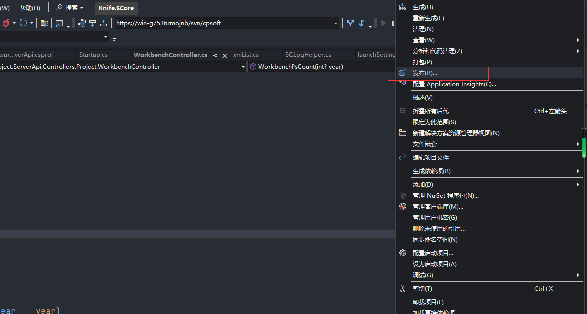
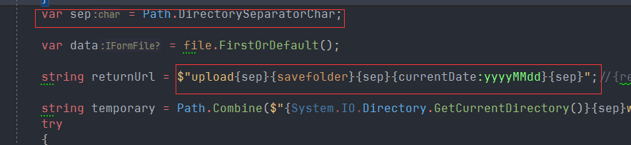

# .net core web 项目部署

## 1.在linux上安装.net core运行环境

### 1.1 添加包存储库

> 将 Microsoft 包签名密钥添加到受信任密钥列表，并添加 Microsoft 包存储库

```
sudo rpm -Uvh https://packages.microsoft.com/config/centos/7/packages-microsoft-prod.rpm
```

### 1.2 安装SDK

> 只安装运行时好像不行

```
sudo yum install dotnet-sdk-7.0
```

auth 数据库加密字符串

```
857A72EEF2731A88A58F3CE9F102ECB3A40353017FCF9942A349194F2C21D9F41F0259F82C3E8819E79FDE1AEA711BF8BBFF003DAE4DBBB8D7EFDEC389DF1631B04A2717D20E1F2BB4A309532D721A293CBD2B653219D0FC
```

api 数据加密字符串

```
857A72EEF2731A88A58F3CE9F102ECB387D3B0465A10690659EB087A9125760956176CA161DEA2FC6479B0313DC69B1801F1163818A3B856097CF618A0974F15CCFD39E131D907896F1C2CCFF135ED669B2A1F48B4494B1B
```

## 2.发布项目

### 2.1 右击项目选择发布



### 2.2 新建配置文件，选择文件夹


### 2.3 填写文件夹位置


### 2.4 修改设置


> 选择目标框架、部署模式选择框架依赖、目标运行时选择linux


### 2.5 点击发布，发布到文件夹


## 3.部署项目

### 3.1 上传项目

> 把发布的项目上传到linux服务器上

项目名.dll 为启动文件


### 3.2 启动项目

后台启动命令

```
nohup dotnet Knife.Hysware.AuthCenter.dll --urls="http://*:9088" > auth.log 2>&1 &
```

命令解释

>`nohup` 后台执行 
>
>`> auth.log`  日志输出到 auth.log 文件
>
>`2 >&1 &` 将标准错误重定向输出到标准输出，再重定向输出到auth.log 后台运行
>
>`--urls` 指定启动端口

### 3.3 打包前端

```
yarn run build
```

### 3.4 部署前端

将打包的前端文件上传到挂载的nginx文件夹中

启动nginx

## 4.问题处理

### 4.1 上传文件，目标文件位置没有文件

问题原因：

> 代码中文件路径分隔符不统一

解决方案:

>文件路径全部改为正斜杠 /

### 4.2 下载文件404

问题原因：

> nginx未进行反向代理

解决方案：

增加如下配置

```
    location ^~ /down/ {
        proxy_pass http://159.75.179.138:9235/;
        proxy_set_header Host $host;
        proxy_set_header X-Real-IP $remote_addr;
        proxy_set_header X-Forwarded-For $proxy_add_x_forwarded_for;
    }

```

### 4.3 文件预览接口 500

问题原因：

> 代码中文件路径分隔符不统一

解决方案:

>文件路径全部改为反斜杠 /

### 4.4 路径分割符统一解决方案

使用 c#自带的方法 Path.DirectorySeparatorChar



如果使用这种方式路径入库时应转换成正斜杠 /


# Docker 部署 项目

## 1.上传项目

> 将发布的项目上传到服务器

## 2.编写Dockerfile文件

```dockerfile
FROM mcr.microsoft.com/dotnet/sdk:7.0
WORKDIR /app
COPY api/ ./
EXPOSE 9235
ENTRYPOINT ["dotnet","Knife.Hysware.Project.ServerApi.dll","--urls=http://*:9235"]
```

## 3.构建镜像

```bash
docker build -t serverapi:1 .
```

## 4.启动镜像

```
docker run --name serverapi -p 9235:9235 -d serverapi:1
```

