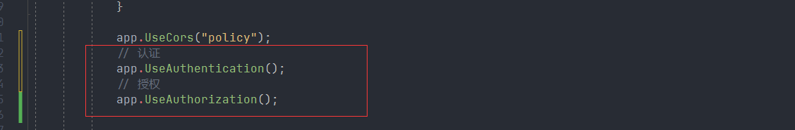
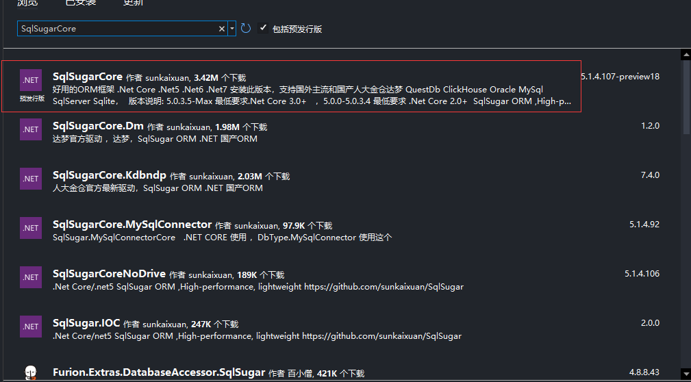

# .net core7 WebAPI项目搭建

## 01.创建.net core项目

选择ASP.NET Core Web API项目


选择.net 7.0的框架


运行程序显示swgger页面


## 02.增强swagger的使用

> 框架是自带swagger的，但是实际项目中我们需要自定义swagger的信息，显示接口注释信息，添加统一请求头信息等。

### 自定义UI信息和说明

> 在`Program.cs`中 修改`builder.Services.AddSwaggerGen();`

```c#
builder.Services.AddSwaggerGen(options =>
{
    options.SwaggerDoc("v1", new OpenApiInfo
    {
        Version = "v1",
        Title = "demo web API",
        Description = "An ASP.NET Core Web API for managing ",
    });
});
```

### 启用xml文档

单击解决方案项目名，右键选择属性 -> 生成 -> 输出


勾选文档文件（生成包含API文档的文件）


取消警告CS1591

> 选择错误和警告，在取消显示警告中添加代码1591


修改AddSwaggerGen方法

```c#
builder.Services.AddSwaggerGen(options =>
{
    options.SwaggerDoc("v1", new OpenApiInfo
    {
        Version = "v1",
        Title = "demo web API",
        Description = "An ASP.NET Core Web API for managing ",
    });
    var xmlFilename = $"{Assembly.GetExecutingAssembly().GetName().Name}.xml";
    options.IncludeXmlComments(Path.Combine(AppContext.BaseDirectory, xmlFilename));
});
```

Controller添加注释

```c#
namespace demo.web.api.Controllers
{   
    /// <summary>
    /// 测试接口管理
    /// </summary>
    [Route("api/[controller]")]
    [ApiController]
    public class TestController : ControllerBase
    {
        /// <summary>
        /// hello 接口
        /// </summary>
        /// <returns></returns>
        [HttpGet("hello")]
        public string hello()
        {
            return "hello world";
        }
    }
}
```


### 配置实体的swagger信息

实体类库 demo.web.Entity 也启用Xml文档


在启动类Program.cs swgger配置中添加如下配置

```
options.IncludeXmlComments(Path.Combine(AppContext.BaseDirectory, "demo.web.Entity.xml"));
```


启动swagger看看是否生效


## 03.读取配置文件工具类

创建一个工具库demo.web.Common

>右击添加项目，选择类库


给这个类库添加读取配置的依赖配置


在webApi项目中引入Common项目


创建一个Helper目录，在Helper目录下创建一个AppSettings的类

> 用来读取appsettings.json的配置

```c#
using Microsoft.Extensions.Configuration.Json;
using Microsoft.Extensions.Configuration;
using static System.Runtime.InteropServices.JavaScript.JSType;

namespace demo.web.Common.Helper
{   
    /// <summary>
    /// 读取配置文件工具类
    /// </summary>
    public class AppSettings
    {

        private static IConfiguration _configuration;

        #region 构造函数
        public AppSettings() 
        {
            _configuration = new ConfigurationBuilder().AddJsonFile("appsettings.json",true,reloadOnChange:true).Build();
        }
        #endregion

        #region 读取指定节点信息
        /// <summary>
        ///  读取指定节点信息
        /// </summary>
        /// <param name="sections">节点名称</param>
        /// <returns></returns>
        public static string ReadString(params string[] sections)
        {
            try
            {
                if (_configuration != null && sections.Any())
                {
                    string? str = _configuration[string.Join(":", sections)];
                    if (!string.IsNullOrEmpty(str))
                    {
                        return str;
                    }
                }
            }
            catch
            { 
                return string.Empty;
            }
            return string.Empty;
        }
        #endregion

        #region 以实体形式读取配置
        /// <summary>
        /// 以实体形式读取
        /// </summary>
        /// <typeparam name="T"></typeparam>
        /// <param name="sections">节点名称</param>
        /// <returns></returns>
        public static T ReadObject<T>(params string[] sections) where T : class , new()
        {
            T data = new();
            try
            {
                if (_configuration != null & sections.Any())
                {
                    _configuration.Bind(string.Join(":", sections), data);
                }
            }
            catch
            { 
                return data;
            }
            return data;
        }
        #endregion


        #region 以数组形式读取配置
        /// <summary>
        /// 以数组形式读取配置
        /// </summary>
        /// <typeparam name="T"></typeparam>
        /// <param name="sections">节点名称</param>
        /// <returns></returns>
        public static List<T> ReadList<T>(params string[] sections) where T : class
        {
            List<T> list = new();
            try 
            {
                if (_configuration != null & sections.Any())
                {
                    _configuration.Bind(string.Join(":", sections), list);
                }
            }
            catch
            {
                return list;
            }
            return list;
        }
        #endregion

    }
}

```

在启动类中注册服务

> 放在最前面

```c#
var builder = WebApplication.CreateBuilder(args);

builder.Services.AddSingleton(new AppSettings());
```

在appsettings.json添加一个配置用于测试

```
"ConnectionType": "PostgreSQL"
```

在controller中编写测试代码

```c#
[HttpGet("json")]
public string configjson()
{
    return AppSettings.ReadString("ConnectionType");
}
```

swagger中测试


## 04.整合JWT权限认证

安装System.IdentityModel.Tokens.Jwt


安装JwtBearer包


在appsettings.json配置jwt配置信息

```json
{
"JwtSetting": {
  "Issuer": "jwtIssuer", //颁发者
  "Audience": "jwtAudience", //可以给哪些客户端使用
  "SecretKey": "yehjsiwkjhuhgyehsndssssssssdsasw" //加密Key
}
}
```

创建JwtHelper用来生成token 和解析token

```c#
namespace demo.web.Common.Helper
{
    public class JwtHelper
    {
        /// <summary>
        /// 生成jwt
        /// </summary>
        /// <param name="tokenModel"></param>
        /// <returns></returns>
        public static string generateToken(TokenModel tokenModel)
        {
            string iss = AppSettings.ReadString(new string[] { "JwtSetting", "Issuer" });
            string aud = AppSettings.ReadString(new string[] { "JwtSetting", "Audience" });
            string secret = AppSettings.ReadString(new string[] { "JwtSetting", "SecretKey" });

            var claims = new List<Claim> 
            {
            new Claim(JwtRegisteredClaimNames.Jti, tokenModel.Uid.ToString()),
                new Claim(JwtRegisteredClaimNames.Iat, $"{new DateTimeOffset(DateTime.Now).ToUnixTimeSeconds()}"),
                new Claim(JwtRegisteredClaimNames.Nbf,$"{new DateTimeOffset(DateTime.Now).ToUnixTimeSeconds()}") ,
                //这个就是过期时间，目前是过期1000秒，可自定义，注意JWT有自己的缓冲过期时间
                new Claim (JwtRegisteredClaimNames.Exp,$"{new DateTimeOffset(DateTime.Now.AddSeconds(1000)).ToUnixTimeSeconds()}"),
                new Claim(JwtRegisteredClaimNames.Iss,iss),
                new Claim(JwtRegisteredClaimNames.Aud,aud),
            };

            // 可以将一个用户的多个角色全部赋予；
            claims.AddRange(tokenModel.Role.Split(',').Select(s => new Claim(ClaimTypes.Role, s)));


            //秘钥 (SymmetricSecurityKey 对安全性的要求，密钥的长度太短会报出异常)
            var key = new SymmetricSecurityKey(Encoding.UTF8.GetBytes(secret));
            var creds = new SigningCredentials(key, SecurityAlgorithms.HmacSha256);

            var jwt = new JwtSecurityToken(
                issuer: iss,
                claims: claims,
                signingCredentials: creds);

            var jwtHandler = new JwtSecurityTokenHandler();
            var encodedJwt = jwtHandler.WriteToken(jwt);

            return encodedJwt;
        }

        /// <summary>
        /// 解析
        /// </summary>
        /// <param name="jwtStr"></param>
        /// <returns></returns>
        public static TokenModel SerializeJwt(string jwtStr)
        {
            var jwtHandler = new JwtSecurityTokenHandler();
            JwtSecurityToken jwtToken = jwtHandler.ReadJwtToken(jwtStr);
            object role;
            try
            {
                jwtToken.Payload.TryGetValue(ClaimTypes.Role, out role);
            }
            catch (Exception e)
            {
                Console.WriteLine(e);
                throw;
            }
            var tm = new TokenModel
            {
                Uid = jwtToken.Id,
                Role = role == null ? "" : role.ToString(),
            };
            return tm;
        }
    }
    
    
    
    public class TokenModel
    {

        public string Uid { get; set; }

        public string Role { get; set; }
    }
}
```

swagger中开启jwt服务

> 修改swagger配置

```c#
            builder.Services.AddSwaggerGen(options =>
            {
                options.SwaggerDoc("v1", new OpenApiInfo
                {
                    Version = "v1",
                    Title = "demo web API",
                    Description = "An ASP.NET Core Web API for managing ",
                });
                var xmlFilename = $"{Assembly.GetExecutingAssembly().GetName().Name}.xml";
                options.IncludeXmlComments(Path.Combine(AppContext.BaseDirectory, xmlFilename));
                options.IncludeXmlComments(Path.Combine(AppContext.BaseDirectory, "demo.web.Entity.xml"));

                // 在header 添加token 

                options.AddSecurityDefinition("Bearer", new OpenApiSecurityScheme
                {
                    In = ParameterLocation.Header,
                    Description = "Authorization identifier needs to be added to the input request header：Bearer Token",
                    Name = "Authorization",
                    Type = SecuritySchemeType.Http,
                    BearerFormat = "JWT",
                    Scheme = "Bearer"
                });

                options.AddSecurityRequirement(new OpenApiSecurityRequirement
                {
                    {
                        new OpenApiSecurityScheme
                        {
                            Reference = new OpenApiReference
                            {
                                Type=ReferenceType.SecurityScheme,
                                Id="Bearer"
                            }
                        },
                        new string[]{}
                    }
                });


            });
```

接口授权

>  使用[Authorize]标识

```c#
        [HttpGet("getList")]
        [Authorize]
        public List<User> GetList()
        {
           
            Task<List<User>> task = _userService.GetList(Expressionable.Create<User>().ToExpression());
            List<User> users = task.GetAwaiter().GetResult();
            return users;
        }
```

配置认证服务

> 新建注册类AuthorizationSetup

```c#
public static class AuthorizationSetup
{
    public static void AddAuthorizationSetup(this IServiceCollection services)
    {
        if (services == null) throw new ArgumentNullException(nameof(services));

        // 1【授权】、这个和上边的异曲同工，好处就是不用在controller中，写多个 roles 。
        // 然后这么写 [Authorize(Policy = "Admin")]
        //services.AddAuthorization(options =>
        //{
         //   options.AddPolicy("User", policy => policy.RequireRole("User").Build());
         //   options.AddPolicy("System", policy => policy.RequireRole("System").Build());
         //  options.AddPolicy("SystemOrAdmin", policy => policy.RequireRole("Admin", "System"));

       // });

        //读取配置文件
        var symmetricKeyAsBase64 = AppSettings.ReadString(new string[] {"JwtSetting", "SecretKey" });
        var keyByteArray = Encoding.ASCII.GetBytes(symmetricKeyAsBase64);
        var signingKey = new SymmetricSecurityKey(keyByteArray);
        var Issuer = AppSettings.ReadString(new string[] {"JwtSetting", "Issuer" });
        var Audience = AppSettings.ReadString(new string[] {"JwtSetting", "Audience" });


        // 令牌验证参数
        var tokenValidationParameters = new TokenValidationParameters
        {
            ValidateIssuerSigningKey = true,
            IssuerSigningKey = signingKey,
            ValidateIssuer = true,
            ValidIssuer = Issuer,//发行人
            ValidateAudience = true,
            ValidAudience = Audience,//订阅人
            ValidateLifetime = true,
            ClockSkew = TimeSpan.FromSeconds(30),
            RequireExpirationTime = true,
        };

        //2.1【认证】、core自带官方JWT认证
        // 开启Bearer认证
        services.AddAuthentication("Bearer")
         // 添加JwtBearer服务
         .AddJwtBearer(o =>
         {
             o.TokenValidationParameters = tokenValidationParameters;
             o.Events = new JwtBearerEvents
             {
                 OnAuthenticationFailed = context =>
                 {
                     // 如果过期，则把<是否过期>添加到，返回头信息中
                     if (context.Exception.GetType() == typeof(SecurityTokenExpiredException))
                     {
                         context.Response.Headers.Add("Token-Expired", "true");
                     }
                     return Task.CompletedTask;
                 }
             };
         });
    }
}
```

在启动类Program.cs注册服务

```c#
            //jwt授权验证
            builder.Services.AddAuthorizationSetup();
```

开启认证

```c#
            app.UseAuthentication();
```

**注意**：认证授权的先后顺序，要先认证再授权



在swagger测试一波

由于swagger开启jwt认证，所以有Authorize


先测试没有添加[Authorize]标识的接口，无需认证

正常访问


测试添加了[Authorize]标识的接口

爆401错误


获取token把token添加到Authorize中


再访问需要认证的接口

通过认证


## 05.整合SqlSuagr + 仓储模式

新建俩个类库demo.web.Repository ,demo.web.Service

在类库demo.web.Entity 安装SqlSugarCore 依赖



在appsettings.json配置数据库配置

```json
"ConnectionStrings": {
  "PostgreSQL": "PORT=5432;DATABASE=ssm;HOST=127.0.0.1;PASSWORD=123456;USER ID=postgres"
},
```

在Repository 下新建DbContext类

```c#
namespace demo.web.Respository.Config
{
    public class DbContext<T> where T : class, new()
    {
        public SqlSugarClient sqlSugarClient;

        public SimpleClient<T> CurrentClient { get { return new SimpleClient<T>(sqlSugarClient); } }
        public DbContext() 
        {
            sqlSugarClient = new SqlSugarClient(new ConnectionConfig
            {
                ConnectionString = AppSettings.ReadString(new string[] { "ConnectionStrings", "PostgreSQL" }),
                DbType = DbType.PostgreSQL,
                InitKeyType = InitKeyType.Attribute,//从特性读取主键和自增列信息
                IsAutoCloseConnection = true,
            });
            sqlSugarClient.Aop.OnLogExecuting = (sql, pars) =>
            {
                Console.WriteLine(sql + "\r\n" +
                    sqlSugarClient.Utilities.SerializeObject(pars.ToDictionary(it => it.ParameterName, it => it.Value)));
                Console.WriteLine();

            };
        }
    }
}
```

在Repository 下新建IBaseRepository接口

```c#
 demo.web.Respository.Base
{
    public interface IBaseRepository<T> where T : class
    {   
        /// <summary>
        /// 查询
        /// </summary>
        /// <param name="whereExpression"></param>
        /// <returns></returns>
        Task<T> GetSingle(Expression<Func<T, bool>> whereExpression);
        /// <summary>
        /// 查询列表
        /// </summary>
        /// <param name="whereExpression"></param>
        /// <returns></returns>
        Task<List<T>> GetList(Expression<Func<T, bool>> whereExpression);
        /// <summary>
        /// 分页查询列表
        /// </summary>
        /// <param name="whereExpression"></param>
        /// <param name="page"></param>
        /// <returns></returns>
        Task<List<T>> GetPageList(Expression<Func<T, bool>> whereExpression, PageModel page);
        /// <summary>
        /// 新增
        /// </summary>
        /// <param name="entity"></param>
        /// <returns></returns>
        Task<int> Add(T entity);
        /// <summary>
        /// 更新
        /// </summary>
        /// <param name="entity"></param>
        /// <returns></returns>
        Task<bool> Update(T entity);
        /// <summary>
        /// 删除
        /// </summary>
        /// <param name="entity"></param>
        /// <returns></returns>
        Task<bool> Delete(T entity);
    }
}
```

在Repository 下新建BaseRepository

```
namespace demo.web.Respository.Base
{
    public class BaseRepository<T> : DbContext<T>, IBaseRepository<T> where T : class, new()
    {
        public async Task<int> Add(T entity)
        {
            return await sqlSugarClient.Insertable(entity).ExecuteCommandAsync();
        }

        public async Task<bool> Delete(T entity)
        {
            return await sqlSugarClient.Deleteable(entity).ExecuteCommandAsync() > 0;
        }

        public async Task<List<T>> GetList(Expression<Func<T, bool>> whereExpression)
        {
            return await Task.Run(() => sqlSugarClient.Queryable<T>().Where(whereExpression).ToList());
        }

        public async Task<List<T>> GetPageList(Expression<Func<T, bool>> whereExpression, PageModel page)
        {
            return await Task.Run(() =>
                                               sqlSugarClient.Queryable<T>()
                                               .Where(whereExpression)
                                               .ToPageList(page.PageIndex, page.PageSize));
        }

        public async Task<T> GetSingle(Expression<Func<T, bool>> whereExpression)
        {
            return await Task.Run(() => sqlSugarClient.Queryable<T>().First(whereExpression));
        }

        public async Task<bool> Update(T entity)
        {
            return await sqlSugarClient.Updateable(entity).ExecuteCommandAsync() > 0;
        }
    }
}
```

在Service下 创建 IBaseServices

```c#
namespace demo.web.Service.Base
{
    public interface IBaseServices<T> where T : class
    {
        /// <summary>
        /// 查询
        /// </summary>
        /// <param name="whereExpression"></param>
        /// <returns></returns>
        Task<T> GetSingle(Expression<Func<T, bool>> whereExpression);
        /// <summary>
        /// 查询列表
        /// </summary>
        /// <param name="whereExpression"></param>
        /// <returns></returns>
        Task<List<T>> GetList(Expression<Func<T, bool>> whereExpression);
        /// <summary>
        /// 分页查询列表
        /// </summary>
        /// <param name="whereExpression"></param>
        /// <param name="page"></param>
        /// <returns></returns>
        Task<List<T>> GetPageList(Expression<Func<T, bool>> whereExpression, PageModel page);
        /// <summary>
        /// 新增
        /// </summary>
        /// <param name="entity"></param>
        /// <returns></returns>
        Task<int> Add(T entity);
        /// <summary>
        /// 更新
        /// </summary>
        /// <param name="entity"></param>
        /// <returns></returns>
        Task<bool> Update(T entity);
        /// <summary>
        /// 删除
        /// </summary>
        /// <param name="entity"></param>
        /// <returns></returns>
        Task<bool> Delete(T entity);
    }
}
```

在Service 下新建BaseServices

```c#
namespace demo.web.Service.Base
{
    public class BaseServices<T> : IBaseServices<T> where T : class , new()
    {
        public IBaseRepository<T> baseRepository =  new BaseRepository<T>();

        public async Task<int> Add(T entity)
        {
            return await baseRepository.Add(entity);
        }

        public async Task<bool> Delete(T entity)
        {
            return await baseRepository.Delete(entity);
        }

        public async Task<List<T>> GetList(Expression<Func<T, bool>> whereExpression)
        {
            return await baseRepository.GetList(whereExpression);
        }

        public async Task<List<T>> GetPageList(Expression<Func<T, bool>> whereExpression, PageModel page)
        {
            return await baseRepository.GetPageList(whereExpression, page);
        }

        public async Task<T> GetSingle(Expression<Func<T, bool>> whereExpression)
        {
            return await baseRepository.GetSingle(whereExpression);
        }

        public async Task<bool> Update(T entity)
        {
            return await baseRepository.Update(entity);
        }
    }
}
```

在demo.web.Entity中新建User实体

```c#
namespace demo.web.Entity.Entity
{
    /// <summary>
    /// User 实体
    /// </summary>
    [SugarTable("t_user")]
    public class User
    {
        public User() { }

        public User(int id, string name, int age)
        {
            Id = id;
            Name = name;
            Age = age;
        }
        /// <summary>
        /// id
        /// </summary>
        [SugarColumn(IsPrimaryKey = true,ColumnName = "tid")]
        public int Id { get; set; }
        /// <summary>
        /// 名字
        /// </summary>
        public string? Name { get; set; }
        /// <summary>
        /// 年龄
        /// </summary>
        public int Age { get; set; }
    }
}
```

在Respository 下新建 IUserRespository 和 UserRespository

```c#
public interface IUserRespository : IBaseRepository<User>
{
}
public class UserRespository : BaseRepository<User> , IUserRespository
{
}

```

在Service下新建 IUserService和UserService

```c#
public interface IUserService : IBaseServices<User>
{
}

public class UserService : BaseServices<User>, IUserService
{
}
```

Controller中编写测试代码

```c#
        [HttpGet("user")]
        public String AddUser()
        {
            IUserService userService = new UserService();
            userService.Add(new User(9, "ss", 18));
            return "ok";
        }
        [HttpGet("getList")]
        public List<User> GetList()
        {
            IUserService userService = new UserService();
            Task<List<User>> task = userService.GetList(Expressionable.Create<User>().ToExpression());
            List<User> users = task.GetAwaiter().GetResult();
            return users;
        }
```


## 06.整合IOC框架AutoFac

安装 Autofac.Extensions.DependencyInjection，Autofac.Extras.DynamicProxy


在新建一个Setup文件夹新建AutofacModuleRegister 类

```c#
namespace demo.web.api.Setup
{
    public class AutofacModuleRegister : Autofac.Module
    {
        protected override void Load(ContainerBuilder builder)
        {
            //注册Service
            var assemblysServices = Assembly.Load("demo.web.Service");
            builder.RegisterAssemblyTypes(assemblysServices)
                   .InstancePerDependency()//瞬时单例
                   .AsImplementedInterfaces() // 自动以其实现的所有接口类型暴露（包括IDisposable接口）
                   .EnableInterfaceInterceptors(); //引用Autofac.Extras.DynamicProxy;


            //注册Repository
            var assemblysRepository = Assembly.Load("demo.web.Respository");
            builder.RegisterAssemblyTypes(assemblysRepository)
                   .InstancePerDependency()//瞬时单例
                   .AsImplementedInterfaces() // 自动以其实现的所有接口类型暴露（包括IDisposable接口）
                   .EnableInterfaceInterceptors(); //引用Autofac.Extras.DynamicProxy;

        }

    }
}
```

在program.cs中注册autofac

```c#
        // Autofac 注册
        builder.Host.UseServiceProviderFactory(new AutofacServiceProviderFactory());
        builder.Host.ConfigureContainer<ContainerBuilder>(containerBuilder =>
        {
            containerBuilder.RegisterModule<AutofacModuleRegister>();
        });
```

修改BaseService改成注入方式

```c#
         // public IBaseRepository<T> baseRepository =  new BaseRepository<T>();
        private readonly IBaseRepository<T> _repository;

        public BaseServices(IBaseRepository<T> repository)
        {
            this._repository = repository;
        }
```

修改UserService

```c#
public class UserService : BaseServices<User>, IUserService
{
    private readonly IUserRespository  _repository;
    public UserService(IBaseRepository<User> repository ,IUserRespository userRespository ) : base(repository)
    {
        _repository = userRespository;
    }
}
```

修改controller

```c#
 private readonly IUserService _userService;
 public TestController(IUserService userService) 
 {
     _userService = userService;
 }
 
[HttpGet("getList")]
public List<User> GetList()
{
           
	Task<List<User>> task = _userService.GetList(Expressionable.Create<User>	().ToExpression());
	List<User> users = task.GetAwaiter().GetResult();
	return users;
}
```

测试一波


## 07.整合NLog日志框架

安装如下Nlog 和 NLog.Web.AspNetCore 两个依赖


创建在根目录nlog.config文件

```xml
<?xml version="1.0" encoding="utf-8" ?>
<nlog xmlns="http://www.nlog-project.org/schemas/NLog.xsd"
      xmlns:xsi="http://www.w3.org/2001/XMLSchema-instance"
      autoReload="true"
      throwConfigExceptions="true"
      internalLogLevel="info"
      internalLogFile="${basedir}/logs/nlog/internal-nlog.txt">

	<!-- 启用asp.net核心布局渲染器 -->
	<extensions>
		<add assembly="NLog.Web.AspNetCore"/>
	</extensions>

	<!--autoReload：修改后自动加载，可能会有延迟-->
	<!--throwConfigExceptions：NLog日志系统抛出异常-->
	<!--internalLogLevel：内部日志的级别-->
	<!--internalLogFile：内部日志保存路径，日志的内容大概就是NLog的版本信息，配置文件的地址等等-->
	<!--输出日志的配置，用于rules读取-->
	<targets>
		<!--将日志写入文件中,fileName可以指定日志生成的路径-->
		<target xsi:type="File" name="allfile" fileName="${basedir}/logs/nlog/all/nlog-all-${shortdate}.log"
				layout="${longdate}|${event-properties:item=EventId_Id:whenEmpty=0}|${uppercase:${level}}|${logger}|${message} ${exception:format=tostring}" />

		<!-- 没用到；同样是将文件写入日志中，写入的内容有所差别，差别在layout属性中体现。写入日志的数量有差别，差别在路由逻辑中体现-->
		<target xsi:type="File" name="ownFile-web" fileName="${basedir}/logs/nlog/my/nlog-own-${shortdate}.log"
				layout="${longdate}|${event-properties:item=EventId_Id:whenEmpty=0}|${uppercase:${level}}|${logger}|${message} ${exception:format=tostring}|url: ${aspnet-request-url}|action: ${aspnet-mvc-action}|" />

		<!-- 没用到；控制台目标，用于托管生存期消息以改进Docker/Visual Studio启动检测-->
		<target xsi:type="Console" name="lifetimeConsole" layout="${MicrosoftConsoleLayout}" />

		<!-- 保留APIs到指定独立目录；最大保存大小10MB，保存时长9天；按天保存； -->
		<target xsi:type="File" name="InterFaceFile" fileName="${basedir}/logs_Interface/${date:format=yyyyMMdd}.log" layout="${longdate} ${uppercase:${level}} ${message}" archiveEvery="Day" maxArchiveDays="9" archiveAboveSize="1024000" />
		

	</targets>

	<!-- 从记录器名称映射到目标的规则，路由匹配逻辑为顺序匹配。 -->
	<rules>
		<!--所有日志，包括来自Microsoft的日志-->
		<logger name="*" minlevel="Error" writeTo="allfile" />
		<!--以Microsoft打头的日志将进入此路由，由于此路由没有writeTo属性，所有会被忽略-->
		<logger name="Microsoft.*" maxlevel="Info" final="true" />
		
		<!--保留APIs到指定独立目录-->
		<logger name="InterFace" minlevel="Debug" maxlevel="Error" writeTo="InterFaceFile" />

		<!--上方已经过滤了所有Microsoft.*的日志，所以此处的日志只会打印除Microsoft.*外的日志-->
		<logger name="*" minlevel="Error" writeTo="ownFile-web" />
	</rules>
</nlog>
```

在修改启动类Program.cs 

```c#
private static void Main(string[] args)
{
    var logger = NLog.LogManager.Setup().GetCurrentClassLogger();
    logger.Debug("[启动服务]");
    try
    {
        var builder = WebApplication.CreateBuilder(args);

        builder.Services.AddSingleton(new AppSettings());

        // 配置 NLog
        builder.Logging.ClearProviders();
        builder.Host.UseNLog();

        // Autofac 注册
        builder.Host.UseServiceProviderFactory(new AutofacServiceProviderFactory());
        builder.Host.ConfigureContainer<ContainerBuilder>(containerBuilder =>
        {
            containerBuilder.RegisterModule<AutofacModuleRegister>();
        });

        // Add services to the container.

        builder.Services.AddControllers();
        // Learn more about configuring Swagger/OpenAPI at https://aka.ms/aspnetcore/swashbuckle
        builder.Services.AddEndpointsApiExplorer();
        builder.Services.AddSwaggerGen(options =>
        {
            options.SwaggerDoc("v1", new OpenApiInfo
            {
                Version = "v1",
                Title = "demo web API",
                Description = "An ASP.NET Core Web API for managing ",
            });
            var xmlFilename = $"{Assembly.GetExecutingAssembly().GetName().Name}.xml";
            options.IncludeXmlComments(Path.Combine(AppContext.BaseDirectory, xmlFilename));
        });
        var app = builder.Build();


        // Configure the HTTP request pipeline.
        if (app.Environment.IsDevelopment())
        {
            app.UseSwagger();
            app.UseSwaggerUI();
        }

        app.UseAuthorization();

        app.MapControllers();

        app.Run();
    }
    catch (Exception ex)
    {
        logger.Error(ex, "[因异常停止服务]");
        throw;
    }
    finally
    {
        NLog.LogManager.Shutdown();
    }
    
}
```

## 08.整合AutoMapper

引入依赖 AutoMapper 和 AutoMapper.Extensions.Microsoft.DependencyInjection


在demo.web.Entity创建一个UserDto 类

```c#
namespace demo.web.Common.Dto
{
    /// <summary>
    /// UserDto
    /// </summary>
    public class UserDto
    {
        public int Id { get; set; }

        public string? Name { get; set; }

        public int Age { get; set; }
    }
}
```

在demo.web.Entity创建一个MapperProfile 类

```c#
namespace demo.web.Common.MapperProfile
{
    public class MapperProfile : Profile
    {
        /// <summary>
        /// 创建映射关系
        /// </summary>
        public MapperProfile() 
        {
            CreateMap<User, UserDto>();
        }
    }
}
```

在启动类Program.cs  注入AutoMapper

```c#
   //注入AutoMapper
   builder.Services.AddAutoMapper(typeof(MapperProfile));
```

修改controller 

```c#
private readonly IUserService _userService;
private readonly IMapper _mapper;
public TestController(IUserService userService,IMapper mapper) 
{
    _userService = userService;
    _mapper = mapper;
}

[HttpGet("sss")]
public UserDto testAutoMapper()
{ 
    User user = new User(1,"ssss",19);
    var userDto = _mapper.Map<UserDto>(user);
    return userDto;

}
```

测试一波


## 09.跨域配置

在启动类Program.cs添加如下配置

```c#
//  跨域配置
builder.Services.AddCors(options =>
{
	options.AddPolicy("policy", builder => { builder.AllowAnyOrigin().AllowAnyHeader().AllowAnyMethod(); });
});


 app.UseCors("policy");
```

## 10.时间序列化配置

安装NewtonsoftJson依赖


在启动类Program.cs增加配置

```c#

            // 配置日期格式转换
            builder.Services.AddControllers().AddNewtonsoftJson(options =>
            {

                //设置时间格式
                options.SerializerSettings.DateFormatString = "yyyy-MM-dd HH:mm:ss";
                //忽略Model中为null的属性
                //options.SerializerSettings.NullValueHandling = NullValueHandling.Ignore;
                //设置本地时间而非UTC时间
                options.SerializerSettings.DateTimeZoneHandling = DateTimeZoneHandling.Local;
            })
            .ConfigureApiBehaviorOptions(options => options.SuppressModelStateInvalidFilter = true);
```

Controller写个接口

```c#

        [HttpGet("testDate")]
        public DateTime testTime() 
        {
            return DateTime.Now;
        }
```

测试一波


## 11.文件上传

```c#
       [HttpPost]
        [Route("UploadImage")]
        public async Task<HyObjectRequestResult<string>> UploadImage(IFormFile file,string Clid,string Pz)
        {
            if (file == null)
            {
                return CommonResult.Failed(1, "没有上传文件!", "");
            }

            if (string.IsNullOrEmpty(Clid))
            {
                return CommonResult.Failed(1, "车辆Id不能为空!", "");
            }
            if (string.IsNullOrEmpty(Pz))
            {
                return CommonResult.Failed(1, "车辆牌照不能为空!", "");
            }
            // 文件上传大小限制 10M
            var limitFileLength = 10 * 1024 * 1000; 
            // 文件名
            var fileName = file.FileName;
            // 保存的文件名
            var saveFileName = DateTime.Now.ToString("yyyyMMddHHmmss") + "_" + Pz + Path.GetExtension(fileName);
            // 保存的文件路径
            var savePath = Path.Combine("UPLOAD", "BGGL", "YCGL");
            // 上传的文件夹
            var uplaodFolder = Path.Combine(Directory.GetCurrentDirectory(), savePath);
            var allowedExtensions = new string[] { ".jpg", ".jepg", ".png", ".gif" };
            if (!allowedExtensions.Contains(Path.GetExtension(fileName).ToLower()))
            {
                return CommonResult.Failed(1, "禁止上传该文件类型!", "");
            }

            if (limitFileLength < file.Length)
            {
                return CommonResult.Failed(1, "超过文件上传大小!", "");
            }

            if (!Directory.Exists(uplaodFolder))
            {
                Directory.CreateDirectory(uplaodFolder);
            }

            var filePath = Path.Combine(uplaodFolder, saveFileName);

            using (var stream = new FileStream(filePath, FileMode.Create))
            {
                await file.CopyToAsync(stream);
            }

            string dataFilePath = "/" + Path.Combine(savePath, saveFileName).Replace("\\", "/");

            // 数据库存储

            return CommonResult.Ok(dataFilePath);
        }
```

