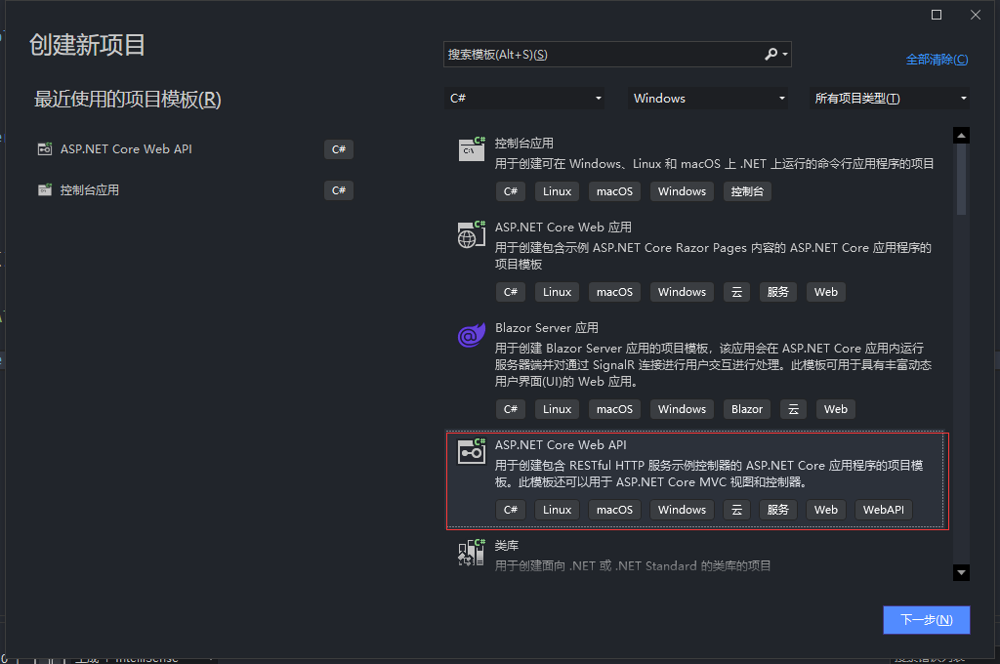
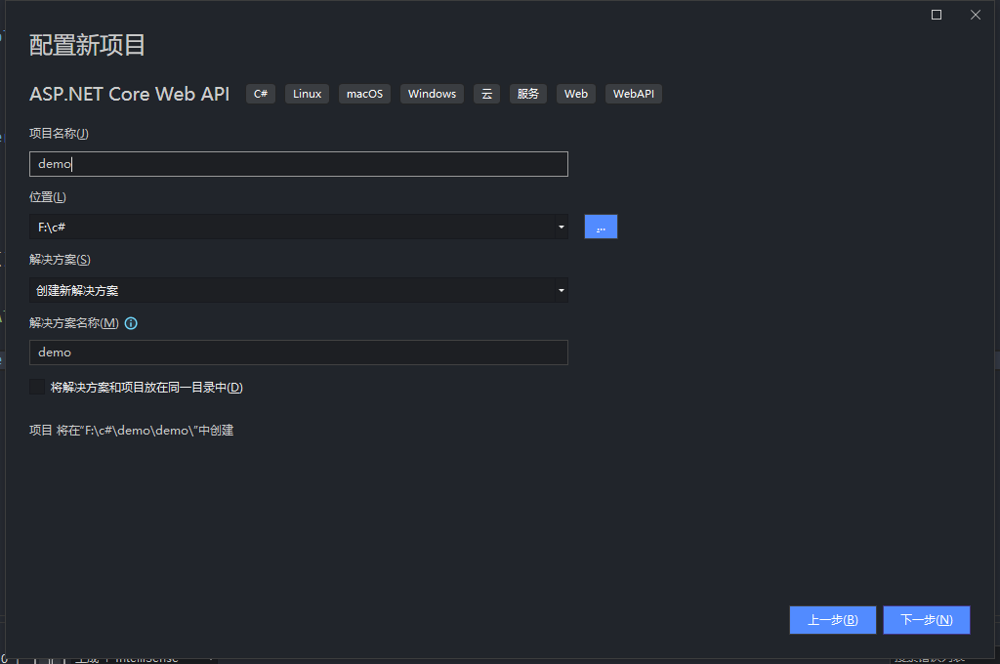
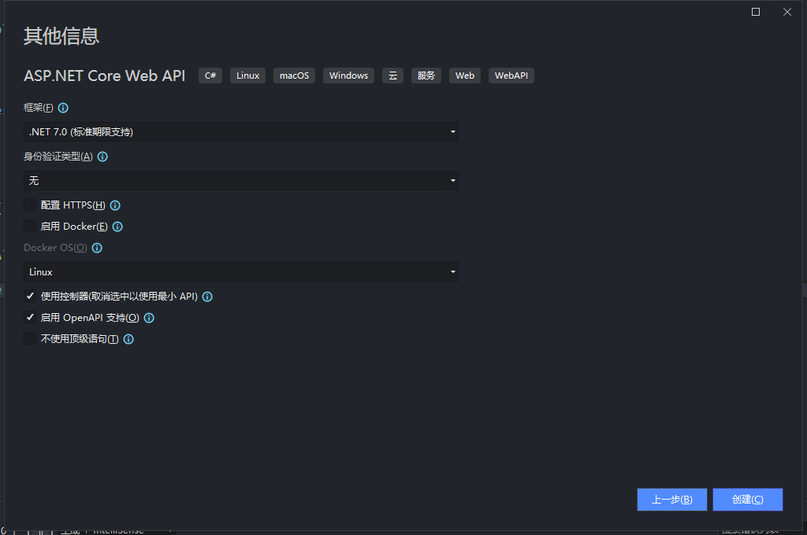
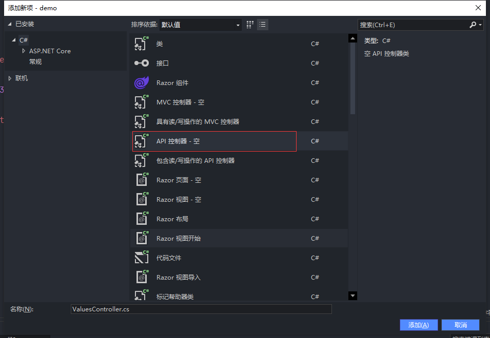

# .net core 项目搭建

## 搭建环境

>Visual Studio 2022
>
>.net core 7

## 01.创建一个新项目







删除生成的WeatherForecast.cs 和 WeatherForecastController.cs

新建一个TestController.cs



```c#
using Microsoft.AspNetCore.Http;
using Microsoft.AspNetCore.Mvc;

namespace demo.Controllers
{
    [Route("api/[controller]")]
    [ApiController]
    public class TestController : ControllerBase
    {

        [HttpGet("hello")]
        public string hello() { 
            return "hello world";
        }
    }
}

```


## 02.整合SqlSugar

使用NuGet下载SqlSugarCore

