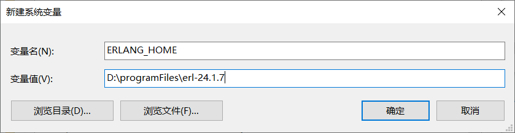
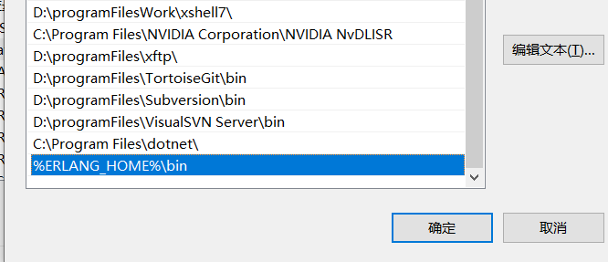
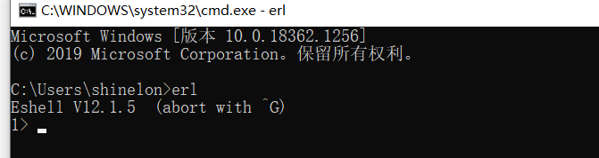
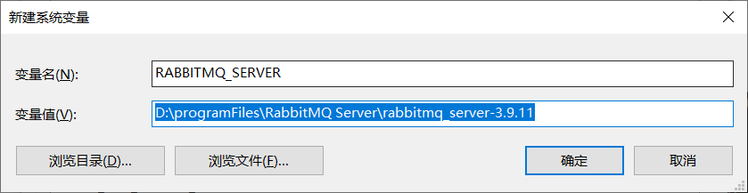
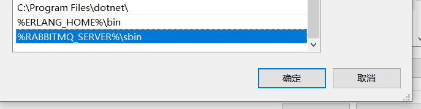
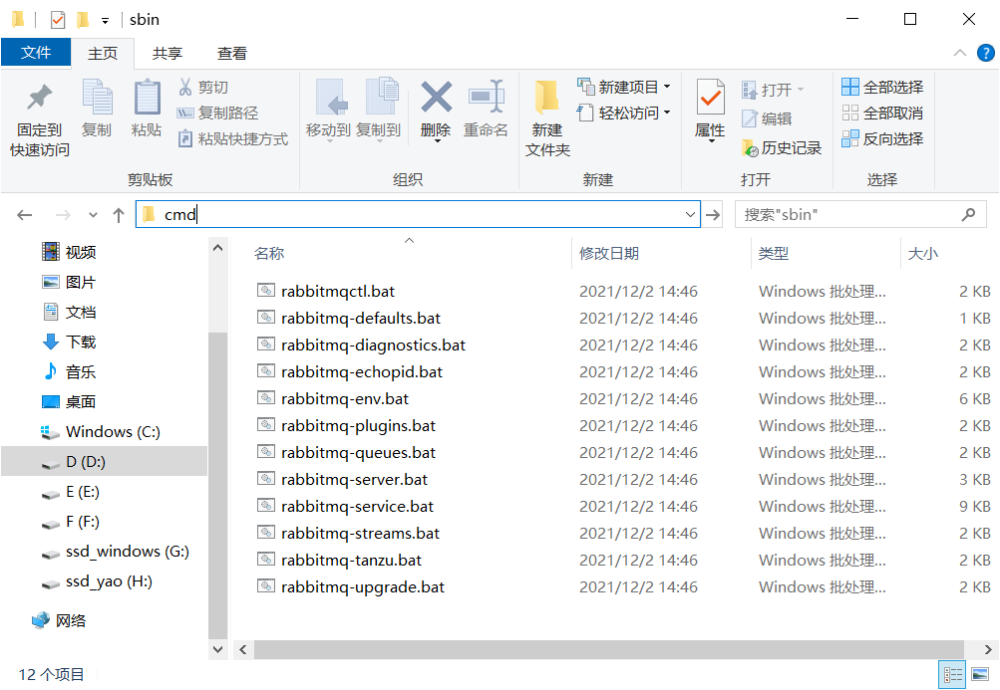
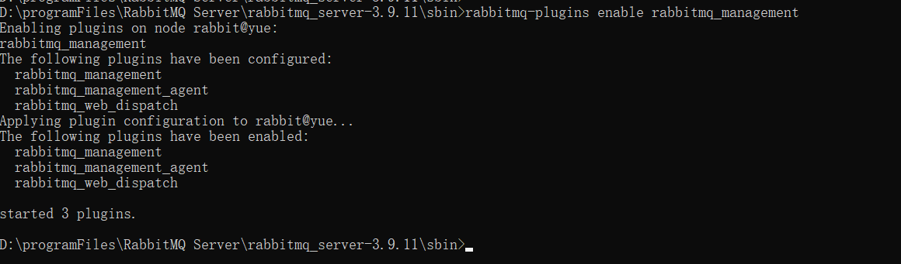
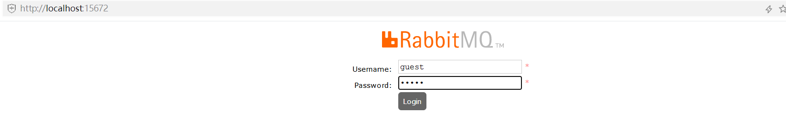

## Window安装rabbitMq

### 安装Erlang环境

1.下载地址：https://erlang.org/download/otp_win64_24.1.7.exe

2.双击执行exe文件即可

3.安装完成后，创建环境变量

> ERLANG_HOME 指向erlang的安装路径



4.将%ERLANG_HOME%\bin加入到Path中。



5.配置完成后，打开命令提示符cmd，输入erl。

> 出现版本则erlang环境配置成功



## 安装RabbitMQ

1.下载地址：https://www.rabbitmq.com/install-windows.html

2.直接双击exe文件

3.配置环境变量RABBITMQ_SERVER



4.将%RABBITMQ_SERVER%\sbin加入到Path中



## 安装RabbitMQ-Plugins

> RabbitMQ-Plugins相当于是一个管理界面，方便我们在浏览器界面查看RabbitMQ各个消息队列以及exchange的工作情况。

1.进入rabbitmq的sbin目录进入cmd中



2.输入命令安装插件

```
rabbitmq-plugins enable rabbitmq_management
```



3.安装完成后在浏览器输入localhsot:15672进行验证

> 出现以下界面即为成功



4.登陆一下，默认用户名/密码为guest/guest


## RabbitMQ常用命令

- **健康检查： rabbitmqctl status**
- **启动监控管理器：rabbitmq-plugins enable rabbitmq_management**
- **关闭监控：rabbitmq-plugins disable rabbitmq_management**
- **停止服务：rabbitmq-service stop**
- **启动服务：rabbitmq-service start**
- 重启命令：net stop RabbitMQ && net start
- **帮助命令：rabbitmqctl help**
- rabbitmqctl list_queues查看所有队列
- rabbitmqctl reset清除所有队列
- rabbitmqctl list_exchanges查看所有交换器
- rabbitmqctl add_user username password添加用户
- rabbitmqctl set_user_tags username administrator分配角色
- rabbitmqctl list_bindings 查看交换器和队列的绑定关系