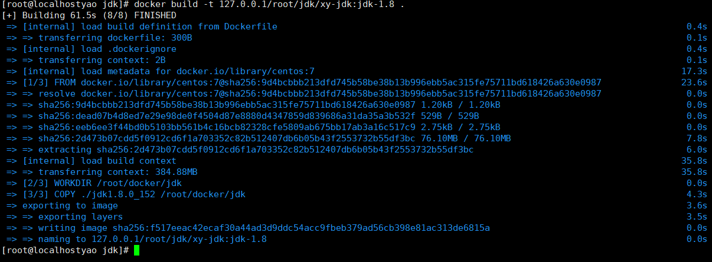
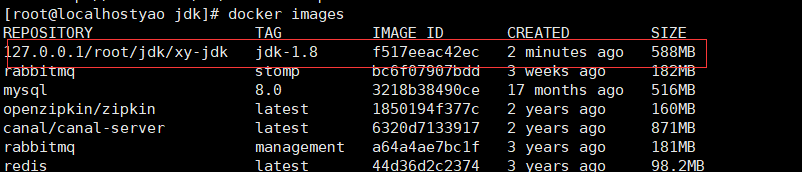
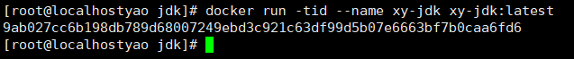
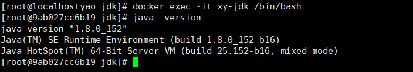
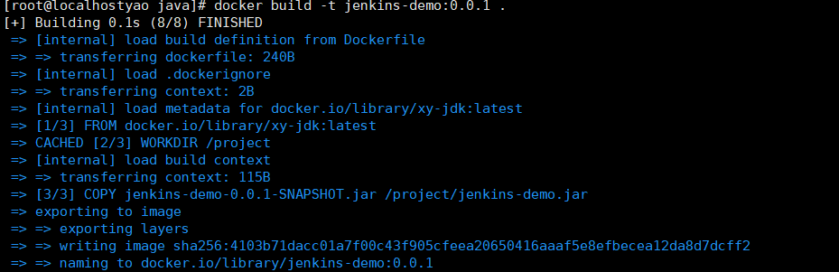
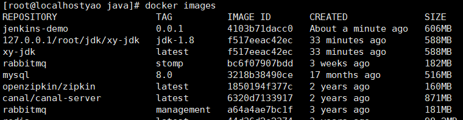
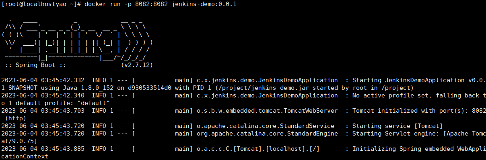
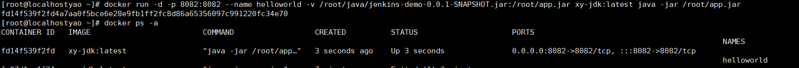

## Docker 创建Centos7+JDK1.8的基础镜像

### 1、下载JDK1.8的Linux安装包

### 2、解压安装包

```apl
tar zxvf jdk-8u152-linux-x64.tar.gz 
```

### 3、创建DockerFile文件

Dockerfile文件需要和解压后的JDK文件放在同一个目录

```shell
FROM centos:7
WORKDIR /root/docker/jdk
COPY ./jdk1.8.0_152 /root/docker/jdk

ENV JAVA_HOME=/root/docker/jdk
ENV CLASSPATH=.:$JAVA_HOME/lib/dt.jar:$JAVA_HOME/lib/tools.jar
ENV PATH=$JAVA_HOME/bin:$PATH
```

### 4、运行构建成一个新的镜像

```
docker build -t 127.0.0.1/root/jdk/xy-jdk:jdk-1.8 .
```



### 5、查看刚刚构建完成的镜像

```
docker images
```



### 6、验证打包完成的镜像是否可以使用

改下名字

```
docker tag f51 xy-jdk
```


运行镜像

```
docker run -tid --name xy-jdk xy-jdk:latest
```



进入容器

```
docker exec -it xy-jdk /bin/bash
```



## Docker 部署java项目

> 打包到容器内

### 1、创建Dockerfile文件

```
FROM xy-jdk:latest
WORKDIR /project
COPY jenkins-demo-0.0.1-SNAPSHOT.jar /project/jenkins-demo.jar

CMD ["java", "-jar", "jenkins-demo.jar"]
```

>    ：FROM 是java项目对应的jdk版本
>
>    ：WORKDIR 指定构建镜像时使用的目录
>
>    ：COPY 将jar包复制到容器中对应的文件中 ，示例代码jar包在当前文件中
>
>    ：CMD 运行Docker容器之后执行的命令，这里是运行jar包的命令，此命令关闭服务器连接的时候，项目也会停止运行。这里拓展一下运行jar包在关闭连接之后，项目依然运行的命令： nohup java -jar xxx.jar & （nohup表示即使当前连接关闭也执行该命令， & 表示放到后台运行。

### 2、构建镜像

```
docker build -t jenkins-demo:0.0.1 .
```



### 3、查看镜像

```
docker images
```



### 4、运行镜像

```
docker run -p 8082:8082 jenkins-demo:0.0.1
```



## docker外挂目录运行

```
d docker run -d -p 8082:8082 --name helloworld -v /root/java/jenkins-demo-0.0.1-SNAPSHOT.jar:/root/app.jar xy-jdk:latest java -jar /root/app.jar
```

**解释：**

> docker run：运行镜像的命令
>
> -d：表示后台启动运行的方式**
>
> helloworld：表示镜像运行后生成的容器名称
>
> -p 8080:8080：映射Linux宿主的8080端口与docker容器中的8080端口相通
>
> -v  /root/java/jenkins-demo-0.0.1-SNAPSHOT.jar：-v表示目录挂载，表示把Linux外部的/root/java/jenkins-demo-0.0.1-SNAPSHOT.jar文件，与docker容器中的/root/app.jar对应，看作为同一个文件
>
> xy-jdk:latest：jdk镜像的名称
>
> java -jar /root/app.jar：表示docker中执行的命令，这里用于启动jar程序

