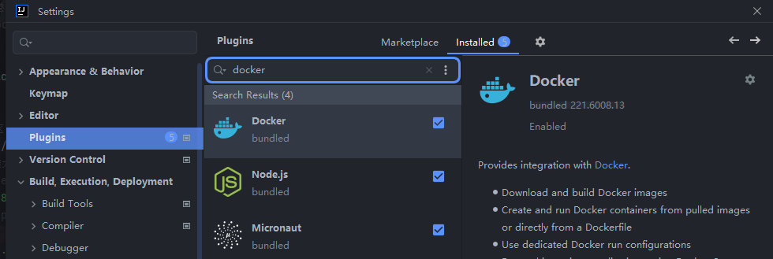
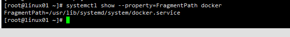
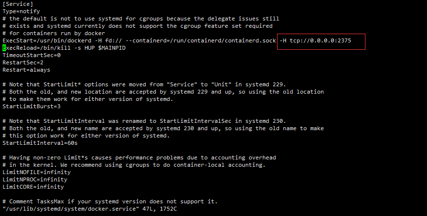
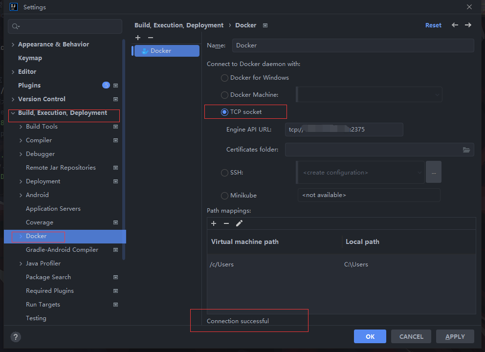
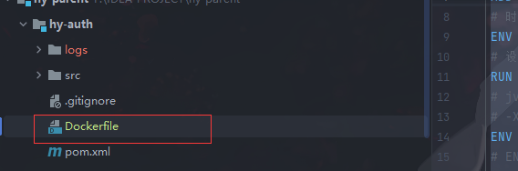
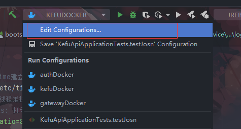
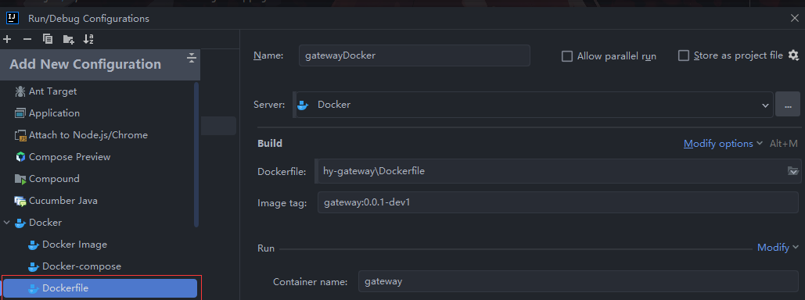
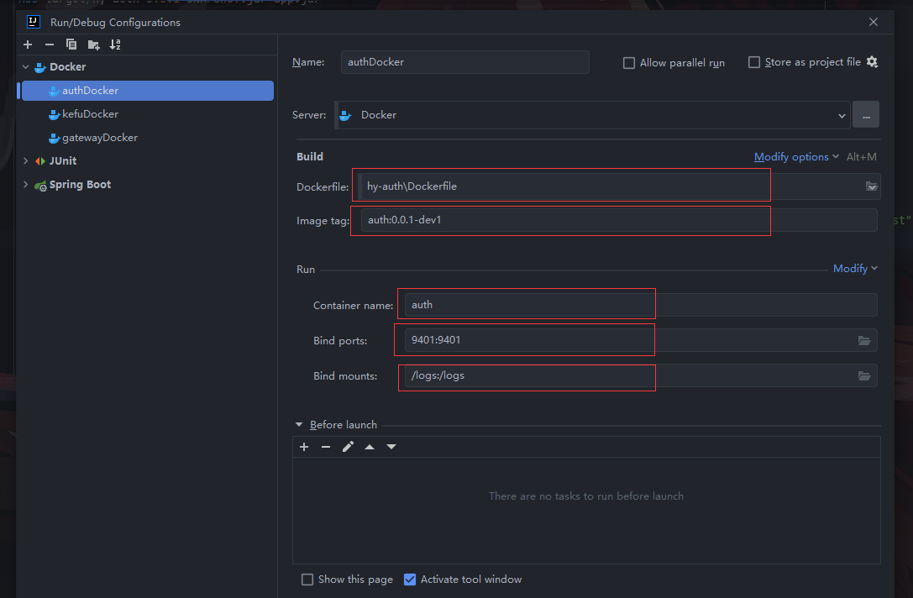
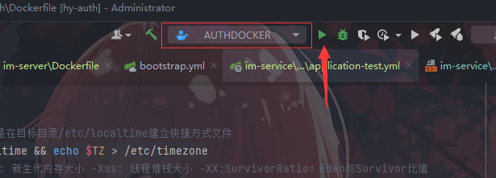
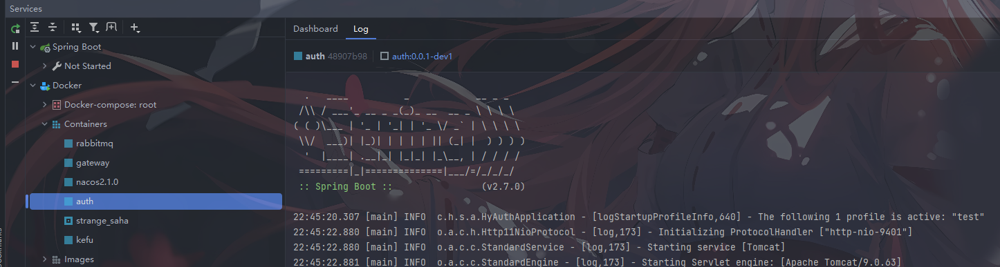

# Docker部署java项目

## IDEA整合docker

### 1.下载docker插件

> 新版idea是自带docker插件的



### 2.配置docker远程API

查看虚拟机中docker配置文件的地址

```
systemctl show --property=FragmentPath docker
```



vim或者vi打开配置文件进行配置

```
vim /usr/lib/systemd/system/docker.service
```

添加远程api启动命令

```

```



重启docker服务

```
systemctl daemon-reload
systemctl restart docker
```

### 3.idea配置docker服务



### 4.编写Dockerfile

```dockerfile
# 指定基础镜像
FROM fabric8/java-alpine-openjdk8-jre:1.9.0
# /tmp 目录作为容器数据卷目录，SpringBoot内嵌Tomcat容器默认使用/tmp作为工作目录，任何向 /tmp 中写入的信息不会记录进容器存储层，从而保证容器存储层的无状态化
# 在宿主机的/var/lib/docker目录下创建一个临时文件并把它链接到容器中的/tmp目录
VOLUME /tmp
# 复制jar包并重命名
ADD target/hy-auth-0.0.1-SNAPSHOT.jar app.jar
# 时区变量值为亚洲上海
ENV TZ=Asia/Shanghai
# 设置时区，如果不设置时区，就是默认时区;ln设置方法就是在目标目录/etc/localtime建立快捷方式文件
RUN ln -sf /usr/share/zoneinfo/$TZ /etc/localtime && echo $TZ > /etc/timezone
# jvm 参数 -xms: 初始堆大小 -Xmx: 最大堆大小 -Xmn: 新生代内存大小 -Xss: 线程堆栈大小 -XX:SurvivorRatio：Eden与Survivor比值
# -XX:+UseConcMarkSweepGC 设置老年代并发收集器CMS  -XX:+PrintGCDetails: 打印gc详情
ENV JAVA_OPTS="-Xms128m -Xmx1024m -Xmn512m -Xss512k -XX:SurvivorRatio=8 -XX:+UseConcMarkSweepGC -XX:+PrintGCDetails"
# ENV START_OPTS="--spring.profiles.active=prod"
# 运行jar包
RUN sh -c 'touch /app.jar'
# "参数-Djava.security.egd=file:/dev/./urandom" 是加快tomcat启动的
ENTRYPOINT ["java","-Djava.security.egd=file:/dev/./urandom","-Dfile.encoding=utf8","-jar","/app.jar","--spring.profiles.active=test"]
```

> 把Dockerfile放在项目根目录下，与src同级



### 5.docker配置

打开Edit Configurations



新建一个Configuration，选择Dockerfile



配置docker



参数解释

>Server：docker服务，就是第三步配置的docker服务
>
>Dockerfile：选择刚刚编写的Dockerfile文件的位置
>
>Image tag：生成的镜像名还有tag
>
>Container name：容器名
>
>Bind ports：对外暴露的端口，绑定的端口
>
>Bind mounts：挂载映射的文件目录

### 6.运行Docker

> 选择对应配置运行即可



