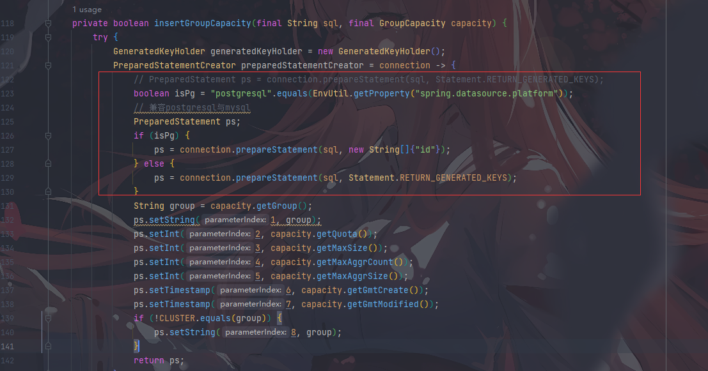

# nacos2.1适配pgsql

## 下载nacos2.1的源码

下载地址：https://github.com/alibaba/nacos


## 启动nacos

### 1.解决consistency模块实体类缺失问题

修改根目录pom，protobuf-java的版本改为3.19.3

```
<protobuf-java.version>3.19.3</protobuf-java.version>
```

编译consistency模块


### 2.解决istio模块包的的缺失问题

重新install该模块


### 3.解决启动报错Unable to start embedded Tomcat问题

主启动类配置单节点模式

```
-Dnacos.standalone=true
```


### 4.启动console模块下的Nacos


## 适配pgsql

### 1.添加PosrgreSQL的依赖

根目录的pom.xml

```xml
<properties>
···
<postgresql.version>42.5.1</postgresql.version>
···
</properties>
 
···
 
<dependency>
<groupId>org.postgresql</groupId>
<artifactId>postgresql</artifactId>
<version>${postgresql.version}</version>
</dependency>
```

config模块的pom.xml

```xml
<dependency>
<groupId>org.postgresql</groupId>
<artifactId>postgresql</artifactId>
</dependency>
```

naming模块的pom.xml

```xml
<dependency>
<groupId>org.postgresql</groupId>
<artifactId>postgresql</artifactId>
</dependency>
```

### 2.添加PostgreSQL驱动代码

**config模块**

com/alibaba/nacos/config/server/constant/PropertiesConstant.java

添加如下代码

```
public static final String POSTGRESQL = "postgresql";
```


com/alibaba/nacos/config/server/utils/PropertyUtil.java

修改loadSetting方法

```
String platform = getString(PropertiesConstant.SPRING_DATASOURCE_PLATFORM, "");
            setUseExternalDB(PropertiesConstant.MYSQL.equalsIgnoreCase(platform) || PropertiesConstant.POSTGRESQL.equalsIgnoreCase(platform));
```


com/alibaba/nacos/config/server/service/datasource/ExternalDataSourceProperties.java

添加如下代码

```
    private static final String JDBC_DRIVER_NAME_POSTGRESQL = "org.postgresql.Driver";
```

修改build方法

```java
List<HikariDataSource> build(Environment environment, Callback<HikariDataSource> callback) {
        List<HikariDataSource> dataSources = new ArrayList<>();
        Binder.get(environment).bind("db", Bindable.ofInstance(this));
        Preconditions.checkArgument(Objects.nonNull(num), "db.num is null");
        Preconditions.checkArgument(CollectionUtils.isNotEmpty(user), "db.user or db.user.[index] is null");
        Preconditions.checkArgument(CollectionUtils.isNotEmpty(password), "db.password or db.password.[index] is null");
        for (int index = 0; index < num; index++) {
            int currentSize = index + 1;
            Preconditions.checkArgument(url.size() >= currentSize, "db.url.%s is null", index);
            DataSourcePoolProperties poolProperties = DataSourcePoolProperties.build(environment);
            // 原代码 poolProperties.setDriverClassName(JDBC_DRIVER_NAME);
            // 适配pgsql代码
            if (PropertiesConstant.POSTGRESQL.equalsIgnoreCase(
                    EnvUtil.getProperty(PropertiesConstant.SPRING_DATASOURCE_PLATFORM))) {
                // 增加对postgresql数据库的支持
                poolProperties.setDriverClassName(JDBC_DRIVER_NAME_POSTGRESQL);
                System.out.println("jdbcDriverName=增加对postgresql数据库的支持" + JDBC_DRIVER_NAME_POSTGRESQL);
            } else {
                // 默认使用mysql驱动
                poolProperties.setDriverClassName(JDBC_DRIVER_NAME);
            }
            poolProperties.setJdbcUrl(url.get(index).trim());
            poolProperties.setUsername(getOrDefault(user, index, user.get(0)).trim());
            poolProperties.setPassword(getOrDefault(password, index, password.get(0)).trim());
            HikariDataSource ds = poolProperties.getDataSource();
            ds.setConnectionTestQuery(TEST_QUERY);
            ds.setIdleTimeout(TimeUnit.MINUTES.toMillis(10L));
            ds.setConnectionTimeout(TimeUnit.SECONDS.toMillis(3L));
            dataSources.add(ds);
            callback.accept(ds);
        }
        Preconditions.checkArgument(CollectionUtils.isNotEmpty(dataSources), "no datasource available");
        return dataSources;
    }
```


**core模块**

com/alibaba/nacos/core/listener/StartingApplicationListener.java

修改judgeStorageMode方法

```java
    private void judgeStorageMode(ConfigurableEnvironment env) {
        
        // External data sources are used by default in cluster mode
        // boolean useExternalStorage = (DEFAULT_DATABASE.equalsIgnoreCase(env.getProperty(DATASOURCE_PLATFORM_PROPERTY, DEFAULT_DATASOURCE_PLATFORM)));
        // 修改为支持 postgresql 与 mysql
        String platform = env.getProperty("spring.datasource.platform", "");
        boolean useExternalStorage = ("mysql".equalsIgnoreCase(platform) || "postgresql".equalsIgnoreCase(platform));

        // must initialize after setUseExternalDB
        // This value is true in stand-alone mode and false in cluster mode
        // If this value is set to true in cluster mode, nacos's distributed storage engine is turned on
        // default value is depend on ${nacos.standalone}
        
        if (!useExternalStorage) {
            boolean embeddedStorage = EnvUtil.getStandaloneMode() || Boolean.getBoolean("embeddedStorage");
            // If the embedded data source storage is not turned on, it is automatically
            // upgraded to the external data source storage, as before
            if (!embeddedStorage) {
                useExternalStorage = true;
            }
        }
        
        LOGGER.info("Nacos started successfully in {} mode. use {} storage",
                System.getProperty(MODE_PROPERTY_KEY_STAND_MODE), useExternalStorage ? DATASOURCE_MODE_EXTERNAL : DATASOURCE_MODE_EMBEDDED);
    }
```


## 兼容PostgreSQL

### 1.主键

> 由于postgresql无法通过Statement.RETURN_GENERATED_KEYS获取主键，因此只能显示的指定要寻找的主键

**config模块**

com/alibaba/nacos/config/server/service/capacity/GroupCapacityPersistService.java

修改insertGroupCapacity方法

```java
    private boolean insertGroupCapacity(final String sql, final GroupCapacity capacity) {
        try {
            GeneratedKeyHolder generatedKeyHolder = new GeneratedKeyHolder();
            PreparedStatementCreator preparedStatementCreator = connection -> {
                // PreparedStatement ps = connection.prepareStatement(sql, Statement.RETURN_GENERATED_KEYS);
                boolean isPg = "postgresql".equals(EnvUtil.getProperty("spring.datasource.platform"));
                // 兼容postgresql与mysql
                PreparedStatement ps;
                if (isPg) {
                    ps = connection.prepareStatement(sql, new String[]{"id"});
                } else {
                    ps = connection.prepareStatement(sql, Statement.RETURN_GENERATED_KEYS);
                }
                String group = capacity.getGroup();
                ps.setString(1, group);
                ps.setInt(2, capacity.getQuota());
                ps.setInt(3, capacity.getMaxSize());
                ps.setInt(4, capacity.getMaxAggrCount());
                ps.setInt(5, capacity.getMaxAggrSize());
                ps.setTimestamp(6, capacity.getGmtCreate());
                ps.setTimestamp(7, capacity.getGmtModified());
                if (!CLUSTER.equals(group)) {
                    ps.setString(8, group);
                }
                return ps;
            };
            jdbcTemplate.update(preparedStatementCreator, generatedKeyHolder);
            return generatedKeyHolder.getKey() != null;
        } catch (CannotGetJdbcConnectionException e) {
            FATAL_LOG.error("[db-error]", e);
            throw e;
        }
    }
```



com/alibaba/nacos/config/server/service/capacity/TenantCapacityPersistService.java

修改insertTenantCapacity方法

```java
public boolean insertTenantCapacity(final TenantCapacity tenantCapacity) {
        final String sql =
                "INSERT INTO tenant_capacity (tenant_id, quota, `usage`, `max_size`, max_aggr_count, max_aggr_size, "
                        + "gmt_create, gmt_modified) SELECT ?, ?, count(*), ?, ?, ?, ?, ? FROM config_info WHERE tenant_id=?;";
        try {
            GeneratedKeyHolder generatedKeyHolder = new GeneratedKeyHolder();
            PreparedStatementCreator preparedStatementCreator = connection -> {
                // PreparedStatement ps = connection.prepareStatement(sql, Statement.RETURN_GENERATED_KEYS);
                boolean isPg = "postgresql".equals(EnvUtil.getProperty("spring.datasource.platform"));
                // 兼容postgresql与mysql
                PreparedStatement ps;
                if (isPg) {
                    ps = connection.prepareStatement(sql, new String[]{"id"});
                } else {
                    ps = connection.prepareStatement(sql, Statement.RETURN_GENERATED_KEYS);
                }
                String tenant = tenantCapacity.getTenant();
                ps.setString(1, tenant);
                ps.setInt(2, tenantCapacity.getQuota());
                ps.setInt(3, tenantCapacity.getMaxSize());
                ps.setInt(4, tenantCapacity.getMaxAggrCount());
                ps.setInt(5, tenantCapacity.getMaxAggrSize());
                ps.setTimestamp(6, tenantCapacity.getGmtCreate());
                ps.setTimestamp(7, tenantCapacity.getGmtModified());
                ps.setString(8, tenantCapacity.getTenant());
                return ps;
            };
            jdbcTemplate.update(preparedStatementCreator, generatedKeyHolder);
            return generatedKeyHolder.getKey() != null;
        } catch (CannotGetJdbcConnectionException e) {
            FATAL_LOG.error("[db-error]", e);
            throw e;
        }
        
    }
```


com/alibaba/nacos/config/server/service/repository/extrnal/ExternalStoragePersistServiceImpl.java

修改addConfigInfoAtomic方法

```java
 // PreparedStatement ps = connection.prepareStatement(sql, Statement.RETURN_GENERATED_KEYS);
                    boolean isPg = "postgresql".equals(EnvUtil.getProperty("spring.datasource.platform"));
                    // 兼容postgresql与mysql
                    PreparedStatement ps;
                    if (isPg) {
                        ps = connection.prepareStatement(sql, new String[]{"id"});
                    } else {
                        ps = connection.prepareStatement(sql, Statement.RETURN_GENERATED_KEYS);
                    }
```


### 2.LIKE

**plugin-default-impl模块**

com/alibaba/nacos/plugin/auth/impl/persistence/ExternalRolePersistServiceImpl.java

修改findRolesLikeRoleName方法

```java
    public List<String> findRolesLikeRoleName(String role) {
        String sql = "SELECT role FROM roles WHERE role LIKE ? ";
        List<String> users = this.jt.queryForList(sql, new String[] {String.format("%%%s%%",role)}, String.class);
        return users;
    }
```


com/alibaba/nacos/plugin/auth/impl/persistence/ExternalUserPersistServiceImpl.java

修改findUserLikeUsername方法

```java
   public List<String> findUserLikeUsername(String username) {
        String sql = "SELECT username FROM users WHERE username LIKE ? ";
        List<String> users = this.jt.queryForList(sql, new String[] {String.format("%%%s%%",username)}, String.class);
        return users;
    }
```


### 3.LIMIT

**config模块**

com/alibaba/nacos/config/server/service/repository/extrnal/ExternalStoragePersistServiceImpl.java

兼容所有的limit语句

添加如下代码

```java
private static final boolean isPg = "postgresql".equals(EnvUtil.getProperty("spring.datasource.platform"));
```


修改所有limit相关代码

例如findAllConfigInfo方法

```java
public Page<ConfigInfo> findAllConfigInfo(final int pageNo, final int pageSize, final String tenant) {
    String tenantTmp = StringUtils.isBlank(tenant) ? StringUtils.EMPTY : tenant;
    String sqlCountRows = "SELECT count(*) FROM config_info";
    String sqlFetchRows ="";
    if(isPg){
        sqlFetchRows = " SELECT t.id,data_id,group_id,tenant_id,app_name,content,md5 "
                + " FROM (  SELECT id FROM config_info WHERE tenant_id LIKE ? ORDER BY id OFFSET ? LIMIT ? )"
                + " g, config_info t  WHERE g.id = t.id ";
    } else {
        sqlFetchRows = " SELECT t.id,data_id,group_id,tenant_id,app_name,content,md5 "
                + " FROM (  SELECT id FROM config_info WHERE tenant_id LIKE ? ORDER BY id LIMIT ?,? )"
                + " g, config_info t  WHERE g.id = t.id ";
    }

    
    PaginationHelper<ConfigInfo> helper = createPaginationHelper();
    try {
        return helper.fetchPageLimit(sqlCountRows, sqlFetchRows,
                new Object[] {generateLikeArgument(tenantTmp), (pageNo - 1) * pageSize, pageSize}, pageNo, pageSize,
                CONFIG_INFO_ROW_MAPPER);
    } catch (CannotGetJdbcConnectionException e) {
        LogUtil.FATAL_LOG.error("[db-error] " + e.toString(), e);
        throw e;
    }
}
```


com/alibaba/nacos/config/server/service/repository/extrnal/ExternalStoragePaginationHelperImpl.java

添加以下代码

```
private static final boolean isPg = "postgresql".equals(EnvUtil.getProperty("spring.datasource.platform"));
```

修改fetchPage方法

```
        String selectSql = "";
        if (isDerby()) {
            selectSql = sqlFetchRows + " OFFSET " + startRow + " ROWS FETCH NEXT " + pageSize + " ROWS ONLY";
        } else if (lastMaxId != null) {
            selectSql = sqlFetchRows + " AND id > " + lastMaxId + " ORDER BY id ASC" + " LIMIT " + 0 + "," + pageSize;
        } else {
            if(isPg){
                selectSql = sqlFetchRows + " OFFSET " + startRow + " LIMIT " + pageSize;
            }else {
                selectSql = sqlFetchRows + " LIMIT " + startRow + "," + pageSize;
            }

        }
```


### 4.BUG处理

**config模块**

修改findAllConfigInfoForDumpAll方法

params.toArray() 替换为 new Object[] {(pageNo - 1) * pageSize, pageSize}


com/alibaba/nacos/config/server/service/repository/embedded/EmbeddedStoragePersistServiceImpl.java

修改findAllConfigInfoForDumpAll方法

EMPTY_ARRAY 替换为 new Object[] {(pageNo - 1) * pageSize, pageSize}


### 5.配置文件

application.properties

```properties
#*************** Config Module Related Configurations ***************#
### If use MySQL as datasource:
spring.datasource.platform=postgresql

### Count of DB:
db.num=1

### Connect URL of DB:
db.url.0=jdbc:postgresql://127.0.0.1:5432/nacos_config?characterEncoding=utf8&connectTimeout=1000&socketTimeout=3000&autoReconnect=true&useUnicode=true&useSSL=false&serverTimezone=UTC
db.user.0=postgres
db.password.0=123456
```

nacos-postgresql.sql

```sql
DROP SEQUENCE IF EXISTS "public"."config_info_id_seq";
CREATE SEQUENCE "public"."config_info_id_seq"
INCREMENT 1
MINVALUE  1
MAXVALUE 9223372036854775807
START 1
CACHE 1;
 
DROP SEQUENCE IF EXISTS "public"."config_info_aggr_id_seq";
CREATE SEQUENCE "public"."config_info_aggr_id_seq"
INCREMENT 1
MINVALUE  1
MAXVALUE 9223372036854775807
START 1
CACHE 1;
 
DROP SEQUENCE IF EXISTS "public"."config_info_beta_id_seq";
CREATE SEQUENCE "public"."config_info_beta_id_seq"
INCREMENT 1
MINVALUE  1
MAXVALUE 9223372036854775807
START 1
CACHE 1;
 
DROP SEQUENCE IF EXISTS "public"."config_info_tag_id_seq";
CREATE SEQUENCE "public"."config_info_tag_id_seq"
INCREMENT 1
MINVALUE  1
MAXVALUE 9223372036854775807
START 1
CACHE 1;
 
DROP SEQUENCE IF EXISTS "public"."config_tags_relation_nid_seq";
CREATE SEQUENCE "public"."config_tags_relation_nid_seq"
INCREMENT 1
MINVALUE  1
MAXVALUE 9223372036854775807
START 1
CACHE 1;
 
DROP SEQUENCE IF EXISTS "public"."group_capacity_id_seq";
CREATE SEQUENCE "public"."group_capacity_id_seq"
INCREMENT 1
MINVALUE  1
MAXVALUE 9223372036854775807
START 1
CACHE 1;
 
DROP SEQUENCE IF EXISTS "public"."his_config_info_nid_seq";
CREATE SEQUENCE "public"."his_config_info_nid_seq"
INCREMENT 1
MINVALUE  1
MAXVALUE 9223372036854775807
START 1
CACHE 1;
 
DROP SEQUENCE IF EXISTS "public"."tenant_capacity_id_seq";
CREATE SEQUENCE "public"."tenant_capacity_id_seq"
INCREMENT 1
MINVALUE  1
MAXVALUE 9223372036854775807
START 1
CACHE 1;
 
DROP SEQUENCE IF EXISTS "public"."tenant_info_id_seq";
CREATE SEQUENCE "public"."tenant_info_id_seq"
INCREMENT 1
MINVALUE  1
MAXVALUE 9223372036854775807
START 1
CACHE 1;
-- ----------------------------
-- Table structure for config_info
-- ----------------------------
DROP TABLE IF EXISTS "public"."config_info";
CREATE TABLE "public"."config_info" (
  "id" int4 NOT NULL DEFAULT nextval('config_info_id_seq'::regclass),
  "data_id" varchar(255) COLLATE "pg_catalog"."default" NOT NULL,
  "group_id" varchar(255) COLLATE "pg_catalog"."default" DEFAULT NULL::character varying,
  "content" text COLLATE "pg_catalog"."default" NOT NULL,
  "md5" varchar(32) COLLATE "pg_catalog"."default" DEFAULT NULL::character varying,
  "gmt_create" timestamp(6) NOT NULL DEFAULT '2010-05-05 00:00:00'::timestamp without time zone,
  "gmt_modified" timestamp(6) NOT NULL DEFAULT '2010-05-05 00:00:00'::timestamp without time zone,
  "src_user" text COLLATE "pg_catalog"."default",
  "src_ip" varchar(50) COLLATE "pg_catalog"."default" DEFAULT NULL::character varying,
  "app_name" varchar(128) COLLATE "pg_catalog"."default" DEFAULT NULL::character varying,
  "tenant_id" varchar(128) COLLATE "pg_catalog"."default" DEFAULT ''::character varying,
  "c_desc" varchar(256) COLLATE "pg_catalog"."default" DEFAULT NULL::character varying,
  "c_use" varchar(64) COLLATE "pg_catalog"."default" DEFAULT NULL::character varying,
  "effect" varchar(64) COLLATE "pg_catalog"."default" DEFAULT NULL::character varying,
  "type" varchar(64) COLLATE "pg_catalog"."default" DEFAULT NULL::character varying,
  "c_schema" text COLLATE "pg_catalog"."default"
)
;
COMMENT ON COLUMN "public"."config_info"."id" IS 'id';
COMMENT ON COLUMN "public"."config_info"."content" IS 'content';
COMMENT ON COLUMN "public"."config_info"."md5" IS 'md5';
COMMENT ON COLUMN "public"."config_info"."gmt_create" IS '创建时间';
COMMENT ON COLUMN "public"."config_info"."gmt_modified" IS '修改时间';
COMMENT ON COLUMN "public"."config_info"."src_user" IS 'source user';
COMMENT ON COLUMN "public"."config_info"."src_ip" IS 'source ip';
COMMENT ON COLUMN "public"."config_info"."tenant_id" IS '租户字段';
COMMENT ON TABLE "public"."config_info" IS 'config_info';
 
-- ----------------------------
-- Table structure for config_info_aggr
-- ----------------------------
DROP TABLE IF EXISTS "public"."config_info_aggr";
CREATE TABLE "public"."config_info_aggr" (
  "id" int4 NOT NULL DEFAULT nextval('config_info_aggr_id_seq'::regclass),
  "data_id" varchar(255) COLLATE "pg_catalog"."default" NOT NULL,
  "group_id" varchar(255) COLLATE "pg_catalog"."default" NOT NULL,
  "datum_id" varchar(255) COLLATE "pg_catalog"."default" NOT NULL,
  "content" text COLLATE "pg_catalog"."default" NOT NULL,
  "gmt_modified" timestamp(6) NOT NULL,
  "app_name" varchar(128) COLLATE "pg_catalog"."default" DEFAULT NULL::character varying,
  "tenant_id" varchar(128) COLLATE "pg_catalog"."default" DEFAULT ''::character varying
)
;
COMMENT ON COLUMN "public"."config_info_aggr"."id" IS 'id';
COMMENT ON COLUMN "public"."config_info_aggr"."data_id" IS 'data_id';
COMMENT ON COLUMN "public"."config_info_aggr"."group_id" IS 'group_id';
COMMENT ON COLUMN "public"."config_info_aggr"."datum_id" IS 'datum_id';
COMMENT ON COLUMN "public"."config_info_aggr"."content" IS '内容';
COMMENT ON COLUMN "public"."config_info_aggr"."gmt_modified" IS '修改时间';
COMMENT ON COLUMN "public"."config_info_aggr"."tenant_id" IS '租户字段';
COMMENT ON TABLE "public"."config_info_aggr" IS '增加租户字段';
 
-- ----------------------------
-- Table structure for config_info_beta
-- ----------------------------
DROP TABLE IF EXISTS "public"."config_info_beta";
CREATE TABLE "public"."config_info_beta" (
  "id" int4 NOT NULL DEFAULT nextval('config_info_beta_id_seq'::regclass),
  "data_id" varchar(255) COLLATE "pg_catalog"."default" NOT NULL,
  "group_id" varchar(128) COLLATE "pg_catalog"."default" NOT NULL,
  "app_name" varchar(128) COLLATE "pg_catalog"."default" DEFAULT NULL::character varying,
  "content" text COLLATE "pg_catalog"."default" NOT NULL,
  "beta_ips" varchar(1024) COLLATE "pg_catalog"."default" DEFAULT NULL::character varying,
  "md5" varchar(32) COLLATE "pg_catalog"."default" DEFAULT NULL::character varying,
  "gmt_create" timestamp(6) NOT NULL DEFAULT '2010-05-05 00:00:00'::timestamp without time zone,
  "gmt_modified" timestamp(6) NOT NULL DEFAULT '2010-05-05 00:00:00'::timestamp without time zone,
  "src_user" text COLLATE "pg_catalog"."default",
  "src_ip" varchar(128) COLLATE "pg_catalog"."default" DEFAULT NULL::character varying,
  "tenant_id" varchar(128) COLLATE "pg_catalog"."default" DEFAULT ''::character varying
)
;
COMMENT ON COLUMN "public"."config_info_beta"."id" IS 'id';
COMMENT ON COLUMN "public"."config_info_beta"."data_id" IS 'data_id';
COMMENT ON COLUMN "public"."config_info_beta"."group_id" IS 'group_id';
COMMENT ON COLUMN "public"."config_info_beta"."app_name" IS 'app_name';
COMMENT ON COLUMN "public"."config_info_beta"."content" IS 'content';
COMMENT ON COLUMN "public"."config_info_beta"."beta_ips" IS 'betaIps';
COMMENT ON COLUMN "public"."config_info_beta"."md5" IS 'md5';
COMMENT ON COLUMN "public"."config_info_beta"."gmt_create" IS '创建时间';
COMMENT ON COLUMN "public"."config_info_beta"."gmt_modified" IS '修改时间';
COMMENT ON COLUMN "public"."config_info_beta"."src_user" IS 'source user';
COMMENT ON COLUMN "public"."config_info_beta"."src_ip" IS 'source ip';
COMMENT ON COLUMN "public"."config_info_beta"."tenant_id" IS '租户字段';
COMMENT ON TABLE "public"."config_info_beta" IS 'config_info_beta';
 
-- ----------------------------
-- Table structure for config_info_tag
-- ----------------------------
DROP TABLE IF EXISTS "public"."config_info_tag";
CREATE TABLE "public"."config_info_tag" (
  "id" int4 NOT NULL DEFAULT nextval('config_info_tag_id_seq'::regclass),
  "data_id" varchar(255) COLLATE "pg_catalog"."default" NOT NULL,
  "group_id" varchar(128) COLLATE "pg_catalog"."default" NOT NULL,
  "tenant_id" varchar(128) COLLATE "pg_catalog"."default" DEFAULT ''::character varying,
  "tag_id" varchar(128) COLLATE "pg_catalog"."default" NOT NULL,
  "app_name" varchar(128) COLLATE "pg_catalog"."default" DEFAULT NULL::character varying,
  "content" text COLLATE "pg_catalog"."default" NOT NULL,
  "md5" varchar(32) COLLATE "pg_catalog"."default" DEFAULT NULL::character varying,
  "gmt_create" timestamp(6) NOT NULL DEFAULT '2010-05-05 00:00:00'::timestamp without time zone,
  "gmt_modified" timestamp(6) NOT NULL DEFAULT '2010-05-05 00:00:00'::timestamp without time zone,
  "src_user" text COLLATE "pg_catalog"."default",
  "src_ip" varchar(50) COLLATE "pg_catalog"."default" DEFAULT NULL::character varying
)
;
COMMENT ON COLUMN "public"."config_info_tag"."id" IS 'id';
COMMENT ON COLUMN "public"."config_info_tag"."data_id" IS 'data_id';
COMMENT ON COLUMN "public"."config_info_tag"."group_id" IS 'group_id';
COMMENT ON COLUMN "public"."config_info_tag"."tenant_id" IS '租户字段';
COMMENT ON COLUMN "public"."config_info_tag"."tag_id" IS 'tag_id';
COMMENT ON COLUMN "public"."config_info_tag"."app_name" IS 'app_name';
COMMENT ON COLUMN "public"."config_info_tag"."content" IS 'content';
COMMENT ON COLUMN "public"."config_info_tag"."md5" IS 'md5';
COMMENT ON COLUMN "public"."config_info_tag"."gmt_create" IS '创建时间';
COMMENT ON COLUMN "public"."config_info_tag"."gmt_modified" IS '修改时间';
COMMENT ON COLUMN "public"."config_info_tag"."src_user" IS 'source user';
COMMENT ON COLUMN "public"."config_info_tag"."src_ip" IS 'source ip';
COMMENT ON TABLE "public"."config_info_tag" IS 'config_info_tag';
 
-- ----------------------------
-- Table structure for config_tags_relation
-- ----------------------------
DROP TABLE IF EXISTS "public"."config_tags_relation";
CREATE TABLE "public"."config_tags_relation" (
  "id" int8 NOT NULL,
  "tag_name" varchar(128) COLLATE "pg_catalog"."default" NOT NULL,
  "tag_type" varchar(64) COLLATE "pg_catalog"."default" DEFAULT NULL::character varying,
  "data_id" varchar(255) COLLATE "pg_catalog"."default" NOT NULL,
  "group_id" varchar(128) COLLATE "pg_catalog"."default" NOT NULL,
  "tenant_id" varchar(128) COLLATE "pg_catalog"."default" DEFAULT ''::character varying,
  "nid" int4 NOT NULL DEFAULT nextval('config_tags_relation_nid_seq'::regclass)
)
;
COMMENT ON COLUMN "public"."config_tags_relation"."id" IS 'id';
COMMENT ON COLUMN "public"."config_tags_relation"."tag_name" IS 'tag_name';
COMMENT ON COLUMN "public"."config_tags_relation"."tag_type" IS 'tag_type';
COMMENT ON COLUMN "public"."config_tags_relation"."data_id" IS 'data_id';
COMMENT ON COLUMN "public"."config_tags_relation"."group_id" IS 'group_id';
COMMENT ON COLUMN "public"."config_tags_relation"."tenant_id" IS 'tenant_id';
COMMENT ON TABLE "public"."config_tags_relation" IS 'config_tag_relation';
 
-- ----------------------------
-- Table structure for group_capacity
-- ----------------------------
DROP TABLE IF EXISTS "public"."group_capacity";
CREATE TABLE "public"."group_capacity" (
  "id" int4 NOT NULL DEFAULT nextval('group_capacity_id_seq'::regclass),
  "group_id" varchar(128) COLLATE "pg_catalog"."default" NOT NULL DEFAULT ''::character varying,
  "quota" int4 NOT NULL DEFAULT 0,
  "usage" int4 NOT NULL DEFAULT 0,
  "max_size" int4 NOT NULL DEFAULT 0,
  "max_aggr_count" int4 NOT NULL DEFAULT 0,
  "max_aggr_size" int4 NOT NULL DEFAULT 0,
  "max_history_count" int4 NOT NULL DEFAULT 0,
  "gmt_create" timestamp(6) NOT NULL DEFAULT '2010-05-05 00:00:00'::timestamp without time zone,
  "gmt_modified" timestamp(6) NOT NULL DEFAULT '2010-05-05 00:00:00'::timestamp without time zone
)
;
COMMENT ON COLUMN "public"."group_capacity"."id" IS '主键ID';
COMMENT ON COLUMN "public"."group_capacity"."group_id" IS 'Group ID，空字符表示整个集群';
COMMENT ON COLUMN "public"."group_capacity"."quota" IS '配额，0表示使用默认值';
COMMENT ON COLUMN "public"."group_capacity"."usage" IS '使用量';
COMMENT ON COLUMN "public"."group_capacity"."max_size" IS '单个配置大小上限，单位为字节，0表示使用默认值';
COMMENT ON COLUMN "public"."group_capacity"."max_aggr_count" IS '聚合子配置最大个数，，0表示使用默认值';
COMMENT ON COLUMN "public"."group_capacity"."max_aggr_size" IS '单个聚合数据的子配置大小上限，单位为字节，0表示使用默认值';
COMMENT ON COLUMN "public"."group_capacity"."max_history_count" IS '最大变更历史数量';
COMMENT ON COLUMN "public"."group_capacity"."gmt_create" IS '创建时间';
COMMENT ON COLUMN "public"."group_capacity"."gmt_modified" IS '修改时间';
COMMENT ON TABLE "public"."group_capacity" IS '集群、各Group容量信息表';
 
-- ----------------------------
-- Table structure for his_config_info
-- ----------------------------
DROP TABLE IF EXISTS "public"."his_config_info";
CREATE TABLE "public"."his_config_info" (
  "id" int8 NOT NULL,
  "nid" int4 NOT NULL DEFAULT nextval('his_config_info_nid_seq'::regclass),
  "data_id" varchar(255) COLLATE "pg_catalog"."default" NOT NULL,
  "group_id" varchar(128) COLLATE "pg_catalog"."default" NOT NULL,
  "app_name" varchar(128) COLLATE "pg_catalog"."default" DEFAULT NULL::character varying,
  "content" text COLLATE "pg_catalog"."default" NOT NULL,
  "md5" varchar(32) COLLATE "pg_catalog"."default" DEFAULT NULL::character varying,
  "gmt_create" timestamp(6) NOT NULL DEFAULT '2010-05-05 00:00:00'::timestamp without time zone,
  "gmt_modified" timestamp(6) NOT NULL DEFAULT '2010-05-05 00:00:00'::timestamp without time zone,
  "src_user" text COLLATE "pg_catalog"."default",
  "src_ip" varchar(50) COLLATE "pg_catalog"."default" DEFAULT NULL::character varying,
  "op_type" char(10) COLLATE "pg_catalog"."default" DEFAULT NULL::bpchar,
  "tenant_id" varchar(128) COLLATE "pg_catalog"."default" DEFAULT ''::character varying
)
;
COMMENT ON COLUMN "public"."his_config_info"."app_name" IS 'app_name';
COMMENT ON COLUMN "public"."his_config_info"."tenant_id" IS '租户字段';
COMMENT ON TABLE "public"."his_config_info" IS '多租户改造';
 
-- ----------------------------
-- Table structure for permissions
-- ----------------------------
DROP TABLE IF EXISTS "public"."permissions";
CREATE TABLE "public"."permissions" (
  "role" varchar(50) COLLATE "pg_catalog"."default" NOT NULL,
  "resource" varchar(255) COLLATE "pg_catalog"."default" NOT NULL,
  "action" varchar(8) COLLATE "pg_catalog"."default" NOT NULL
)
;
 
-- ----------------------------
-- Table structure for roles
-- ----------------------------
DROP TABLE IF EXISTS "public"."roles";
CREATE TABLE "public"."roles" (
  "username" varchar(50) COLLATE "pg_catalog"."default" NOT NULL,
  "role" varchar(50) COLLATE "pg_catalog"."default" NOT NULL
)
;
 
-- ----------------------------
-- Table structure for tenant_capacity
-- ----------------------------
DROP TABLE IF EXISTS "public"."tenant_capacity";
CREATE TABLE "public"."tenant_capacity" (
  "id" int4 NOT NULL DEFAULT nextval('tenant_capacity_id_seq'::regclass),
  "tenant_id" varchar(128) COLLATE "pg_catalog"."default" NOT NULL DEFAULT ''::character varying,
  "quota" int4 NOT NULL DEFAULT 0,
  "usage" int4 NOT NULL DEFAULT 0,
  "max_size" int4 NOT NULL DEFAULT 0,
  "max_aggr_count" int4 NOT NULL DEFAULT 0,
  "max_aggr_size" int4 NOT NULL DEFAULT 0,
  "max_history_count" int4 NOT NULL DEFAULT 0,
  "gmt_create" timestamp(6) NOT NULL DEFAULT '2010-05-05 00:00:00'::timestamp without time zone,
  "gmt_modified" timestamp(6) NOT NULL DEFAULT '2010-05-05 00:00:00'::timestamp without time zone
)
;
COMMENT ON COLUMN "public"."tenant_capacity"."id" IS '主键ID';
COMMENT ON COLUMN "public"."tenant_capacity"."tenant_id" IS 'Tenant ID';
COMMENT ON COLUMN "public"."tenant_capacity"."quota" IS '配额，0表示使用默认值';
COMMENT ON COLUMN "public"."tenant_capacity"."usage" IS '使用量';
COMMENT ON COLUMN "public"."tenant_capacity"."max_size" IS '单个配置大小上限，单位为字节，0表示使用默认值';
COMMENT ON COLUMN "public"."tenant_capacity"."max_aggr_count" IS '聚合子配置最大个数';
COMMENT ON COLUMN "public"."tenant_capacity"."max_aggr_size" IS '单个聚合数据的子配置大小上限，单位为字节，0表示使用默认值';
COMMENT ON COLUMN "public"."tenant_capacity"."max_history_count" IS '最大变更历史数量';
COMMENT ON COLUMN "public"."tenant_capacity"."gmt_create" IS '创建时间';
COMMENT ON COLUMN "public"."tenant_capacity"."gmt_modified" IS '修改时间';
COMMENT ON TABLE "public"."tenant_capacity" IS '租户容量信息表';
 
-- ----------------------------
-- Table structure for tenant_info
-- ----------------------------
DROP TABLE IF EXISTS "public"."tenant_info";
CREATE TABLE "public"."tenant_info" (
  "id" int4 NOT NULL DEFAULT nextval('tenant_info_id_seq'::regclass),
  "kp" varchar(128) COLLATE "pg_catalog"."default" NOT NULL,
  "tenant_id" varchar(128) COLLATE "pg_catalog"."default" DEFAULT ''::character varying,
  "tenant_name" varchar(128) COLLATE "pg_catalog"."default" DEFAULT ''::character varying,
  "tenant_desc" varchar(256) COLLATE "pg_catalog"."default" DEFAULT NULL::character varying,
  "create_source" varchar(32) COLLATE "pg_catalog"."default" DEFAULT NULL::character varying,
  "gmt_create" int8 NOT NULL,
  "gmt_modified" int8 NOT NULL
)
;
COMMENT ON COLUMN "public"."tenant_info"."id" IS 'id';
COMMENT ON COLUMN "public"."tenant_info"."kp" IS 'kp';
COMMENT ON COLUMN "public"."tenant_info"."tenant_id" IS 'tenant_id';
COMMENT ON COLUMN "public"."tenant_info"."tenant_name" IS 'tenant_name';
COMMENT ON COLUMN "public"."tenant_info"."tenant_desc" IS 'tenant_desc';
COMMENT ON COLUMN "public"."tenant_info"."create_source" IS 'create_source';
COMMENT ON COLUMN "public"."tenant_info"."gmt_create" IS '创建时间';
COMMENT ON COLUMN "public"."tenant_info"."gmt_modified" IS '修改时间';
COMMENT ON TABLE "public"."tenant_info" IS 'tenant_info';
 
-- ----------------------------
-- Table structure for users
-- ----------------------------
DROP TABLE IF EXISTS "public"."users";
CREATE TABLE "public"."users" (
  "username" varchar(50) COLLATE "pg_catalog"."default" NOT NULL,
  "password" varchar(500) COLLATE "pg_catalog"."default" NOT NULL,
  "enabled" bool NOT NULL
)
;
 
-- ----------------------------
-- Uniques structure for table config_info
-- ----------------------------
ALTER TABLE "public"."config_info" ADD CONSTRAINT "uk_configinfo_datagrouptenant" UNIQUE ("data_id", "group_id", "tenant_id");
 
-- ----------------------------
-- Primary Key structure for table config_info
-- ----------------------------
ALTER TABLE "public"."config_info" ADD CONSTRAINT "config_info_pkey" PRIMARY KEY ("id");
 
-- ----------------------------
-- Uniques structure for table config_info_aggr
-- ----------------------------
ALTER TABLE "public"."config_info_aggr" ADD CONSTRAINT "uk_configinfoaggr_datagrouptenantdatum" UNIQUE ("data_id", "group_id", "tenant_id", "datum_id");
 
-- ----------------------------
-- Primary Key structure for table config_info_aggr
-- ----------------------------
ALTER TABLE "public"."config_info_aggr" ADD CONSTRAINT "config_info_aggr_pkey" PRIMARY KEY ("id");
 
-- ----------------------------
-- Uniques structure for table config_info_beta
-- ----------------------------
ALTER TABLE "public"."config_info_beta" ADD CONSTRAINT "uk_configinfobeta_datagrouptenant" UNIQUE ("data_id", "group_id", "tenant_id");
 
-- ----------------------------
-- Primary Key structure for table config_info_beta
-- ----------------------------
ALTER TABLE "public"."config_info_beta" ADD CONSTRAINT "config_info_beta_pkey" PRIMARY KEY ("id");
 
-- ----------------------------
-- Uniques structure for table config_info_tag
-- ----------------------------
ALTER TABLE "public"."config_info_tag" ADD CONSTRAINT "uk_configinfotag_datagrouptenanttag" UNIQUE ("data_id", "group_id", "tenant_id", "tag_id");
 
-- ----------------------------
-- Primary Key structure for table config_info_tag
-- ----------------------------
ALTER TABLE "public"."config_info_tag" ADD CONSTRAINT "config_info_tag_pkey" PRIMARY KEY ("id");
 
-- ----------------------------
-- Uniques structure for table config_tags_relation
-- ----------------------------
ALTER TABLE "public"."config_tags_relation" ADD CONSTRAINT "uk_configtagrelation_configidtag" UNIQUE ("id", "tag_name", "tag_type");
 
-- ----------------------------
-- Primary Key structure for table config_tags_relation
-- ----------------------------
ALTER TABLE "public"."config_tags_relation" ADD CONSTRAINT "config_tags_relation_pkey" PRIMARY KEY ("nid");
 
-- ----------------------------
-- Uniques structure for table group_capacity
-- ----------------------------
ALTER TABLE "public"."group_capacity" ADD CONSTRAINT "uk_group_id" UNIQUE ("group_id");
 
-- ----------------------------
-- Checks structure for table group_capacity
-- ----------------------------
ALTER TABLE "public"."group_capacity" ADD CONSTRAINT "group_capacity_max_aggr_count_check" CHECK (max_aggr_count >= 0);
ALTER TABLE "public"."group_capacity" ADD CONSTRAINT "group_capacity_quota_check" CHECK (quota >= 0);
ALTER TABLE "public"."group_capacity" ADD CONSTRAINT "group_capacity_max_history_count_check" CHECK (max_history_count >= 0);
ALTER TABLE "public"."group_capacity" ADD CONSTRAINT "group_capacity_max_aggr_size_check" CHECK (max_aggr_size >= 0);
ALTER TABLE "public"."group_capacity" ADD CONSTRAINT "group_capacity_usage_check" CHECK (usage >= 0);
ALTER TABLE "public"."group_capacity" ADD CONSTRAINT "group_capacity_max_size_check" CHECK (max_size >= 0);
 
-- ----------------------------
-- Primary Key structure for table group_capacity
-- ----------------------------
ALTER TABLE "public"."group_capacity" ADD CONSTRAINT "group_capacity_pkey" PRIMARY KEY ("id");
 
-- ----------------------------
-- Checks structure for table his_config_info
-- ----------------------------
ALTER TABLE "public"."his_config_info" ADD CONSTRAINT "his_config_info_id_check" CHECK (id >= 0);
ALTER TABLE "public"."his_config_info" ADD CONSTRAINT "his_config_info_nid_check" CHECK (nid >= 0);
 
-- ----------------------------
-- Primary Key structure for table his_config_info
-- ----------------------------
ALTER TABLE "public"."his_config_info" ADD CONSTRAINT "his_config_info_pkey" PRIMARY KEY ("nid");
 
-- ----------------------------
-- Uniques structure for table tenant_capacity
-- ----------------------------
ALTER TABLE "public"."tenant_capacity" ADD CONSTRAINT "uk_tenant_id" UNIQUE ("tenant_id");
 
-- ----------------------------
-- Checks structure for table tenant_capacity
-- ----------------------------
ALTER TABLE "public"."tenant_capacity" ADD CONSTRAINT "tenant_capacity_max_size_check" CHECK (max_size >= 0);
ALTER TABLE "public"."tenant_capacity" ADD CONSTRAINT "tenant_capacity_id_check" CHECK (id >= 0);
ALTER TABLE "public"."tenant_capacity" ADD CONSTRAINT "tenant_capacity_max_aggr_size_check" CHECK (max_aggr_size >= 0);
ALTER TABLE "public"."tenant_capacity" ADD CONSTRAINT "tenant_capacity_max_history_count_check" CHECK (max_history_count >= 0);
ALTER TABLE "public"."tenant_capacity" ADD CONSTRAINT "tenant_capacity_max_aggr_count_check" CHECK (max_aggr_count >= 0);
ALTER TABLE "public"."tenant_capacity" ADD CONSTRAINT "tenant_capacity_quota_check" CHECK (quota >= 0);
ALTER TABLE "public"."tenant_capacity" ADD CONSTRAINT "tenant_capacity_usage_check" CHECK (usage >= 0);
 
-- ----------------------------
-- Primary Key structure for table tenant_capacity
-- ----------------------------
ALTER TABLE "public"."tenant_capacity" ADD CONSTRAINT "tenant_capacity_pkey" PRIMARY KEY ("id");
 
-- ----------------------------
-- Uniques structure for table tenant_info
-- ----------------------------
ALTER TABLE "public"."tenant_info" ADD CONSTRAINT "uk_tenant_info_kptenantid" UNIQUE ("kp", "tenant_id");
 
-- ----------------------------
-- Primary Key structure for table tenant_info
-- ----------------------------
ALTER TABLE "public"."tenant_info" ADD CONSTRAINT "tenant_info_pkey" PRIMARY KEY ("id");
 
-- ----------------------------
-- Primary Key structure for table users
-- ----------------------------
ALTER TABLE "public"."users" ADD CONSTRAINT "users_pkey" PRIMARY KEY ("username");
 
 
INSERT INTO users (username, password, enabled) VALUES ('nacos', '$2a$10$EuWPZHzz32dJN7jexM34MOeYirDdFAZm2kuWj7VEOJhhZkDrxfvUu', TRUE);
 
INSERT INTO roles (username, role) VALUES ('nacos', 'ROLE_ADMIN');
```

## 源码编译

### 1.添加maven插件版本

在consolo模块的pom添加spring-boot-maven-plugin的版本


### 2.源码编译

在nacos源码根目录下打开terminal窗口执行，编译成功之后，distribution模块下生成target目录，里面有编译之后的文件

```
mvn -Prelease-nacos '-Dmaven.test.skip=true' '-Dcheckstyle.skip=true' '-Dpmd.skip=true' clean install -U
```


### 3.启动测试

配置好配置文件

进入bin目录下启动测试

```
startup.cmd -m standalone
```

