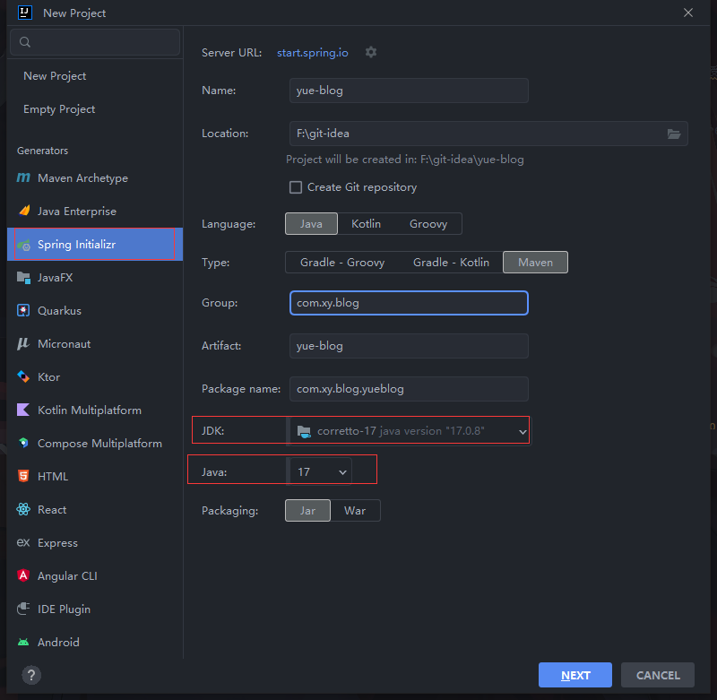
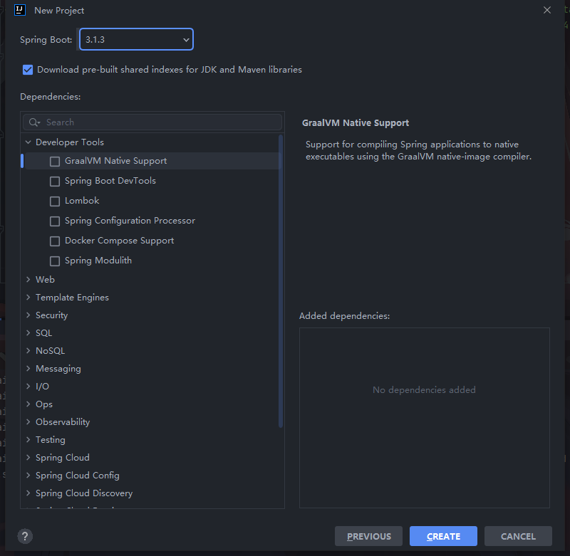
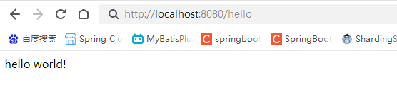
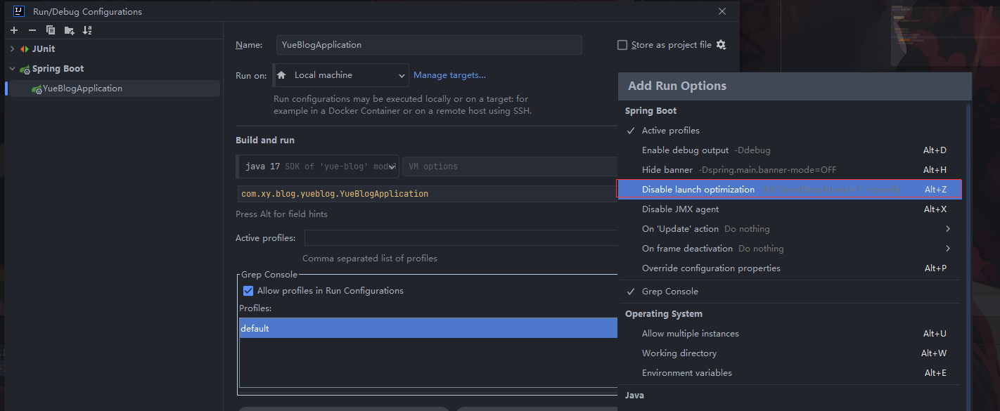
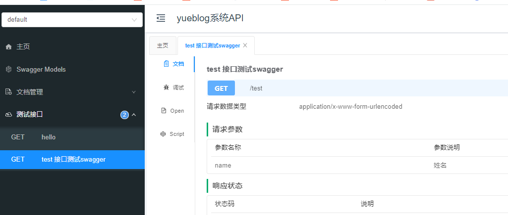
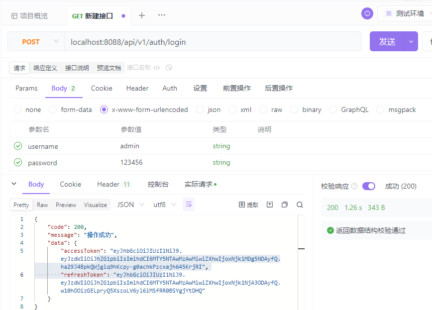

# SpringBoot3.0项目实战

## 01.项目初始化

1.使用IDEA创建一个项目





这里下载依赖可能会出现的问题

如果我们选择的版本是最新版本，可能会出现下载失败的情况，这时我们需要在pom.xml中指定Spring的maven仓库

```
    <repositories>
        <repository>
            <id>spring-milestones</id>
            <name>Spring Milestones</name>
            <url>https://repo.spring.io/milestone</url>
            <snapshots>
                <enabled>false</enabled>
            </snapshots>
        </repository>
        <repository>
            <id>spring-snapshots</id>
            <name>Spring Snapshots</name>
            <url>https://repo.spring.io/snapshot</url>
            <releases>
                <enabled>false</enabled>
            </releases>
        </repository>
    </repositories>
    <pluginRepositories>
        <pluginRepository>
            <id>spring-milestones</id>
            <name>Spring Milestones</name>
            <url>https://repo.spring.io/milestone</url>
            <snapshots>
                <enabled>false</enabled>
            </snapshots>
        </pluginRepository>
        <pluginRepository>
            <id>spring-snapshots</id>
            <name>Spring Snapshots</name>
            <url>https://repo.spring.io/snapshot</url>
            <releases>
                <enabled>false</enabled>
            </releases>
        </pluginRepository>
    </pluginRepositories>
```

添加一个web应用的依赖

```
<dependency>
        <groupId>org.springframework.boot</groupId>
        <artifactId>spring-boot-starter-web</artifactId>
</dependency>

```

写点代码测试一下

```
@RestController
public class TestController {


    @GetMapping("hello")
    public String hello(){
        return "hello world!";
    }
}
```



## 02.整合MybatisPlus

添加mybatisplus、postgresql、lombok相关依赖

```xml
    <properties>
        <java.version>17</java.version>
        <springboot.version>3.1.3</springboot.version>
        <mybatis-plus.version>3.5.3.2</mybatis-plus.version>
        <postgresql.version>42.6.0</postgresql.version>
    </properties>
    <dependencies>
        <dependency>
            <groupId>com.baomidou</groupId>
            <artifactId>mybatis-plus-boot-starter</artifactId>
            <version>${mybatis-plus.version}</version>
        </dependency>
        <dependency>
            <groupId>org.postgresql</groupId>
            <artifactId>postgresql</artifactId>
            <version>${postgresql.version}</version>
            <scope>compile</scope>
        </dependency>
        <dependency>
            <groupId>org.projectlombok</groupId>
            <artifactId>lombok</artifactId>
        </dependency>
    </dependencies>
```

在application.yaml添加数据库配置

```yaml
spring:
  application:
    name: yue-blog

  datasource:
    url: jdbc:postgresql://127.0.0.1:5432/yue_blog
    username: postgres
    password: 123456
    driver-class-name: org.postgresql.Driver
    type: com.zaxxer.hikari.HikariDataSource
    hikari:
      minimum-idle: 5            # 最小空闲连接数量 默认10
      maximum-pool-size: 10      # 连接池默认最大连接数 默认10
      idle-timeout: 30000        # 空闲时间最大存活时间
      auto-commit: true          # 此属性控制从池返回的连接的默认自动提交行为,默认值：true
      pool-name: HikariCP        # 连接池名称
      max-lifetime: 180000       # 此属性控制池中连接的最长生命周期，值0表示无限生命周期，默认1800000即30分钟
      connection-timeout: 30000  # 数据库连接超时时间,默认30秒，即30000
      connection-test-query: SELECT 1
```

配置分页插件

```java
@Configuration
public class MybatisPlusConfig {
    /**
     * 新的分页插件,一缓和二缓遵循mybatis的规则,需要设置 MybatisConfiguration#useDeprecatedExecutor = false 避免缓存出现问题(该属性会在旧插件移除后一同移除)
     */
    @Bean
    public MybatisPlusInterceptor mybatisPlusInterceptor() {
        MybatisPlusInterceptor interceptor = new MybatisPlusInterceptor();
        interceptor.addInnerInterceptor(new PaginationInnerInterceptor(DbType.POSTGRE_SQL));
        return interceptor;
    }
}
```

简单的创建一张表

```sql
CREATE TABLE "public"."sys_user" (
  "tid" varchar(50) COLLATE "pg_catalog"."default" NOT NULL,
  "username" varchar(50) COLLATE "pg_catalog"."default" NOT NULL,
  CONSTRAINT "sys_user_pkey" PRIMARY KEY ("tid")
)
;
```

创建entity、mapper、service

```java
@TableName("sys_user")
@Data
public class SysUser implements Serializable {

    @TableId(value = "tid",type = IdType.ASSIGN_ID)
    private String tid;

    @TableField("username")
    private String username;
}
@Mapper
public interface SysUserMapper extends BaseMapper<SysUser> {
}
public interface ISysUserService extends IService<SysUser> {
}
@Service
public class SysUserServiceImpl extends ServiceImpl<SysUserMapper, SysUser> implements ISysUserService {
}
@RestController
public class TestController {

    @Autowired
    private ISysUserService sysUserService;


    @GetMapping("hello")
    public String hello(){
        SysUser sysUser = new SysUser();
        sysUser.setUsername("aaaa");
        boolean i = sysUserService.save(sysUser);
        return "hello world!";
    }
}

```

消除警告OpenJDK 64-Bit Server VM warning: Options -Xverify:none and -noverify were deprecated in JDK 13 and will likely be removed in a future release.



## 03.整合数据校验

SpringBoot中常用的用于参数校验的注解如下：

```java
空检查
@Null			验证对象是否为null
@NotNull		验证对象是否不为null, 无法查检长度为0的字符串
@NotBlank		检查约束字符串是不是Null还有被Trim的长度是否大于0,只对字符串,且会去掉前后空格.
@NotEmpty		检查约束元素是否为NULL或者是EMPTY. 

Booelan检查
@AssertTrue		验证 Boolean 对象是否为 true  
@AssertFalse	验证 Boolean 对象是否为 false  

长度检查
@Size(min=, max=)		验证对象（Array,Collection,Map,String）长度是否在给定的范围之内  
@Length(min=, max=)		验证注解的元素值长度在min和max区间内

日期检查
@Past		验证 Date 和 Calendar 对象是否在当前时间之前  
@Future		验证 Date 和 Calendar 对象是否在当前时间之后  
@Pattern	验证 String 对象是否符合正则表达式的规则

数值检查，建议使用在Stirng,Integer类型，不建议使用在int类型上，因为表单值为“”时无法转换为int，但可以转换为Stirng为"",Integer为null
@Min			验证 Number 和 String 对象是否大等于指定的值  
@Max			验证 Number 和 String 对象是否小等于指定的值  
@DecimalMax		被标注的值必须不大于约束中指定的最大值. 这个约束的参数是一个通过BigDecimal定义的最大值的字符串表示.小数存在精度
@DecimalMin		被标注的值必须不小于约束中指定的最小值. 这个约束的参数是一个通过BigDecimal定义的最小值的字符串表示.小数存在精度
@Digits			验证 Number 和 String 的构成是否合法  
@Digits(integer=,fraction=)		验证字符串是否是符合指定格式的数字，interger指定整数精度，fraction指定小数精度。

@Range(min=, max=)	验证注解的元素值在最小值和最大值之间
@Range(min=10000,max=50000,message="range.bean.wage")

@Valid 写在方法参数前，递归的对该对象进行校验, 如果关联对象是个集合或者数组,那么对其中的元素进行递归校验,如果是一个map,则对其中的值部分进行校验.(是否进行递归验证)
@CreditCardNumber信用卡验证
@Email  验证是否是邮件地址，如果为null,不进行验证，算通过验证。
@ScriptAssert(lang= ,script=, alias=)
@URL(protocol=,host=, port=,regexp=, flags=)
```

在要使用注解的模块引入依赖

```java
		<dependency>
			<groupId>org.springframework.boot</groupId>
			<artifactId>spring-boot-starter-validation</artifactId>
		</dependency>
```

在loginVo使用不为空的注解

```java
@Data
@EqualsAndHashCode(callSuper = false)
public class LoginVo {
    @NotEmpty
    @ApiModelProperty(value = "用户名", required = true)
    private String username;
    @NotEmpty
    @ApiModelProperty(value = "密码", required = true)
    private String password;
}
```

接口的参数使用@Valid注解

```java
    @RequestMapping(value = "/api/login", method = RequestMethod.POST)
    public CommonResult login(@Valid @RequestBody LoginVo loginVo) {
    }
```

如果只想对某个传参进行效验

**必须在类上标明@Validated注解才会生效**

```java
@Validated
@RestController
public class BookController {
@RequestMapping(value = "/book/info", method = RequestMethod.GET)
public Object getBookInfo(@NotBlank(message = "书籍ID不能为空") String bookId) {
    return "SUCCESS";
	}
}
```

**自定义注解**

首先你可以使用Crtl+B进入任意一个注解查看源代码，发现它们都有类似的结构，因此我们可以根据这些共同点，来开发我们自定义注解，下面以开发自定义验证是否是中国手机号来举例说明

```java
@Target({ METHOD, FIELD, ANNOTATION_TYPE, CONSTRUCTOR, PARAMETER, TYPE_USE })
@Retention(RUNTIME)
@Documented
@Constraint(validatedBy = { IsMobileVaildator.class })
public @interface IsMobile {
    //下面是可选的4个参数，且提前定义了默认值
    //required:是否是必填项,默认是true
    boolean required() default true;
	
    String message() default "手机号格式错误";

    Class<?>[] groups() default { };

    Class<? extends Payload>[] payload() default { };
}
```

下面是实现验证过程的类，实现该接口ConstraintValidator<T,T>.

第一个T代表你自定义接口的名字，第二个T代表的是该注解支持哪种对象的类型，这里是手机号自然就是String类型。

```java
public class IsMobileVaildator implements ConstraintValidator<IsMobile,String> {
    private boolean required =false;
	/**
	* 初始化方法
	*
	*/
    @Override
    public void initialize(IsMobile constraintAnnotation) {
        //初始为true意思就是你加了此注解就是保证它是个手机号
        required= constraintAnnotation.required();
    }

    /**
     * 在该方法中写具体验证过程
     * @param value object to validate
     * @param context context in which the constraint is evaluated
     *
     * @return 是否是个中国手机号
     */
    @Override
    public boolean isValid(String value, ConstraintValidatorContext context) {
        if(required){
           return MobileUtil.checkPhone(value);
        }else {
            //否则就是不是必填，2种情况，一种是没填返回true,一种是填了，既然填了就要验证,将验证的结果返回
            if(ObjectUtils.isEmpty(value)){
                return true;
            }else{
                return MobileUtil.checkPhone(value);
            }
        }
    }
}

```

## 04.整合多环境切换

以测试环境test和开发环境dev为例

分别创建application.yaml、application-test.yaml、application-dev.yaml文件

在application.yaml 写上每个环境共同拥有的配置比如端口号、项目名等配置。

通过spring.profile.active配置指定使用哪个环境的配置

```yaml
spring:
  application:
    name: yue-blog
  profiles:
    active: dev
server:
  port: 8088
```

这个配置就是指定的使用aplication-dev.yaml配置中的内容

application-dev.yaml

```yaml
spring:
  datasource:
    url: jdbc:postgresql://localhost:5432/yue_blog
    username: postgres
    password: 123456
    driver-class-name: org.postgresql.Driver
    type: com.zaxxer.hikari.HikariDataSource
    hikari:
      minimum-idle: 5            # 最小空闲连接数量 默认10
      maximum-pool-size: 10      # 连接池默认最大连接数 默认10
      idle-timeout: 30000        # 空闲时间最大存活时间
      auto-commit: true          # 此属性控制从池返回的连接的默认自动提交行为,默认值：true
      pool-name: HikariCP        # 连接池名称
      max-lifetime: 180000       # 此属性控制池中连接的最长生命周期，值0表示无限生命周期，默认1800000即30分钟
      connection-timeout: 30000  # 数据库连接超时时间,默认30秒，即30000
      connection-test-query: SELECT 1
mybatis-plus:
  configuration:
    log-impl: org.apache.ibatis.logging.stdout.StdOutImpl
```

## 05.整合logback日志

在resource下新建logback-spring.xml

```xml
<?xml version="1.0" encoding="UTF-8"?>
<configuration scan="true" scanPeriod="60 seconds" debug="false">
    <!-- 日志输出格式 -->
    <property name="log.pattern" value="%d{HH:mm:ss.SSS} [%thread] %-5level %logger{20} - [%method,%line] - %msg%n" />
    <!-- 从 Spring Boot 配置文件中，读取 spring.application.name 应用名 -->
    <springProperty name="applicationName" scope="context" source="spring.application.name" />
    <!-- 日志存放路径 -->
    <property name="log.path" value="./logs/${applicationName}" />
    <!-- 控制台输出 -->
    <appender name="console" class="ch.qos.logback.core.ConsoleAppender">
        <encoder>
            <pattern>${log.pattern}</pattern>
        </encoder>
    </appender>

    <!-- 系统日志输出 -->
    <appender name="file_info" class="ch.qos.logback.core.rolling.RollingFileAppender">
        <file>${log.path}/info.log</file>
        <!-- 循环政策：基于时间创建日志文件  基于时间 + 大小的分包策略-->
        <rollingPolicy class="ch.qos.logback.core.rolling.SizeAndTimeBasedRollingPolicy">
            <!-- 日志文件名格式  每日生成日志文件或日志文件大小超出限制后输出的文件名模板-->
            <fileNamePattern>${log.path}/info-%d{yyyy-MM-dd}.%i.log</fileNamePattern>
            <!-- 日志最大的历史 30天 -->
            <maxHistory>30</maxHistory>
            <!-- 日志文件最大大小：30MB -->
            <maxFileSize>30MB</maxFileSize>
        </rollingPolicy>
        <encoder>
            <pattern>${log.pattern}</pattern>
        </encoder>
        <filter class="ch.qos.logback.classic.filter.LevelFilter">
            <!-- 过滤的级别 -->
            <level>INFO</level>
            <!-- 匹配时的操作：接收（记录） -->
            <onMatch>ACCEPT</onMatch>
            <!-- 不匹配时的操作：拒绝（不记录） -->
            <onMismatch>DENY</onMismatch>
        </filter>
    </appender>

    <appender name="file_error" class="ch.qos.logback.core.rolling.RollingFileAppender">
        <file>${log.path}/error.log</file>
        <!-- 循环政策：基于时间创建日志文件  基于时间 + 大小的分包策略-->
        <rollingPolicy class="ch.qos.logback.core.rolling.SizeAndTimeBasedRollingPolicy">
            <!-- 日志文件名格式 -->
            <fileNamePattern>${log.path}/error-%d{yyyy-MM-dd}.%i.log</fileNamePattern>
            <!-- 日志最大的历史 30天 -->
            <maxHistory>30</maxHistory>
            <!-- 日志文件最大大小：30MB -->
            <maxFileSize>30MB</maxFileSize>
        </rollingPolicy>
        <encoder>
            <pattern>${log.pattern}</pattern>
        </encoder>
        <filter class="ch.qos.logback.classic.filter.LevelFilter">
            <!-- 过滤的级别 -->
            <level>ERROR</level>
            <!-- 匹配时的操作：接收（记录） -->
            <onMatch>ACCEPT</onMatch>
            <!-- 不匹配时的操作：拒绝（不记录） -->
            <onMismatch>DENY</onMismatch>
        </filter>
    </appender>

    <!-- 测试环境，独有的配置 -->
    <springProfile name="dev">
        <!-- 系统模块日志级别控制  -->
        <logger name="com.hy.sys" level="debug" />
        <!-- Spring日志级别控制  -->
        <logger name="org.springframework" level="warn" />

        <root level="info">
            <appender-ref ref="console" />
        </root>

        <!--系统操作日志-->
        <root level="info">
            <appender-ref ref="file_info" />
            <appender-ref ref="file_error" />
        </root>
    </springProfile>
    <!-- 测试环境，独有的配置 -->
    <springProfile name="test">
        <!-- 系统模块日志级别控制  -->
        <logger name="com.hy.sys" level="debug" />
        <!-- Spring日志级别控制  -->
        <logger name="org.springframework" level="warn" />

        <root level="info">
            <appender-ref ref="console" />
        </root>

        <!--系统操作日志-->
        <root level="info">
            <appender-ref ref="file_info" />
            <appender-ref ref="file_error" />
        </root>
    </springProfile>
    <!-- 生产环境，独有的配置 -->
    <springProfile name="prod">
        <!-- 设置 Appender -->
        <root level="INFO">
            <appender-ref ref="console"/>
            <appender-ref ref="file_info" />
            <appender-ref ref="file_error" />
        </root>
    </springProfile>
</configuration>
```

## 06.整合Knif4j

官网

```
https://doc.xiaominfo.com/
```

添加依赖

```
<dependency>
    <groupId>com.github.xiaoymin</groupId>
    <artifactId>knife4j-openapi3-jakarta-spring-boot-starter</artifactId>
    <version>4.3.0</version>
</dependency>
```

配置

```yaml
# springdoc-openapi项目配置
springdoc:
  swagger-ui:
    path: /swagger-ui.html
    tags-sorter: alpha
    operations-sorter: alpha
  api-docs:
    path: /v3/api-docs
  group-configs:
    - group: 'default'
      paths-to-match: '/**'
      packages-to-scan: com.xy.blog.blog.controller
# knife4j的增强配置，不需要增强可以不配
knife4j:
  enable: true
  setting:
    language: zh_cn
```

自定义配置类

```java
@Configuration
public class SwaggerConfig {


    @Bean
    public OpenAPI customOpenAPI() {
        return new OpenAPI()
                .info(new Info()
                        .title("yueblog系统API")
                        .version("1.0")

                        .description( "yueblog接口文档")
                        .termsOfService("http://doc.xiaominfo.com")
                        .license(new License().name("Apache 2.0")
                                .url("http://doc.xiaominfo.com")));
    }
}
```

​	测试类

```
@RestController
@Tag(name = "测试接口")
public class TestController {

    @Autowired
    private ISysUserService sysUserService;


    @GetMapping("hello")
    public String hello(){
        SysUser sysUser = new SysUser();
        sysUser.setUsername("aaaa");
        boolean i = sysUserService.save(sysUser);
        return "hello world!";
    }
    @Operation(summary = "test 接口测试swagger")
    @Parameters({
            @Parameter(name = "name",description = "姓名",required = true,in= ParameterIn.QUERY)
    })
    @GetMapping("test")
    public ResponseEntity<String> test(@RequestParam("name") String name){
        return ResponseEntity.ok(name);
    }
} 	
```

访问localhost:8088/doc.html



## 07.整合redis

添加依赖

```
<dependency>
    <groupId>org.springframework.boot</groupId>
    <artifactId>spring-boot-starter-data-redis</artifactId>
</dependency>
<dependency>
    <groupId>org.apache.commons</groupId>
    <artifactId>commons-pool2</artifactId>
</dependency>
```

配置redis地址

```yaml
spring:
  data:
    redis:
      database: 0
      host: 127.0.0.1
      port: 6379
      password:
      timeout: 3000
      connect-timeout: 5000
      lettuce:
        pool:
          max-active: 10
          max-wait: -1
          max-idle: 8
          min-idle: 0
```


配置redis序列化

```java

@Configuration
public class RedisConfig {

    @Autowired
    RedisConnectionFactory redisConnectionFactory;

    @Bean
    public RedisTemplate<Object, Object> redisTemplate() {
        RedisTemplate<Object, Object> template = new RedisTemplate<>();
        template.setConnectionFactory(redisConnectionFactory);

        //使用Jackson2JsonRedisSerializer来序列化和反序列化redis的value值
        //Jackson2JsonRedisSerializer serializer = new Jackson2JsonRedisSerializer(Object.class);
        //使用Fastjson2JsonRedisSerializer来序列化和反序列化redis的value值

        ObjectMapper mapper = new ObjectMapper();
        mapper.setVisibility(PropertyAccessor.ALL, JsonAutoDetect.Visibility.ANY);
//        mapper.enableDefaultTyping(ObjectMapper.DefaultTyping.NON_FINAL);被废弃了
        mapper.activateDefaultTyping(LaissezFaireSubTypeValidator.instance,ObjectMapper.DefaultTyping.NON_FINAL, JsonTypeInfo.As.PROPERTY);
        GenericJackson2JsonRedisSerializer jackson2JsonRedisSerializer = new GenericJackson2JsonRedisSerializer(mapper);
        template.setValueSerializer(new StringRedisSerializer());
        //使用StringRedisSerializer来序列化和反序列化redis的key值
        template.setKeySerializer(new StringRedisSerializer());
        template.afterPropertiesSet();
        template.setHashKeySerializer(new StringRedisSerializer());
        template.setHashValueSerializer(jackson2JsonRedisSerializer);

        return template;
    }
}
```

## 08.整合统一结果返回工具类

返回结果码枚举类

```java
public enum ResultCodeEnum {
    /**
     *操作成功
     **/
    SUCCESS(200, "操作成功"),
    ERROR(500,"操作失败"),
    ;

    private final Integer code;

    private final String message;

    ResultCodeEnum(Integer code,String message){
        this.code = code;
        this.message = message;
    }

    public Integer getCode(){
        return this.code;
    }

    public String getMessage(){
        return this.message;
    }
}
```

通过返回结果类

```java
public class Result<T> {

    private Integer code;
    private String message;
    private T data;

    /**
     * 成功返回结果
     */
    public static <T> Result<T> ok(T data ,String message){
        Result<T> result = new Result<>();
        result.setCode(ResultCodeEnum.SUCCESS.getCode());
        result.setMessage(message);
        result.setData(data);
        return result;
    }

    /**
     * 成功返回结果
     */
    public static  <T> Result<T> ok(T data){
        Result<T> result = new Result<>();
        result.setCode(ResultCodeEnum.SUCCESS.getCode());
        result.setMessage(ResultCodeEnum.SUCCESS.getMessage());
        result.setData(data);
        return result;
    }

    /**
     * 成功返回结果
     */
    public static <T> Result<T> ok(){
        Result<T> result = new Result<>();
        result.setCode(ResultCodeEnum.SUCCESS.getCode());
        result.setMessage(ResultCodeEnum.SUCCESS.getMessage());
        result.setData(null);
        return result;
    }

    /**
     * 失败返回结果
     */
    public static <T> Result<T> failed(T data ,String message){
        Result<T> result = new Result<>();
        result.setCode(ResultCodeEnum.ERROR.getCode());
        result.setMessage(message);
        result.setData(data);
        return result;
    }

    /**
     * 失败返回结果
     */
    public static  <T> Result<T> failed(String message){
        Result<T> result = new Result<>();
        result.setCode(ResultCodeEnum.ERROR.getCode());
        result.setMessage(message);
        result.setData(null);
        return result;
    }

    /**
     * 失败返回结果
     */
    public static <T> Result<T> failed(){
        Result<T> result = new Result<>();
        result.setCode(ResultCodeEnum.ERROR.getCode());
        result.setMessage(ResultCodeEnum.ERROR.getMessage());
        result.setData(null);
        return result;
    }


    /**
     * 自定义返回结果
     */
    public static <T> Result<T> custom(ResultCodeEnum resultCodeEnum){
        Result<T> result = new Result<>();
        result.setCode(resultCodeEnum.getCode());
        result.setMessage(resultCodeEnum.getMessage());
        result.setData(null);
        return result;
    }

    /**
     * 自定义返回结果

     */
    public static <T> Result<T> custom(ResultCodeEnum resultCodeEnum,String message){
        Result<T> result = new Result<>();
        result.setCode(resultCodeEnum.getCode());
        result.setMessage(message);
        result.setData(null);
        return result;
    }


}
```

通用分页返回封装

```java
@Data
public class ResultPage<T> {
    /**
     * 每页个数
     */
    private long pageSize;

    /**
     * 当前页
     */
    private long pageNum;

    /**
     * 总页数
     */
    private long totalPage;

    /**
     * 总个数
     */
    private long total;

    /**
     * 数据记录
     */
    private List<T> items;


    public static <T> ResultPage<T> build(IPage<T> page){
        ResultPage<T> resultPage = new ResultPage<>();
        resultPage.setPageSize(page.getSize());
        resultPage.setPageNum(page.getCurrent());
        resultPage.setTotalPage(page.getPages());
        resultPage.setTotal(page.getTotal());
        resultPage.setItems(page.getRecords());
        return resultPage;
    }
    /**
     *
     *  支持自定义列表
     *
     **/
    public static  <T> ResultPage<T> build(IPage<T> page ,List<T> items){
        ResultPage<T> resultPage = new ResultPage<>();
        resultPage.setPageSize(page.getSize());
        resultPage.setPageNum(page.getCurrent());
        resultPage.setTotalPage(page.getPages());
        resultPage.setTotal(page.getTotal());
        resultPage.setItems(items);
        return resultPage;
    }
}
```

## 09.整合Spring Security + JWT

添加依赖

```
		<dependency>
			<groupId>io.jsonwebtoken</groupId>
			<artifactId>jjwt-api</artifactId>
			<version>0.11.5</version>
		</dependency>
		<dependency>
			<groupId>io.jsonwebtoken</groupId>
			<artifactId>jjwt-impl</artifactId>
			<version>0.11.5</version>
		</dependency>
		<dependency>
			<groupId>io.jsonwebtoken</groupId>
			<artifactId>jjwt-jackson</artifactId>
			<version>0.11.5</version>
		</dependency>
		<dependency>
			<groupId>org.springframework.boot</groupId>
			<artifactId>spring-boot-starter-security</artifactId>
		</dependency>
```

添加配置项

```yaml
application:
  security:
    jwt:
      secret-key: 404E635266556A586E3272357538782F413F4428472B4B6250645367566B5970
      expiration: 86400000 # a day
      refresh-token:
        expiration: 604800000 # 7 days


white-list:
  urls:
    - "/doc.html"
    - "/swagger-resources/**"
    - "/swagger/**"
    - "/v3/api-docs/**"
    - "/*/*.js"
    - "/*/*.css"
    - "/*/*.png"
    - "/*.ico"
    - "/webjars/**"
    - "/actuator/**"
    - "/api/v1/auth/login"
```

JwtService

```java
@Service
public class JwtService {
    @Value("${application.security.jwt.secret-key}")
    private String secretKey;
    @Value("${application.security.jwt.expiration}")
    private long jwtExpiration;
    @Value("${application.security.jwt.refresh-token.expiration}")
    private long refreshExpiration;

    public String extractUsername(String token) {
        return extractClaim(token, Claims::getSubject);
    }

    public <T> T extractClaim(String token, Function<Claims, T> claimsResolver) {
        final Claims claims = extractAllClaims(token);
        return claimsResolver.apply(claims);
    }

    /**
     * 生成token
     * @param userDetails
     * @return
     */
    public String generateToken(UserDetails userDetails) {
        return generateToken(new HashMap<>(), userDetails);
    }

    public String generateToken(Map<String, Object> extraClaims, UserDetails userDetails) {
        return buildToken(extraClaims, userDetails, jwtExpiration);
    }

    public String generateRefreshToken(UserDetails userDetails) {
        return buildToken(new HashMap<>(), userDetails, refreshExpiration);
    }

    private String buildToken(Map<String, Object> extraClaims, UserDetails userDetails, long expiration) {
        return Jwts
                .builder()
                .setClaims(extraClaims)
                .setSubject(userDetails.getUsername())
                .setIssuedAt(new Date(System.currentTimeMillis()))
                .setExpiration(new Date(System.currentTimeMillis() + expiration))
                .signWith(getSignInKey(), SignatureAlgorithm.HS256)
                .compact();
    }

    public boolean isTokenValid(String token, SecurityUser sysUser) {
        final String username = extractUsername(token);
        return (username.equals(sysUser.getUsername())) && !isTokenExpired(token);
    }

    public boolean isTokenExpired(String token) {
        return extractExpiration(token).before(new Date());
    }

    private Date extractExpiration(String token) {
        return extractClaim(token, Claims::getExpiration);
    }

    /**
     * 解析jwt
     * @param token
     * @return
     */
    private Claims extractAllClaims(String token) {
        return Jwts
                .parserBuilder()
                .setSigningKey(getSignInKey())
                .build()
                .parseClaimsJws(token)
                .getBody();
    }

    /**
     * 获取Signkey
     * @return
     */
    private Key getSignInKey() {
        byte[] keyBytes = Decoders.BASE64.decode(secretKey);
        return Keys.hmacShaKeyFor(keyBytes);
    }

}
```

dto

```java
@Data
public class JWTDto {
    /**
     * 主题
     */
    private String sub;

    /**
     * 签发时间
     */
    private Long iat;

    /**
     * 过期时间
     */
    private Long exp;

    /**
     * JWT ID
     */
    private String jti;

    /**
     * 用户id
     */
    private String userId;

    /**
     * 用户名
     */
    private String username;

    /**
     * 用户状态(1:正常;0:禁用)
     */
    private String status;

    /**
     * 用户角色
     */
    private List<String> roles;

    /**
     * 权限列表
     */
//    private List<String> permissions;

}

@Data
@NoArgsConstructor
@AllArgsConstructor
@Accessors(chain = true)
public class SecurityUser implements UserDetails, Serializable {


    private String id;

    private String username;

    private String password;


    //该用户所拥有的权限，如果细分为角色和权限，可以把两个都放到这个集合里面，比如ROLE_ADMIN,admin:user:create可以同时存入
    private Collection<? extends GrantedAuthority> authorities;


    public SecurityUser(SysUser sysUser){
        this.id = sysUser.getTid();
        this.password = sysUser.getPassword();
        this.username = sysUser.getUsername();
        this.authorities = CollUtil.toList(new SimpleGrantedAuthority("ADMIN"));

    }

    @Override
    public Collection<? extends GrantedAuthority> getAuthorities() {
        return this.authorities;
    }

    @Override
    public String getPassword() {
        return this.password;
    }

    @Override
    public String getUsername() {
        return this.username;
    }

    @Override
    public boolean isAccountNonExpired() {
        return true;
    }

    @Override
    public boolean isAccountNonLocked() {
        return true;
    }

    @Override
    public boolean isCredentialsNonExpired() {
        return true;
    }

    @Override
    public boolean isEnabled() {
        return true;
    }

}
```

UserServiceImpl

```java
@RequiredArgsConstructor
@Service
@Slf4j
public class UserServiceImpl implements UserDetailsService, UserDetailsPasswordService {

    @Autowired
    private ISysUserService sysUserService;

    //获取当前用户的方法，使用框架的上下文获取当前请求的用户
    public static Authentication getCurrentUser() {
        return SecurityContextHolder.getContext().getAuthentication();
    }

    @Override
    public UserDetails updatePassword(UserDetails user, String newPassword) {

        return null;
    }

    @Override
    public UserDetails loadUserByUsername(String username) throws UsernameNotFoundException {
        QueryWrapper<SysUser> queryWrapper = new QueryWrapper<>();
        queryWrapper.lambda().eq(SysUser::getUsername,username);
        SysUser sysUser = sysUserService.getOne(queryWrapper);
        if(sysUser!=null){
            return new SecurityUser(sysUser);
        }

        return null;
    }
}
```

LogoutService

```java
@Service
public class LogoutService implements LogoutHandler {
    @Override
    public void logout(HttpServletRequest request, HttpServletResponse response, Authentication authentication) {
        //先获取token
        final String authHeader = request.getHeader(SysConstant.JWT_TOKEN_HEADER);
        final String jwt;
        if (authHeader == null ||!authHeader.startsWith(SysConstant.JWT_TOKEN_PREFIX)) {
            return;
        }
        // todo redis黑名单存token
        SecurityContextHolder.clearContext();
    }
}
```

exception

```java
public class NotTokenException extends RuntimeException{
}
public class TokenExpiredException extends RuntimeException{
}
public class TokenVerifyErrorException extends RuntimeException{
}
public class UnAuthorizationException extends RuntimeException{
}
```

自定义无权访问处理类

```
@Component
public class MyAccessDeniedHandler implements AccessDeniedHandler {
    @Override
    public void handle(HttpServletRequest request, HttpServletResponse response, AccessDeniedException accessDeniedException) throws IOException, ServletException {
        throw new UnAuthorizationException();
    }
}
```

全局异常处理类

```java
@RestControllerAdvice
@Order(Ordered.HIGHEST_PRECEDENCE)
@Slf4j
public class MyGlobalExceptionHander {

    @ExceptionHandler(UnAuthorizationException.class)
    public Result<Object> unAuthorizationExceptionHandle(){
        log.info("无权访问接口");
        return Result.custom(ResultCodeEnum.UN_AUTHORIZATION);
    }


    @ExceptionHandler(NotTokenException.class)
    public Result<Object> noTokenExceptionHandle(){
        log.info("拦截到未携带凭证的请求");
        return Result.custom(ResultCodeEnum.CERTIFICATE_MISS);
    }


    @ExceptionHandler(TokenVerifyErrorException.class)
    public Result<Object> tokenVerifyErrorExceptionHandle(){
        log.info("凭证校验失败");
        return Result.custom(ResultCodeEnum.TOKEN_INVALID);
    }

    @ExceptionHandler(TokenExpiredException.class)
    public Result<Object> tokenExpiredExceptionHandle(){
        log.info("token失效");
        return Result.custom(ResultCodeEnum.TOKEN_EXPIRED);
    }
}
```

url白名单配置

```java
@Data
@EqualsAndHashCode(callSuper = false)
@Component
@ConfigurationProperties(prefix="white-list")
public class UrlWhiteListConfig {
    private List<String> urls;
}
```

常量

```java
public class SysConstant {
    /**
     * 认证信息Http请求头
     */
    public final static String JWT_TOKEN_HEADER = "Authorization";
    /**
     * JWT令牌前缀
     */
    public final static String JWT_TOKEN_PREFIX = "Bearer ";
    

    public final static String REDIS_ACCESS_TOKEN_KEY = "accessToken:";

    public final static String REDIS_REFRESH_TOKEN_KEY = "refreshToken:";
}
```

jwt过滤器

```java
@Slf4j
@Component
public class JWTAuthenticationFilter extends OncePerRequestFilter {

    @Autowired
    private UrlWhiteListConfig urlWhiteListConfig;
    @Autowired
    private JwtService jwtService;
    @Autowired
    private UserServiceImpl userService;
    @Autowired
    private StringRedisTemplate stringRedisTemplate;

    @Override
    protected void doFilterInternal(HttpServletRequest request, HttpServletResponse response, FilterChain filterChain) throws ServletException, IOException {
        // 获取当前url
        String uri = request.getRequestURI();
        PathMatcher pathMatcher = new AntPathMatcher();
        List<String> urls = urlWhiteListConfig.getUrls();
        // 白名单直接放行
        for (String url : urls) {
            if (pathMatcher.match(url, uri)) {
                filterChain.doFilter(request, response);
                return;
            }
        }
        String authorization = request.getHeader(SysConstant.JWT_TOKEN_HEADER);
        if (StrUtil.isBlank(authorization) || !authorization.startsWith(SysConstant.JWT_TOKEN_PREFIX)) {
            throw new NotTokenException();
        }

        String realToken = authorization.replace(SysConstant.JWT_TOKEN_PREFIX, "");
        String username = null;
        try {
            username = jwtService.extractUsername(realToken);
        } catch (Exception e) {
            log.error("token格式异常:{}", e.getMessage());
            throw new TokenVerifyErrorException();
        }
        boolean tokenExpired = jwtService.isTokenExpired(realToken);
        if (tokenExpired) {
            throw new TokenExpiredException();
        }

        if (username != null && SecurityContextHolder.getContext().getAuthentication() == null) {
            SecurityUser securityUser = (SecurityUser) userService.loadUserByUsername(username);
            boolean isTokenValid = false;
            //校验token准确性和是否过期，此处可以自定义校验，可以使用jwt自带的校验也可以通过数据库和redis等共同判断
            String userInfo= (String) stringRedisTemplate.opsForValue().get(SysConstant.REDIS_ACCESS_TOKEN_KEY  +realToken);
            if(StrUtil.isNotBlank(userInfo)) {
                isTokenValid=true;
            }
            if (securityUser != null && jwtService.isTokenValid(realToken, securityUser) && isTokenValid) {
                /**
                 * 封装成用户的凭证，传入用户实体类和用户的权限集合，spring security会自动去判断是否拥有权限
                 */
                UsernamePasswordAuthenticationToken authToken = new UsernamePasswordAuthenticationToken(
                        securityUser,
                        null,
                        securityUser.getAuthorities()
                );
                /**
                 * 在 Spring Security 中，当用户进行认证时，会先通过 AuthenticationFilter 进行请求过滤，
                 * 然后调用 AuthenticationManager 进行认证。在认证过程中，Spring Security 会自动创建一个
                 * Authentication 对象，其中包含了认证请求的相关信息。如果你需要自定义 Authentication
                 * 对象的详细信息，就可以使用 WebAuthenticationDetailsSource 来创建 WebAuthenticationDetails 对象。
                 */
                authToken.setDetails(
                        new WebAuthenticationDetailsSource().buildDetails(request)
                );
                SecurityContextHolder.getContext().setAuthentication(authToken);
            }
        }


        filterChain.doFilter(request, response);


    }
}
```

鉴权配置

```java
@Configuration
public class AuthConfig {

    @Autowired
    private UserServiceImpl userService;

    /**
     * 鉴权
     *
     * @return
     */
    @Bean
    public AuthenticationProvider authenticationProvider() {
        DaoAuthenticationProvider authProvider = new DaoAuthenticationProvider();
        //使用自定义的用户校验
        authProvider.setUserDetailsService(userService);
        authProvider.setPasswordEncoder(passwordEncoder());
        return authProvider;
    }

    @Bean
    public AuthenticationManager authenticationManager(AuthenticationConfiguration config) throws Exception {
        return config.getAuthenticationManager();
    }

    @Bean
    public PasswordEncoder passwordEncoder() {
        return new BCryptPasswordEncoder();
    }
}
```

security配置

```java
@Configuration
@EnableWebSecurity
@EnableMethodSecurity
public class SecurityConfig {

    @Autowired
    private AuthenticationProvider authenticationProvider;

    @Autowired
    private JWTAuthenticationFilter jwtAuthenticationFilter;

    @Autowired
    private MyAccessDeniedHandler myAccessDeniedHandler;

    @Autowired
    private LogoutService logoutService;

    @Autowired
    private UrlWhiteListConfig urlWhiteListConfig;

    @Bean
    public SecurityFilterChain securityFilterChain(HttpSecurity http) throws Exception {
        http
                .csrf(AbstractHttpConfigurer::disable)
                .authorizeHttpRequests((authorize) -> authorize
                .requestMatchers(urlWhiteListConfig.getUrls().toArray(new String[0])).permitAll()
                .anyRequest().authenticated());
        http
                .exceptionHandling((exception) -> exception.accessDeniedHandler(myAccessDeniedHandler));
        http
                .sessionManagement((session) -> session.sessionCreationPolicy(SessionCreationPolicy.STATELESS));
        http
                .authenticationProvider(authenticationProvider)
                .addFilterBefore(jwtAuthenticationFilter,UsernamePasswordAuthenticationFilter.class)
                .logout((logout) ->logout
                        .logoutUrl("/api/v1/auth/logout")
                        .addLogoutHandler(logoutService)
                        .logoutSuccessHandler((request, response, authentication) -> SecurityContextHolder.clearContext()));


        return http.build();
    }
}
```

登录接口

> 重新写service 是为了避免循环依赖

```java
public interface IUserLoginService {

    Result login(String username, String password);
}
@Service
public class UserLoginService implements IUserLoginService {
    @Autowired
    private PasswordEncoder passwordEncoder;
    @Autowired
    private JwtService jwtService;
    @Autowired
    private StringRedisTemplate stringRedisTemplate;
    @Autowired
    private ISysUserService sysUserService;

    @Value("${application.security.jwt.expiration}")
    private long jwtExpiration;
    @Value("${application.security.jwt.refresh-token.expiration}")
    private long refreshExpiration;

    @Override
    public Result login(String username, String password) {
        QueryWrapper<SysUser> queryWrapper = new QueryWrapper<>();
        queryWrapper.lambda().eq(SysUser::getUsername,username);
        SysUser sysUser = sysUserService.getOne(queryWrapper);
        if(sysUser == null){
            return Result.custom(ResultCodeEnum.USERNAME_PASSWORD_ERROR);
        }
        if(passwordEncoder.matches(password,sysUser.getPassword())){
            var securityUser = new SecurityUser(sysUser);
            var accessToken = jwtService.generateToken(securityUser);
            var refreshToken = jwtService.generateRefreshToken(securityUser);
            String accessTokenKey = SysConstant.REDIS_ACCESS_TOKEN_KEY+accessToken;
            String refreshTokenKey = SysConstant.REDIS_REFRESH_TOKEN_KEY+refreshToken;
            stringRedisTemplate.opsForValue().set(accessTokenKey, JSONUtil.toJsonStr(securityUser),jwtExpiration, TimeUnit.SECONDS);
            stringRedisTemplate.opsForValue().set(refreshTokenKey, JSONUtil.toJsonStr(securityUser),refreshExpiration, TimeUnit.SECONDS);
            return Result.ok(new TokenVo(accessToken,refreshToken));
        }
        return Result.custom(ResultCodeEnum.USERNAME_PASSWORD_ERROR);
    }
}
```

Controller

```java
    @PostMapping("/api/v1/auth/login")
    @Operation(summary = "登录接口")
    @RequestBody(content = @Content(mediaType = MediaType.APPLICATION_FORM_URLENCODED_VALUE))
    public Result login(@Valid LoginVo loginVo){
        return userLoginService.login(loginVo.getUsername(), loginVo.getPassword());
    }
}
```


