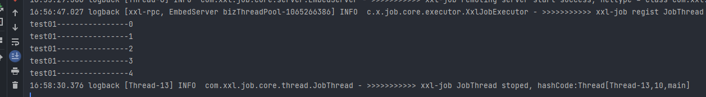

## xxl-job适配postgres

> xxl-job默认是支持mysql，由于postgres与mysql部分语法不同，所以需要修改
>
> 本次使用的是2.4.1的版本

### 1、去github下载源码

```
https://github.com/xuxueli/xxl-job.git
```

### 2、修改数据库建表sql

> 这一步主要出现的问题是自增序列的问题，还有int类型非空字段没有默认导致报错

> 创建数据库xxl-job，执行以下sql

```sql
/*
 Navicat Premium Data Transfer

 Source Server         : yaopglocal
 Source Server Type    : PostgreSQL
 Source Server Version : 130011
 Source Host           : localhost:5432
 Source Catalog        : xxl-job
 Source Schema         : public

 Target Server Type    : PostgreSQL
 Target Server Version : 130011
 File Encoding         : 65001

 Date: 12/06/2023 16:20:50
*/


-- ----------------------------
-- Sequence structure for xxl_job_group_id_seq
-- ----------------------------
DROP SEQUENCE IF EXISTS "public"."xxl_job_group_id_seq";
CREATE SEQUENCE "public"."xxl_job_group_id_seq" 
INCREMENT 1
MINVALUE  1
MAXVALUE 9223372036854775807
START 1
CACHE 1;

-- ----------------------------
-- Sequence structure for xxl_job_info_id_seq
-- ----------------------------
DROP SEQUENCE IF EXISTS "public"."xxl_job_info_id_seq";
CREATE SEQUENCE "public"."xxl_job_info_id_seq" 
INCREMENT 1
MINVALUE  1
MAXVALUE 9223372036854775807
START 1
CACHE 1;

-- ----------------------------
-- Sequence structure for xxl_job_log_id_seq
-- ----------------------------
DROP SEQUENCE IF EXISTS "public"."xxl_job_log_id_seq";
CREATE SEQUENCE "public"."xxl_job_log_id_seq" 
INCREMENT 1
MINVALUE  1
MAXVALUE 9223372036854775807
START 1
CACHE 1;

-- ----------------------------
-- Sequence structure for xxl_job_log_report_id_seq
-- ----------------------------
DROP SEQUENCE IF EXISTS "public"."xxl_job_log_report_id_seq";
CREATE SEQUENCE "public"."xxl_job_log_report_id_seq" 
INCREMENT 1
MINVALUE  1
MAXVALUE 9223372036854775807
START 1
CACHE 1;

-- ----------------------------
-- Sequence structure for xxl_job_logglue_id_seq
-- ----------------------------
DROP SEQUENCE IF EXISTS "public"."xxl_job_logglue_id_seq";
CREATE SEQUENCE "public"."xxl_job_logglue_id_seq" 
INCREMENT 1
MINVALUE  1
MAXVALUE 9223372036854775807
START 1
CACHE 1;

-- ----------------------------
-- Sequence structure for xxl_job_registry_id_seq
-- ----------------------------
DROP SEQUENCE IF EXISTS "public"."xxl_job_registry_id_seq";
CREATE SEQUENCE "public"."xxl_job_registry_id_seq" 
INCREMENT 1
MINVALUE  1
MAXVALUE 9223372036854775807
START 1
CACHE 1;

-- ----------------------------
-- Sequence structure for xxl_job_user_id_seq
-- ----------------------------
DROP SEQUENCE IF EXISTS "public"."xxl_job_user_id_seq";
CREATE SEQUENCE "public"."xxl_job_user_id_seq" 
INCREMENT 1
MINVALUE  1
MAXVALUE 9223372036854775807
START 1
CACHE 1;

-- ----------------------------
-- Table structure for xxl_job_group
-- ----------------------------
DROP TABLE IF EXISTS "public"."xxl_job_group";
CREATE TABLE "public"."xxl_job_group" (
  "id" int4 NOT NULL DEFAULT nextval('xxl_job_group_id_seq'::regclass),
  "app_name" varchar(64) COLLATE "pg_catalog"."default" NOT NULL,
  "title" varchar(12) COLLATE "pg_catalog"."default" NOT NULL,
  "address_type" int2 NOT NULL DEFAULT 0,
  "address_list" text COLLATE "pg_catalog"."default",
  "update_time" timestamp(6)
)
;
COMMENT ON COLUMN "public"."xxl_job_group"."app_name" IS '执行器AppName';
COMMENT ON COLUMN "public"."xxl_job_group"."title" IS '执行器名称';
COMMENT ON COLUMN "public"."xxl_job_group"."address_type" IS '执行器地址类型：0=自动注册、1=手动录入';
COMMENT ON COLUMN "public"."xxl_job_group"."address_list" IS '执行器地址列表，多地址逗号分隔';

-- ----------------------------
-- Table structure for xxl_job_info
-- ----------------------------
DROP TABLE IF EXISTS "public"."xxl_job_info";
CREATE TABLE "public"."xxl_job_info" (
  "id" int4 NOT NULL DEFAULT nextval('xxl_job_info_id_seq'::regclass),
  "job_group" int4 NOT NULL,
  "job_desc" varchar(255) COLLATE "pg_catalog"."default" NOT NULL,
  "add_time" timestamp(6),
  "update_time" timestamp(6),
  "author" varchar(64) COLLATE "pg_catalog"."default",
  "alarm_email" varchar(255) COLLATE "pg_catalog"."default",
  "schedule_type" varchar(50) COLLATE "pg_catalog"."default" NOT NULL,
  "schedule_conf" varchar(128) COLLATE "pg_catalog"."default",
  "misfire_strategy" varchar(50) COLLATE "pg_catalog"."default" NOT NULL,
  "executor_route_strategy" varchar(50) COLLATE "pg_catalog"."default",
  "executor_handler" varchar(255) COLLATE "pg_catalog"."default",
  "executor_param" varchar(512) COLLATE "pg_catalog"."default",
  "executor_block_strategy" varchar(50) COLLATE "pg_catalog"."default",
  "executor_timeout" int4 NOT NULL DEFAULT 0,
  "executor_fail_retry_count" int4 NOT NULL DEFAULT 0,
  "glue_type" varchar(50) COLLATE "pg_catalog"."default" NOT NULL,
  "glue_source" text COLLATE "pg_catalog"."default",
  "glue_remark" varchar(128) COLLATE "pg_catalog"."default",
  "glue_updatetime" timestamp(6),
  "child_jobid" varchar(255) COLLATE "pg_catalog"."default",
  "trigger_status" int2 NOT NULL DEFAULT 0,
  "trigger_last_time" int8 NOT NULL,
  "trigger_next_time" int8 NOT NULL
)
;
COMMENT ON COLUMN "public"."xxl_job_info"."job_group" IS '执行器主键ID';
COMMENT ON COLUMN "public"."xxl_job_info"."author" IS '作者';
COMMENT ON COLUMN "public"."xxl_job_info"."alarm_email" IS '报警邮件';
COMMENT ON COLUMN "public"."xxl_job_info"."schedule_type" IS '调度类型';
COMMENT ON COLUMN "public"."xxl_job_info"."schedule_conf" IS '调度配置，值含义取决于调度类型';
COMMENT ON COLUMN "public"."xxl_job_info"."misfire_strategy" IS '调度过期策略';
COMMENT ON COLUMN "public"."xxl_job_info"."executor_route_strategy" IS '执行器路由策略';
COMMENT ON COLUMN "public"."xxl_job_info"."executor_handler" IS '执行器任务handler';
COMMENT ON COLUMN "public"."xxl_job_info"."executor_param" IS '执行器任务参数';
COMMENT ON COLUMN "public"."xxl_job_info"."executor_block_strategy" IS '阻塞处理策略';
COMMENT ON COLUMN "public"."xxl_job_info"."executor_timeout" IS '任务执行超时时间，单位秒';
COMMENT ON COLUMN "public"."xxl_job_info"."executor_fail_retry_count" IS '失败重试次数';
COMMENT ON COLUMN "public"."xxl_job_info"."glue_type" IS 'GLUE类型';
COMMENT ON COLUMN "public"."xxl_job_info"."glue_source" IS 'GLUE源代码';
COMMENT ON COLUMN "public"."xxl_job_info"."glue_remark" IS 'GLUE备注';
COMMENT ON COLUMN "public"."xxl_job_info"."glue_updatetime" IS 'GLUE更新时间';
COMMENT ON COLUMN "public"."xxl_job_info"."child_jobid" IS '子任务ID，多个逗号分隔';
COMMENT ON COLUMN "public"."xxl_job_info"."trigger_status" IS '调度状态：0-停止，1-运行';
COMMENT ON COLUMN "public"."xxl_job_info"."trigger_last_time" IS '上次调度时间';
COMMENT ON COLUMN "public"."xxl_job_info"."trigger_next_time" IS '下次调度时间';

-- ----------------------------
-- Table structure for xxl_job_lock
-- ----------------------------
DROP TABLE IF EXISTS "public"."xxl_job_lock";
CREATE TABLE "public"."xxl_job_lock" (
  "lock_name" varchar(50) COLLATE "pg_catalog"."default" NOT NULL
)
;
COMMENT ON COLUMN "public"."xxl_job_lock"."lock_name" IS '锁名称';

-- ----------------------------
-- Table structure for xxl_job_log
-- ----------------------------
DROP TABLE IF EXISTS "public"."xxl_job_log";
CREATE TABLE "public"."xxl_job_log" (
  "id" int8 NOT NULL DEFAULT nextval('xxl_job_log_id_seq'::regclass),
  "job_group" int4 NOT NULL,
  "job_id" int4 NOT NULL,
  "executor_address" varchar(255) COLLATE "pg_catalog"."default",
  "executor_handler" varchar(255) COLLATE "pg_catalog"."default",
  "executor_param" varchar(512) COLLATE "pg_catalog"."default",
  "executor_sharding_param" varchar(20) COLLATE "pg_catalog"."default",
  "executor_fail_retry_count" int4 NOT NULL DEFAULT 0,
  "trigger_time" timestamp(6),
  "trigger_code" int4 NOT NULL DEFAULT 0,
  "trigger_msg" text COLLATE "pg_catalog"."default",
  "handle_time" timestamp(6),
  "handle_code" int4 NOT NULL DEFAULT 0,
  "handle_msg" text COLLATE "pg_catalog"."default",
  "alarm_status" int2 NOT NULL DEFAULT 0
)
;
COMMENT ON COLUMN "public"."xxl_job_log"."job_group" IS '执行器主键ID';
COMMENT ON COLUMN "public"."xxl_job_log"."job_id" IS '任务，主键ID';
COMMENT ON COLUMN "public"."xxl_job_log"."executor_address" IS '执行器地址，本次执行的地址';
COMMENT ON COLUMN "public"."xxl_job_log"."executor_handler" IS '执行器任务handler';
COMMENT ON COLUMN "public"."xxl_job_log"."executor_param" IS '执行器任务参数';
COMMENT ON COLUMN "public"."xxl_job_log"."executor_sharding_param" IS '执行器任务分片参数，格式如 1/2';
COMMENT ON COLUMN "public"."xxl_job_log"."executor_fail_retry_count" IS '失败重试次数';
COMMENT ON COLUMN "public"."xxl_job_log"."trigger_time" IS '调度-时间';
COMMENT ON COLUMN "public"."xxl_job_log"."trigger_code" IS '调度-结果';
COMMENT ON COLUMN "public"."xxl_job_log"."trigger_msg" IS '调度-日志';
COMMENT ON COLUMN "public"."xxl_job_log"."handle_time" IS '执行-时间';
COMMENT ON COLUMN "public"."xxl_job_log"."handle_code" IS '执行-状态';
COMMENT ON COLUMN "public"."xxl_job_log"."handle_msg" IS '执行-日志';
COMMENT ON COLUMN "public"."xxl_job_log"."alarm_status" IS '告警状态：0-默认、1-无需告警、2-告警成功、3-告警失败';

-- ----------------------------
-- Table structure for xxl_job_log_report
-- ----------------------------
DROP TABLE IF EXISTS "public"."xxl_job_log_report";
CREATE TABLE "public"."xxl_job_log_report" (
  "id" int4 NOT NULL DEFAULT nextval('xxl_job_log_report_id_seq'::regclass),
  "trigger_day" timestamp(6),
  "running_count" int4 NOT NULL DEFAULT 0,
  "suc_count" int4 NOT NULL DEFAULT 0,
  "fail_count" int4 NOT NULL DEFAULT 0,
  "update_time" timestamp(6)
)
;
COMMENT ON COLUMN "public"."xxl_job_log_report"."trigger_day" IS '调度-时间';
COMMENT ON COLUMN "public"."xxl_job_log_report"."running_count" IS '运行中-日志数量';
COMMENT ON COLUMN "public"."xxl_job_log_report"."suc_count" IS '执行成功-日志数量';
COMMENT ON COLUMN "public"."xxl_job_log_report"."fail_count" IS '执行失败-日志数量';

-- ----------------------------
-- Table structure for xxl_job_logglue
-- ----------------------------
DROP TABLE IF EXISTS "public"."xxl_job_logglue";
CREATE TABLE "public"."xxl_job_logglue" (
  "id" int4 NOT NULL DEFAULT nextval('xxl_job_logglue_id_seq'::regclass),
  "job_id" int4 NOT NULL,
  "glue_type" varchar(50) COLLATE "pg_catalog"."default",
  "glue_source" text COLLATE "pg_catalog"."default",
  "glue_remark" varchar(128) COLLATE "pg_catalog"."default" NOT NULL,
  "add_time" timestamp(6),
  "update_time" timestamp(6)
)
;
COMMENT ON COLUMN "public"."xxl_job_logglue"."job_id" IS '任务，主键ID';
COMMENT ON COLUMN "public"."xxl_job_logglue"."glue_type" IS 'GLUE类型';
COMMENT ON COLUMN "public"."xxl_job_logglue"."glue_source" IS 'GLUE源代码';
COMMENT ON COLUMN "public"."xxl_job_logglue"."glue_remark" IS 'GLUE备注';

-- ----------------------------
-- Table structure for xxl_job_registry
-- ----------------------------
DROP TABLE IF EXISTS "public"."xxl_job_registry";
CREATE TABLE "public"."xxl_job_registry" (
  "id" int4 NOT NULL DEFAULT nextval('xxl_job_registry_id_seq'::regclass),
  "registry_group" varchar(50) COLLATE "pg_catalog"."default" NOT NULL,
  "registry_key" varchar(255) COLLATE "pg_catalog"."default" NOT NULL,
  "registry_value" varchar(255) COLLATE "pg_catalog"."default" NOT NULL,
  "update_time" timestamp(6)
)
;

-- ----------------------------
-- Table structure for xxl_job_user
-- ----------------------------
DROP TABLE IF EXISTS "public"."xxl_job_user";
CREATE TABLE "public"."xxl_job_user" (
  "id" int4 NOT NULL DEFAULT nextval('xxl_job_user_id_seq'::regclass),
  "username" varchar(50) COLLATE "pg_catalog"."default" NOT NULL,
  "password" varchar(50) COLLATE "pg_catalog"."default" NOT NULL,
  "role" int2 NOT NULL DEFAULT 1,
  "permission" varchar(255) COLLATE "pg_catalog"."default"
)
;
COMMENT ON COLUMN "public"."xxl_job_user"."username" IS '账号';
COMMENT ON COLUMN "public"."xxl_job_user"."password" IS '密码';
COMMENT ON COLUMN "public"."xxl_job_user"."role" IS '角色：0-普通用户、1-管理员';
COMMENT ON COLUMN "public"."xxl_job_user"."permission" IS '权限：执行器ID列表，多个逗号分割';

-- ----------------------------
-- Alter sequences owned by
-- ----------------------------
--SELECT setval('"public"."xxl_job_group_id_seq"', 1, true);

-- ----------------------------
-- Alter sequences owned by
-- ----------------------------
--SELECT setval('"public"."xxl_job_info_id_seq"', 1, true);

-- ----------------------------
-- Alter sequences owned by
-- ----------------------------
--SELECT setval('"public"."xxl_job_log_id_seq"', 1, true);

-- ----------------------------
-- Alter sequences owned by
-- ----------------------------
---SELECT setval('"public"."xxl_job_log_report_id_seq"', 1, true);

-- ----------------------------
-- Alter sequences owned by
-- ----------------------------
--SELECT setval('"public"."xxl_job_logglue_id_seq"', 1, false);

-- ----------------------------
-- Alter sequences owned by
-- ----------------------------
--SELECT setval('"public"."xxl_job_registry_id_seq"', 1, true);

-- ----------------------------
-- Alter sequences owned by
-- ----------------------------
--SELECT setval('"public"."xxl_job_user_id_seq"', 1, true);

-- ----------------------------
-- Primary Key structure for table xxl_job_group
-- ----------------------------
ALTER TABLE "public"."xxl_job_group" ADD CONSTRAINT "xxl_job_group_pkey" PRIMARY KEY ("id");

-- ----------------------------
-- Primary Key structure for table xxl_job_info
-- ----------------------------
ALTER TABLE "public"."xxl_job_info" ADD CONSTRAINT "xxl_job_info_pkey" PRIMARY KEY ("id");

-- ----------------------------
-- Primary Key structure for table xxl_job_lock
-- ----------------------------
ALTER TABLE "public"."xxl_job_lock" ADD CONSTRAINT "xxl_job_lock_pkey" PRIMARY KEY ("lock_name");

-- ----------------------------
-- Indexes structure for table xxl_job_log
-- ----------------------------
CREATE INDEX "I_handle_code" ON "public"."xxl_job_log" USING btree (
  "handle_code" "pg_catalog"."int4_ops" ASC NULLS LAST
);
CREATE INDEX "I_trigger_time" ON "public"."xxl_job_log" USING btree (
  "trigger_time" "pg_catalog"."timestamp_ops" ASC NULLS LAST
);

-- ----------------------------
-- Primary Key structure for table xxl_job_log
-- ----------------------------
ALTER TABLE "public"."xxl_job_log" ADD CONSTRAINT "xxl_job_log_pkey" PRIMARY KEY ("id");

-- ----------------------------
-- Indexes structure for table xxl_job_log_report
-- ----------------------------
CREATE INDEX "i_trigger_day" ON "public"."xxl_job_log_report" USING btree (
  "trigger_day" "pg_catalog"."timestamp_ops" ASC NULLS LAST
);

-- ----------------------------
-- Primary Key structure for table xxl_job_log_report
-- ----------------------------
ALTER TABLE "public"."xxl_job_log_report" ADD CONSTRAINT "xxl_job_log_report_pkey" PRIMARY KEY ("id");

-- ----------------------------
-- Primary Key structure for table xxl_job_logglue
-- ----------------------------
ALTER TABLE "public"."xxl_job_logglue" ADD CONSTRAINT "xxl_job_logglue_pkey" PRIMARY KEY ("id");

-- ----------------------------
-- Indexes structure for table xxl_job_registry
-- ----------------------------
CREATE INDEX "i_g_k_v" ON "public"."xxl_job_registry" USING btree (
  "registry_group" COLLATE "pg_catalog"."default" "pg_catalog"."text_ops" ASC NULLS LAST,
  "registry_key" COLLATE "pg_catalog"."default" "pg_catalog"."text_ops" ASC NULLS LAST,
  "registry_value" COLLATE "pg_catalog"."default" "pg_catalog"."text_ops" ASC NULLS LAST
);

-- ----------------------------
-- Primary Key structure for table xxl_job_registry
-- ----------------------------
ALTER TABLE "public"."xxl_job_registry" ADD CONSTRAINT "xxl_job_registry_pkey" PRIMARY KEY ("id");

-- ----------------------------
-- Indexes structure for table xxl_job_user
-- ----------------------------
CREATE INDEX "i_username" ON "public"."xxl_job_user" USING btree (
  "username" COLLATE "pg_catalog"."default" "pg_catalog"."text_ops" ASC NULLS LAST
);

-- ----------------------------
-- Primary Key structure for table xxl_job_user
-- ----------------------------
ALTER TABLE "public"."xxl_job_user" ADD CONSTRAINT "xxl_job_user_pkey" PRIMARY KEY ("id");

INSERT INTO "public"."xxl_job_group"("app_name", "title", "address_type", "address_list", "update_time") VALUES ('xxl-job-executor-sample', '示例执行器', 0, NULL, '2018-11-03 22:21:31');
INSERT INTO "public"."xxl_job_info"("job_group", "job_desc", "add_time", "update_time", "author", "alarm_email", "schedule_type", "schedule_conf", "misfire_strategy", "executor_route_strategy", "executor_handler", "executor_param", "executor_block_strategy", "executor_timeout", "executor_fail_retry_count", "glue_type", "glue_source", "glue_remark", "glue_updatetime", "child_jobid", "trigger_status", "trigger_last_time", "trigger_next_time") 
VALUES (1, '测试任务1', '2018-11-03 22:21:31', '2018-11-03 22:21:31', 'XXL', '', 'CRON', '0 0 0 * * ? *', 'DO_NOTHING', 'FIRST', 'demoJobHandler', '', 'SERIAL_EXECUTION', 0, 0, 'BEAN', '', 'GLUE代码初始化', '2018-11-03 22:21:31', '', 0, 0, 0);
INSERT INTO "public"."xxl_job_user"( "username", "password", "role", "permission") VALUES ('admin', 'e10adc3949ba59abbe56e057f20f883e', 1, NULL);
INSERT INTO "public"."xxl_job_lock" VALUES ('schedule_lock');
```

### 3、修改mapper.xml文件

> 主要是修改xxl-job-admin resource下的mapper.xml

> 主要的问题是mysql与pgsql的函数不同，还有使用``符号导致的语法错误

```
1.Mysql与Postgresql分页查询不一样，导致列表中查询不到数据，需要将所有Mapper.xml文件中的分页语句替换为：LIMIT #{pagesize} OFFSET #{offset}
2.DATE_ADD(#{nowTime},INTERVAL -#{timeout} SECOND)修改为((select NOW())-INTERVAL ‘${timeout} S’ )
3.
WHERE !(
(trigger_code in (0, 200) and handle_code = 0)
OR
(handle_code = 200)
)修改为
WHERE
(trigger_code !=0 AND handle_code !=0 )
OR
(trigger_code !=200 AND handle_code !=0 )
OR
(handle_code != 200)
```

具体的mapper

#### XxlJobGroupMapper.xml

```xml
<?xml version="1.0" encoding="UTF-8"?>
<!DOCTYPE mapper PUBLIC "-//mybatis.org//DTD Mapper 3.0//EN" 
	"http://mybatis.org/dtd/mybatis-3-mapper.dtd">
<mapper namespace="com.xxl.job.admin.dao.XxlJobGroupDao">
	
	<resultMap id="XxlJobGroup" type="com.xxl.job.admin.core.model.XxlJobGroup" >
		<result column="id" property="id" />
	    <result column="app_name" property="appname" />
	    <result column="title" property="title" />
		<result column="address_type" property="addressType" />
		<result column="address_list" property="addressList" />
		<result column="update_time" property="updateTime" />
	</resultMap>

	<sql id="Base_Column_List">
		t.id,
		t.app_name,
		t.title,
		t.address_type,
		t.address_list,
		t.update_time
	</sql>

	<select id="findAll" resultMap="XxlJobGroup">
		SELECT <include refid="Base_Column_List" />
		FROM xxl_job_group AS t
		ORDER BY t.app_name, t.title, t.id ASC
	</select>

	<select id="findByAddressType" parameterType="java.lang.Integer" resultMap="XxlJobGroup">
		SELECT <include refid="Base_Column_List" />
		FROM xxl_job_group AS t
		WHERE t.address_type = #{addressType}
		ORDER BY t.app_name, t.title, t.id ASC
	</select>

	<insert id="save" parameterType="com.xxl.job.admin.core.model.XxlJobGroup" useGeneratedKeys="true" keyProperty="id" >
		INSERT INTO xxl_job_group ( "app_name", "title", "address_type", "address_list", "update_time")
		values ( #{appname}, #{title}, #{addressType}, #{addressList}, #{updateTime} );
	</insert>

	<update id="update" parameterType="com.xxl.job.admin.core.model.XxlJobGroup" >
		UPDATE xxl_job_group
		SET "app_name" = #{appname},
			"title" = #{title},
			"address_type" = #{addressType},
			"address_list" = #{addressList},
			"update_time" = #{updateTime}
		WHERE id = #{id}
	</update>

	<delete id="remove" parameterType="java.lang.Integer" >
		DELETE FROM xxl_job_group
		WHERE id = #{id}
	</delete>

	<select id="load" parameterType="java.lang.Integer" resultMap="XxlJobGroup">
		SELECT <include refid="Base_Column_List" />
		FROM xxl_job_group AS t
		WHERE t.id = #{id}
	</select>

	<select id="pageList" parameterType="java.util.HashMap" resultMap="XxlJobGroup">
		SELECT <include refid="Base_Column_List" />
		FROM xxl_job_group AS t
		<trim prefix="WHERE" prefixOverrides="AND | OR" >
			<if test="appname != null and appname != ''">
				AND t.app_name like CONCAT(CONCAT('%', #{appname}), '%')
			</if>
			<if test="title != null and title != ''">
				AND t.title like CONCAT(CONCAT('%', #{title}), '%')
			</if>
		</trim>
		ORDER BY t.app_name, t.title, t.id ASC
		<!-- LIMIT #{offset}, #{pagesize} -->
		LIMIT #{pagesize} OFFSET #{offset}
	</select>

	<select id="pageListCount" parameterType="java.util.HashMap" resultType="int">
		SELECT count(1)
		FROM xxl_job_group AS t
		<trim prefix="WHERE" prefixOverrides="AND | OR" >
			<if test="appname != null and appname != ''">
				AND t.app_name like CONCAT(CONCAT('%', #{appname}), '%')
			</if>
			<if test="title != null and title != ''">
				AND t.title like CONCAT(CONCAT('%', #{title}), '%')
			</if>
		</trim>
	</select>

</mapper>
```

#### XxlJobInfoMapper.xml

```xml
<?xml version="1.0" encoding="UTF-8"?>
<!DOCTYPE mapper PUBLIC "-//mybatis.org//DTD Mapper 3.0//EN"
	"http://mybatis.org/dtd/mybatis-3-mapper.dtd">
<mapper namespace="com.xxl.job.admin.dao.XxlJobInfoDao">

	<resultMap id="XxlJobInfo" type="com.xxl.job.admin.core.model.XxlJobInfo" >
		<result column="id" property="id" />

		<result column="job_group" property="jobGroup" />
	    <result column="job_desc" property="jobDesc" />

	    <result column="add_time" property="addTime" />
	    <result column="update_time" property="updateTime" />

	    <result column="author" property="author" />
	    <result column="alarm_email" property="alarmEmail" />

		<result column="schedule_type" property="scheduleType" />
		<result column="schedule_conf" property="scheduleConf" />
		<result column="misfire_strategy" property="misfireStrategy" />

		<result column="executor_route_strategy" property="executorRouteStrategy" />
		<result column="executor_handler" property="executorHandler" />
	    <result column="executor_param" property="executorParam" />
		<result column="executor_block_strategy" property="executorBlockStrategy" />
		<result column="executor_timeout" property="executorTimeout" />
		<result column="executor_fail_retry_count" property="executorFailRetryCount" />

	    <result column="glue_type" property="glueType" />
	    <result column="glue_source" property="glueSource" />
	    <result column="glue_remark" property="glueRemark" />
		<result column="glue_updatetime" property="glueUpdatetime" />

		<result column="child_jobid" property="childJobId" />

		<result column="trigger_status" property="triggerStatus" />
		<result column="trigger_last_time" property="triggerLastTime" />
		<result column="trigger_next_time" property="triggerNextTime" />
	</resultMap>

	<sql id="Base_Column_List">
		t.id,
		t.job_group,
		t.job_desc,
		t.add_time,
		t.update_time,
		t.author,
		t.alarm_email,
		t.schedule_type,
		t.schedule_conf,
		t.misfire_strategy,
		t.executor_route_strategy,
		t.executor_handler,
		t.executor_param,
		t.executor_block_strategy,
		t.executor_timeout,
		t.executor_fail_retry_count,
		t.glue_type,
		t.glue_source,
		t.glue_remark,
		t.glue_updatetime,
		t.child_jobid,
		t.trigger_status,
		t.trigger_last_time,
		t.trigger_next_time
	</sql>

	<select id="pageList" parameterType="java.util.HashMap" resultMap="XxlJobInfo">
		SELECT <include refid="Base_Column_List" />
		FROM xxl_job_info AS t
		<trim prefix="WHERE" prefixOverrides="AND | OR" >
			<if test="jobGroup gt 0">
				AND t.job_group = #{jobGroup}
			</if>
            <if test="triggerStatus gte 0">
                AND t.trigger_status = #{triggerStatus}
            </if>
			<if test="jobDesc != null and jobDesc != ''">
				AND t.job_desc like CONCAT(CONCAT('%', #{jobDesc}), '%')
			</if>
			<if test="executorHandler != null and executorHandler != ''">
				AND t.executor_handler like CONCAT(CONCAT('%', #{executorHandler}), '%')
			</if>
			<if test="author != null and author != ''">
				AND t.author like CONCAT(CONCAT('%', #{author}), '%')
			</if>
		</trim>
		ORDER BY id DESC
		<!--LIMIT #{offset}, #{pagesize}-->
		LIMIT #{pagesize} OFFSET #{offset}
	</select>

	<select id="pageListCount" parameterType="java.util.HashMap" resultType="int">
		SELECT count(1)
		FROM xxl_job_info AS t
		<trim prefix="WHERE" prefixOverrides="AND | OR" >
			<if test="jobGroup gt 0">
				AND t.job_group = #{jobGroup}
			</if>
            <if test="triggerStatus gte 0">
                AND t.trigger_status = #{triggerStatus}
            </if>
			<if test="jobDesc != null and jobDesc != ''">
				AND t.job_desc like CONCAT(CONCAT('%', #{jobDesc}), '%')
			</if>
			<if test="executorHandler != null and executorHandler != ''">
				AND t.executor_handler like CONCAT(CONCAT('%', #{executorHandler}), '%')
			</if>
			<if test="author != null and author != ''">
				AND t.author like CONCAT(CONCAT('%', #{author}), '%')
			</if>
		</trim>
	</select>

	<insert id="save" parameterType="com.xxl.job.admin.core.model.XxlJobInfo" useGeneratedKeys="true" keyProperty="id" >
		INSERT INTO xxl_job_info (
			job_group,
			job_desc,
			add_time,
			update_time,
			author,
			alarm_email,
			schedule_type,
			schedule_conf,
			misfire_strategy,
            executor_route_strategy,
			executor_handler,
			executor_param,
			executor_block_strategy,
			executor_timeout,
			executor_fail_retry_count,
			glue_type,
			glue_source,
			glue_remark,
			glue_updatetime,
			child_jobid,
			trigger_status,
			trigger_last_time,
			trigger_next_time
		) VALUES (
			#{jobGroup},
			#{jobDesc},
			#{addTime},
			#{updateTime},
			#{author},
			#{alarmEmail},
			#{scheduleType},
			#{scheduleConf},
			#{misfireStrategy},
			#{executorRouteStrategy},
			#{executorHandler},
			#{executorParam},
			#{executorBlockStrategy},
			#{executorTimeout},
			#{executorFailRetryCount},
			#{glueType},
			#{glueSource},
			#{glueRemark},
			#{glueUpdatetime},
			#{childJobId},
			#{triggerStatus},
			#{triggerLastTime},
			#{triggerNextTime}
		);
		<!--<selectKey resultType="java.lang.Integer" order="AFTER" keyProperty="id">
			SELECT LAST_INSERT_ID()
			/*SELECT @@IDENTITY AS id*/
		</selectKey>-->
	</insert>

	<select id="loadById" parameterType="java.util.HashMap" resultMap="XxlJobInfo">
		SELECT <include refid="Base_Column_List" />
		FROM xxl_job_info AS t
		WHERE t.id = #{id}
	</select>

	<update id="update" parameterType="com.xxl.job.admin.core.model.XxlJobInfo" >
		UPDATE xxl_job_info
		SET
			job_group = #{jobGroup},
			job_desc = #{jobDesc},
			update_time = #{updateTime},
			author = #{author},
			alarm_email = #{alarmEmail},
			schedule_type = #{scheduleType},
			schedule_conf = #{scheduleConf},
			misfire_strategy = #{misfireStrategy},
			executor_route_strategy = #{executorRouteStrategy},
			executor_handler = #{executorHandler},
			executor_param = #{executorParam},
			executor_block_strategy = #{executorBlockStrategy},
			executor_timeout = ${executorTimeout},
			executor_fail_retry_count = ${executorFailRetryCount},
			glue_type = #{glueType},
			glue_source = #{glueSource},
			glue_remark = #{glueRemark},
			glue_updatetime = #{glueUpdatetime},
			child_jobid = #{childJobId},
			trigger_status = #{triggerStatus},
			trigger_last_time = #{triggerLastTime},
			trigger_next_time = #{triggerNextTime}
		WHERE id = #{id}
	</update>

	<delete id="delete" parameterType="java.util.HashMap">
		DELETE
		FROM xxl_job_info
		WHERE id = #{id}
	</delete>

	<select id="getJobsByGroup" parameterType="java.util.HashMap" resultMap="XxlJobInfo">
		SELECT <include refid="Base_Column_List" />
		FROM xxl_job_info AS t
		WHERE t.job_group = #{jobGroup}
	</select>

	<select id="findAllCount" resultType="int">
		SELECT count(1)
		FROM xxl_job_info
	</select>


	<select id="scheduleJobQuery" parameterType="java.util.HashMap" resultMap="XxlJobInfo">
		SELECT <include refid="Base_Column_List" />
		FROM xxl_job_info AS t
		WHERE t.trigger_status = 1
			and t.trigger_next_time <![CDATA[ <= ]]> #{maxNextTime}
		ORDER BY id ASC
		LIMIT #{pagesize}
	</select>

	<update id="scheduleUpdate" parameterType="com.xxl.job.admin.core.model.XxlJobInfo"  >
		UPDATE xxl_job_info
		SET
			trigger_last_time = #{triggerLastTime},
			trigger_next_time = #{triggerNextTime},
			trigger_status = #{triggerStatus}
		WHERE id = #{id}
	</update>

</mapper>
```

#### XxlJobLogGlueMapper.xml

```xml
<?xml version="1.0" encoding="UTF-8"?>
<!DOCTYPE mapper PUBLIC "-//mybatis.org//DTD Mapper 3.0//EN" 
	"http://mybatis.org/dtd/mybatis-3-mapper.dtd">
<mapper namespace="com.xxl.job.admin.dao.XxlJobLogGlueDao">
	
	<resultMap id="XxlJobLogGlue" type="com.xxl.job.admin.core.model.XxlJobLogGlue" >
		<result column="id" property="id" />
	    <result column="job_id" property="jobId" />
		<result column="glue_type" property="glueType" />
	    <result column="glue_source" property="glueSource" />
	    <result column="glue_remark" property="glueRemark" />
	    <result column="add_time" property="addTime" />
	    <result column="update_time" property="updateTime" />
	</resultMap>

	<sql id="Base_Column_List">
		t.id,
		t.job_id,
		t.glue_type,
		t.glue_source,
		t.glue_remark,
		t.add_time,
		t.update_time
	</sql>
	
	<insert id="save" parameterType="com.xxl.job.admin.core.model.XxlJobLogGlue" useGeneratedKeys="true" keyProperty="id" >
		INSERT INTO xxl_job_logglue (
			"job_id",
			"glue_type",
			"glue_source",
			"glue_remark",
			"add_time", 
			"update_time"
		) VALUES (
			#{jobId},
			#{glueType},
			#{glueSource},
			#{glueRemark},
			#{addTime},
			#{updateTime}
		);
		<!--<selectKey resultType="java.lang.Integer" order="AFTER" keyProperty="id">
			SELECT LAST_INSERT_ID() 
		</selectKey>-->
	</insert>
	
	<select id="findByJobId" parameterType="java.lang.Integer" resultMap="XxlJobLogGlue">
		SELECT <include refid="Base_Column_List" />
		FROM xxl_job_logglue AS t
		WHERE t.job_id = #{jobId}
		ORDER BY id DESC
	</select>
	
	<delete id="removeOld" >
		DELETE FROM xxl_job_logglue
		WHERE id NOT in(
			SELECT id FROM(
				SELECT id FROM xxl_job_logglue
				WHERE "job_id" = #{jobId}
				ORDER BY update_time desc
				LIMIT 0, #{limit}
			) t1
		) AND "job_id" = #{jobId}
	</delete>
	
	<delete id="deleteByJobId" parameterType="java.lang.Integer" >
		DELETE FROM xxl_job_logglue
		WHERE "job_id" = #{jobId}
	</delete>
	
</mapper>
```

#### XxlJobLogMapper.xml

```xml
<?xml version="1.0" encoding="UTF-8"?>
<!DOCTYPE mapper PUBLIC "-//mybatis.org//DTD Mapper 3.0//EN" 
	"http://mybatis.org/dtd/mybatis-3-mapper.dtd">
<mapper namespace="com.xxl.job.admin.dao.XxlJobLogDao">
	
	<resultMap id="XxlJobLog" type="com.xxl.job.admin.core.model.XxlJobLog" >
		<result column="id" property="id" />

		<result column="job_group" property="jobGroup" />
		<result column="job_id" property="jobId" />

		<result column="executor_address" property="executorAddress" />
		<result column="executor_handler" property="executorHandler" />
	    <result column="executor_param" property="executorParam" />
		<result column="executor_sharding_param" property="executorShardingParam" />
		<result column="executor_fail_retry_count" property="executorFailRetryCount" />
	    
	    <result column="trigger_time" property="triggerTime" />
	    <result column="trigger_code" property="triggerCode" />
	    <result column="trigger_msg" property="triggerMsg" />
	    
	    <result column="handle_time" property="handleTime" />
	    <result column="handle_code" property="handleCode" />
	    <result column="handle_msg" property="handleMsg" />

		<result column="alarm_status" property="alarmStatus" />
	</resultMap>

	<sql id="Base_Column_List">
		t.id,
		t.job_group,
		t.job_id,
		t.executor_address,
		t.executor_handler,
		t.executor_param,
		t.executor_sharding_param,
		t.executor_fail_retry_count,
		t.trigger_time,
		t.trigger_code,
		t.trigger_msg,
		t.handle_time,
		t.handle_code,
		t.handle_msg,
		t.alarm_status
	</sql>
	
	<select id="pageList" resultMap="XxlJobLog">
		SELECT <include refid="Base_Column_List" />
		FROM xxl_job_log AS t
		<trim prefix="WHERE" prefixOverrides="AND | OR" >
			<if test="jobId==0 and jobGroup gt 0">
				AND t.job_group = #{jobGroup}
			</if>
			<if test="jobId gt 0">
				AND t.job_id = #{jobId}
			</if>
			<if test="triggerTimeStart != null">
				AND t.trigger_time <![CDATA[ >= ]]> #{triggerTimeStart}
			</if>
			<if test="triggerTimeEnd != null">
				AND t.trigger_time <![CDATA[ <= ]]> #{triggerTimeEnd}
			</if>
			<if test="logStatus == 1" >
				AND t.handle_code = 200
			</if>
			<if test="logStatus == 2" >
				AND (
					t.trigger_code NOT IN (0, 200) OR
					t.handle_code NOT IN (0, 200)
				)
			</if>
			<if test="logStatus == 3" >
				AND t.trigger_code = 200
				AND t.handle_code = 0
			</if>
		</trim>
		ORDER BY t.trigger_time DESC
		<!-- LIMIT #{offset}, #{pagesize} -->
		LIMIT #{pagesize} OFFSET #{offset}
	</select>
	
	<select id="pageListCount" resultType="int">
		SELECT count(1)
		FROM xxl_job_log AS t
		<trim prefix="WHERE" prefixOverrides="AND | OR" >
			<if test="jobId==0 and jobGroup gt 0">
				AND t.job_group = #{jobGroup}
			</if>
			<if test="jobId gt 0">
				AND t.job_id = #{jobId}
			</if>
			<if test="triggerTimeStart != null">
				AND t.trigger_time <![CDATA[ >= ]]> #{triggerTimeStart}
			</if>
			<if test="triggerTimeEnd != null">
				AND t.trigger_time <![CDATA[ <= ]]> #{triggerTimeEnd}
			</if>
			<if test="logStatus == 1" >
				AND t.handle_code = 200
			</if>
			<if test="logStatus == 2" >
				AND (
					t.trigger_code NOT IN (0, 200) OR
					t.handle_code NOT IN (0, 200)
				)
			</if>
			<if test="logStatus == 3" >
				AND t.trigger_code = 200
				AND t.handle_code = 0
			</if>
		</trim>
	</select>
	
	<select id="load" parameterType="java.lang.Long" resultMap="XxlJobLog">
		SELECT <include refid="Base_Column_List" />
		FROM xxl_job_log AS t
		WHERE t.id = #{id}
	</select>

	
	<insert id="save" parameterType="com.xxl.job.admin.core.model.XxlJobLog" useGeneratedKeys="true" keyProperty="id" >
		INSERT INTO xxl_job_log (
			"job_group",
			"job_id",
			"trigger_time",			"trigger_code",
			"handle_code"
		) VALUES (
			#{jobGroup},
			#{jobId},
			#{triggerTime},
			#{triggerCode},
			#{handleCode}
		);
		<!--<selectKey resultType="java.lang.Integer" order="AFTER" keyProperty="id">
			SELECT LAST_INSERT_ID() 
		</selectKey>-->
	</insert>

	<update id="updateTriggerInfo" >
		UPDATE xxl_job_log
		SET
			"trigger_time"= #{triggerTime},
			"trigger_code"= #{triggerCode},
			"trigger_msg"= #{triggerMsg},
			"executor_address"= #{executorAddress},
			"executor_handler"=#{executorHandler},
			"executor_param"= #{executorParam},
			"executor_sharding_param"= #{executorShardingParam},
			"executor_fail_retry_count"= #{executorFailRetryCount}
		WHERE "id"= #{id}
	</update>

	<update id="updateHandleInfo">
		UPDATE xxl_job_log
		SET 
			"handle_time"= #{handleTime}, 
			"handle_code"= #{handleCode},
			"handle_msg"= #{handleMsg}
		WHERE "id"= #{id}
	</update>
	
	<delete id="delete" >
		delete from xxl_job_log
		WHERE job_id = #{jobId}
	</delete>

    <!--<select id="triggerCountByDay" resultType="java.util.Map" >
		SELECT
			DATE_FORMAT(trigger_time,'%Y-%m-%d') triggerDay,
			COUNT(handle_code) triggerDayCount,
			SUM(CASE WHEN (trigger_code in (0, 200) and handle_code = 0) then 1 else 0 end) as triggerDayCountRunning,
			SUM(CASE WHEN handle_code = 200 then 1 else 0 end) as triggerDayCountSuc
		FROM xxl_job_log
		WHERE trigger_time BETWEEN #{from} and #{to}
		GROUP BY triggerDay
		ORDER BY triggerDay
    </select>-->

    <select id="findLogReport" resultType="java.util.Map" >
		SELECT
			COUNT(handle_code) triggerDayCount,
			SUM(CASE WHEN (trigger_code in (0, 200) and handle_code = 0) then 1 else 0 end) as triggerDayCountRunning,
			SUM(CASE WHEN handle_code = 200 then 1 else 0 end) as triggerDayCountSuc
		FROM xxl_job_log
		WHERE trigger_time BETWEEN #{from} and #{to}
    </select>

	<select id="findClearLogIds" resultType="long" >
		SELECT id FROM xxl_job_log
		<trim prefix="WHERE" prefixOverrides="AND | OR" >
			<if test="jobGroup gt 0">
				AND job_group = #{jobGroup}
			</if>
			<if test="jobId gt 0">
				AND job_id = #{jobId}
			</if>
			<if test="clearBeforeTime != null">
				AND trigger_time <![CDATA[ <= ]]> #{clearBeforeTime}
			</if>
			<if test="clearBeforeNum gt 0">
				AND id NOT in(
				SELECT id FROM(
				SELECT id FROM xxl_job_log AS t
				<trim prefix="WHERE" prefixOverrides="AND | OR" >
					<if test="jobGroup gt 0">
						AND t.job_group = #{jobGroup}
					</if>
					<if test="jobId gt 0">
						AND t.job_id = #{jobId}
					</if>
				</trim>
				ORDER BY t.trigger_time desc
				LIMIT 0, #{clearBeforeNum}
				) t1
				)
			</if>
		</trim>
		order by id asc
		LIMIT #{pagesize}
	</select>

	<delete id="clearLog" >
		delete from xxl_job_log
		WHERE id in
		<foreach collection="logIds" item="item" open="(" close=")" separator="," >
			#{item}
		</foreach>
	</delete>
<!--
	<select id="findFailJobLogIds" resultType="long" >
		SELECT id FROM "xxl_job_log"
		WHERE !(
			(trigger_code in (0, 200) and handle_code = 0)
			OR
			(handle_code = 200)
		)
		AND "alarm_status" = 0
		ORDER BY id ASC
		LIMIT #{pagesize}
	</select>
	-->
	<select id="findFailJobLogIds" resultType="long" >
		SELECT id FROM "xxl_job_log"
		WHERE
			(trigger_code !=0 AND handle_code !=0 )
		   OR
			(trigger_code !=200 AND handle_code !=0 )
		   OR
				(handle_code != 200)
		  AND "alarm_status" = 0
		ORDER BY id ASC
			LIMIT #{pagesize}
	</select>


	<update id="updateAlarmStatus" >
		UPDATE xxl_job_log
		SET
			"alarm_status" = #{newAlarmStatus}
		WHERE "id"= #{logId} AND "alarm_status" = #{oldAlarmStatus}
	</update>

	<select id="findLostJobIds" resultType="long" >
		SELECT
			t.id
		FROM
			xxl_job_log t
			LEFT JOIN xxl_job_registry t2 ON t.executor_address = t2.registry_value
		WHERE
			t.trigger_code = 200
				AND t.handle_code = 0
				AND t.trigger_time <![CDATA[ <= ]]> #{losedTime}
				AND t2.id IS NULL;
	</select>
	<!--
	SELECT t.id
	FROM xxl_job_log AS t
	WHERE t.trigger_code = 200
		and t.handle_code = 0
		and t.trigger_time <![CDATA[ <= ]]> #{losedTime}
		and t.executor_address not in (
			SELECT t2.registry_value
			FROM xxl_job_registry AS t2
		)
	-->

</mapper>
```

#### XxlJobLogReportMapper.xml

```xml
<?xml version="1.0" encoding="UTF-8"?>
<!DOCTYPE mapper PUBLIC "-//mybatis.org//DTD Mapper 3.0//EN" 
	"http://mybatis.org/dtd/mybatis-3-mapper.dtd">
<mapper namespace="com.xxl.job.admin.dao.XxlJobLogReportDao">
	
	<resultMap id="XxlJobLogReport" type="com.xxl.job.admin.core.model.XxlJobLogReport" >
		<result column="id" property="id" />
	    <result column="trigger_day" property="triggerDay" />
		<result column="running_count" property="runningCount" />
	    <result column="suc_count" property="sucCount" />
	    <result column="fail_count" property="failCount" />
	</resultMap>

	<sql id="Base_Column_List">
		t.id,
		t.trigger_day,
		t.running_count,
		t.suc_count,
		t.fail_count
	</sql>
	
	<insert id="save" parameterType="com.xxl.job.admin.core.model.XxlJobLogReport" useGeneratedKeys="true" keyProperty="id" >
		INSERT INTO xxl_job_log_report (
			"trigger_day",
			"running_count",
			"suc_count",
			"fail_count"
		) VALUES (
			#{triggerDay},
			#{runningCount},
			#{sucCount},
			#{failCount}
		);
		<!--<selectKey resultType="java.lang.Integer" order="AFTER" keyProperty="id">
			SELECT LAST_INSERT_ID() 
		</selectKey>-->
	</insert>

	<update id="update" >
        UPDATE xxl_job_log_report
        SET "running_count" = #{runningCount},
        	"suc_count" = #{sucCount},
        	"fail_count" = #{failCount}
        WHERE "trigger_day" = #{triggerDay}
    </update>

	<select id="queryLogReport" resultMap="XxlJobLogReport">
		SELECT <include refid="Base_Column_List" />
		FROM xxl_job_log_report AS t
		WHERE t.trigger_day between #{triggerDayFrom} and #{triggerDayTo}
		ORDER BY t.trigger_day ASC
	</select>

	<select id="queryLogReportTotal" resultMap="XxlJobLogReport">
		SELECT
			SUM(running_count) running_count,
			SUM(suc_count) suc_count,
			SUM(fail_count) fail_count
		FROM xxl_job_log_report AS t
	</select>

</mapper>
```

#### XxlJobRegistryMapper.xml

```xml
<?xml version="1.0" encoding="UTF-8"?>
<!DOCTYPE mapper PUBLIC "-//mybatis.org//DTD Mapper 3.0//EN" 
	"http://mybatis.org/dtd/mybatis-3-mapper.dtd">
<mapper namespace="com.xxl.job.admin.dao.XxlJobRegistryDao">
	
	<resultMap id="XxlJobRegistry" type="com.xxl.job.admin.core.model.XxlJobRegistry" >
		<result column="id" property="id" />
	    <result column="registry_group" property="registryGroup" />
	    <result column="registry_key" property="registryKey" />
	    <result column="registry_value" property="registryValue" />
		<result column="update_time" property="updateTime" />
	</resultMap>

	<sql id="Base_Column_List">
		t.id,
		t.registry_group,
		t.registry_key,
		t.registry_value,
		t.update_time
	</sql>

	<select id="findDead" parameterType="java.util.HashMap" resultType="java.lang.Integer" >
		SELECT t.id
		FROM xxl_job_registry AS t
		<!-- WHERE t.update_time <![CDATA[ < ]]> DATE_ADD(#{nowTime},INTERVAL -#{timeout} SECOND)-->
		WHERE t.update_time <![CDATA[ < ]]> ((select NOW())-INTERVAL '${timeout} S')
	</select>
	
	<delete id="removeDead" parameterType="java.lang.Integer" >
		DELETE FROM xxl_job_registry
		WHERE id in
		<foreach collection="ids" item="item" open="(" close=")" separator="," >
			#{item}
		</foreach>
	</delete>

	<select id="findAll" parameterType="java.util.HashMap" resultMap="XxlJobRegistry">
		SELECT <include refid="Base_Column_List" />
		FROM xxl_job_registry AS t
		<!-- WHERE t.update_time <![CDATA[ > ]]> DATE_ADD(#{nowTime},INTERVAL -#{timeout} SECOND) -->
		WHERE t.update_time <![CDATA[ > ]]> ((select NOW())-INTERVAL '${timeout} S')
	</select>

    <update id="registryUpdate" >
        UPDATE xxl_job_registry
        SET "update_time" = #{updateTime}
        WHERE "registry_group" = #{registryGroup}
          AND "registry_key" = #{registryKey}
          AND "registry_value" = #{registryValue}
    </update>

    <insert id="registrySave" >
        INSERT INTO xxl_job_registry( "registry_group" , "registry_key" , "registry_value", "update_time")
        VALUES( #{registryGroup}  , #{registryKey} , #{registryValue}, #{updateTime})
    </insert>

	<delete id="registryDelete" >
		DELETE FROM xxl_job_registry
		WHERE registry_group = #{registryGroup}
			AND registry_key = #{registryKey}
			AND registry_value = #{registryValue}
	</delete>

</mapper>
```

#### XxljobUserMapper.xml

```xml
<?xml version="1.0" encoding="UTF-8"?>
<!DOCTYPE mapper PUBLIC "-//mybatis.org//DTD Mapper 3.0//EN"
	"http://mybatis.org/dtd/mybatis-3-mapper.dtd">
<mapper namespace="com.xxl.job.admin.dao.XxlJobUserDao">

	<resultMap id="XxlJobUser" type="com.xxl.job.admin.core.model.XxlJobUser" >
		<result column="id" property="id" />
		<result column="username" property="username" />
	    <result column="password" property="password" />
	    <result column="role" property="role" />
	    <result column="permission" property="permission" />
	</resultMap>

	<sql id="Base_Column_List">
		t.id,
		t.username,
		t.password,
		t.role,
		t.permission
	</sql>

	<select id="pageList" parameterType="java.util.HashMap" resultMap="XxlJobUser">
		SELECT <include refid="Base_Column_List" />
		FROM xxl_job_user AS t
		<trim prefix="WHERE" prefixOverrides="AND | OR" >
			<if test="username != null and username != ''">
				AND t.username like CONCAT(CONCAT('%', #{username}), '%')
			</if>
			<if test="role gt -1">
				AND t.role = #{role}
			</if>
		</trim>
		ORDER BY username ASC
		<!-- LIMIT #{offset}, #{pagesize} -->
		LIMIT #{pagesize} OFFSET #{offset}
	</select>

	<select id="pageListCount" parameterType="java.util.HashMap" resultType="int">
		SELECT count(1)
		FROM xxl_job_user AS t
		<trim prefix="WHERE" prefixOverrides="AND | OR" >
			<if test="username != null and username != ''">
				AND t.username like CONCAT(CONCAT('%', #{username}), '%')
			</if>
			<if test="role gt -1">
				AND t.role = #{role}
			</if>
		</trim>
	</select>

	<select id="loadByUserName" parameterType="java.util.HashMap" resultMap="XxlJobUser">
		SELECT <include refid="Base_Column_List" />
		FROM xxl_job_user AS t
		WHERE t.username = #{username}
	</select>

	<insert id="save" parameterType="com.xxl.job.admin.core.model.XxlJobUser" useGeneratedKeys="true" keyProperty="id" >
		INSERT INTO xxl_job_user (
			username,
			password,
			role,
			permission
		) VALUES (
			#{username},
			#{password},
			#{role},
			#{permission}
		);
	</insert>

	<update id="update" parameterType="com.xxl.job.admin.core.model.XxlJobUser" >
		UPDATE xxl_job_user
		SET
			<if test="password != null and password != ''">
				password = #{password},
			</if>
			role = #{role},
			permission = #{permission}
		WHERE id = #{id}
	</update>

	<delete id="delete" parameterType="java.util.HashMap">
		DELETE
		FROM xxl_job_user
		WHERE id = #{id}
	</delete>

</mapper>
```

### 4、修改application.properties配置文件

> 主要修改数据源这部分

```properties
### xxl-job, datasource
spring.datasource.url=jdbc:postgresql://localhost:5432/xxl-job
spring.datasource.username=postgres
spring.datasource.password=123456
spring.datasource.driver-class-name=org.postgresql.Driver
```

### 5、添加pgsql驱动的依赖

```xml
			<dependency>
				<groupId>org.postgresql</groupId>
				<artifactId>postgresql</artifactId>
				<version>42.5.1</version>
			</dependency>
```

### 6、启动xxl-job-admin

启动成功访问http://localhost:8080/xxl-job-admin


默认账号密码是admin/123456


在xxl-job-executor-sampler在springboot子模块下编写测试hander

创建TestJobHandler，

```
@Slf4j
@Component
public class TestJobHandler {


    @XxlJob("testJob1")
    public void testJob1() throws InterruptedException {
        XxlJobHelper.log("不带返回值：XXL-JOB, Hello World.");
        for (int i = 0; i < 5; i++) {
            XxlJobHelper.log("beat at:" + i);
            TimeUnit.SECONDS.sleep(2);
            System.out.println("test01----------------"+i);
        }

    }

    /**
     * 2、简单任务示例（Bean模式）带成功或失败返回值
     */
    @XxlJob("testJob2")
    public ReturnT<String> testJob2() throws Exception {

        XxlJobHelper.log("带返回值：XXL-JOB, Hello World.");
        for (int i = 0; i < 5; i++) {
            XxlJobHelper.log("beat at:" + i);
            TimeUnit.SECONDS.sleep(2);
            System.out.println("test02----------------"+i);
        }
        return ReturnT.SUCCESS;
    }

}
```

修改配置文件

```properties
# web port
server.port=8081
# no web
#spring.main.web-environment=false

# log config
logging.config=classpath:logback.xml


### xxl-job admin address list, such as "http://address" or "http://address01,http://address02"
xxl.job.admin.addresses=http://127.0.0.1:8080/xxl-job-admin

### xxl-job, access token
xxl.job.accessToken=

### xxl-job executor appname
xxl.job.executor.appname=xxl-job-executor-sample
### xxl-job executor registry-address: default use address to registry , otherwise use ip:port if address is null
xxl.job.executor.address=
### xxl-job executor server-info
xxl.job.executor.ip=127.0.0.1
xxl.job.executor.port=9999
### xxl-job executor log-path
xxl.job.executor.logpath=/data/applogs/xxl-job/jobhandler
### xxl-job executor log-retention-days
xxl.job.executor.logretentiondays=30

```

直接运行XxlJobExecutorApplication

> 出现如下说明已经注册到服务端


点击执行器管理找到对应的appname点击查看可以看到对应的注册地址


点击任务管理，新增任务


填写任务信息

> Jobhandler的值与你@XxlJob注解的值一致


保存之后在操作点击执行一次


控制台出现的信息



点击调度日志可以看到对应的日志信息


点击操作的执行日志，可以看到执行日志信息


