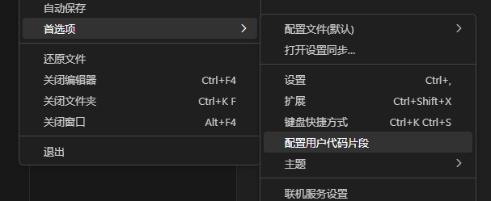
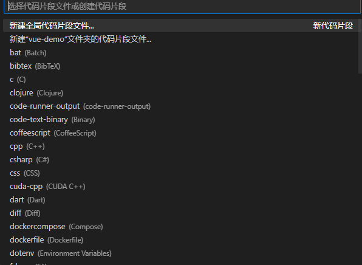
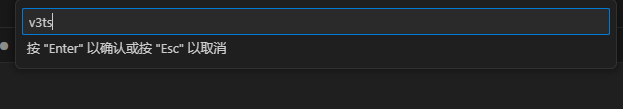
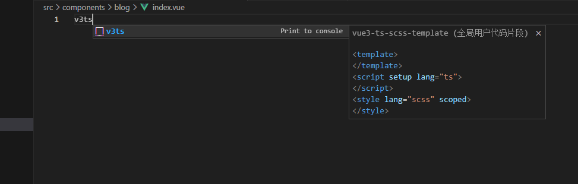

## vscode 创建自定义模板代码

1.模板创建

文件->首选项->配置用户代码片段



新建全局代码片段

	

输入使用模板命令



模板代码

```json
{
	"Print to console": {
		"scope": "typescript",
		"prefix": "v3ts",
		"body": [
			"<template>",
			"</template>",
			"<script setup lang=\"ts\">",
			"</script>",
			"<style lang=\"scss\" scoped>",
			"</style>"
		],
		"description": "vue3-ts-scss-template"
	}
}
```

使用

