# SpringCloud 项目搭建过程

## 版本说明

>SpringBoot 2.7.0
>
>SpringCloud 2021.0.3
>
>SpringCloudAlibaba 2021.0.1.0
>
>mysql 8.0

## 创建Maven工程

> 创建一个demo-parent的父工程，然后在父工程的基础上新建demo-auth、demo-common、demo-entity、demo-gateway、demo-service、demo-api等子模块。

demo-parent的pom.xml

```xml
<?xml version="1.0" encoding="UTF-8"?>
<project xmlns="http://maven.apache.org/POM/4.0.0" xmlns:xsi="http://www.w3.org/2001/XMLSchema-instance"
	xsi:schemaLocation="http://maven.apache.org/POM/4.0.0 https://maven.apache.org/xsd/maven-4.0.0.xsd">
	<modelVersion>4.0.0</modelVersion>
	<parent>
		<groupId>org.springframework.boot</groupId>
		<artifactId>spring-boot-starter-parent</artifactId>
		<version>2.7.0</version>
		<relativePath/> <!-- lookup parent from repository -->
	</parent>
	<groupId>com.hy</groupId>
	<artifactId>demo-parent</artifactId>
	<version>0.0.1-SNAPSHOT</version>
	<name>demo-parent</name>
	<description>demo-parent</description>
	<packaging>pom</packaging>
	<properties>
		<java.version>1.8</java.version>
		<project.build.sourceEncoding>UTF-8</project.build.sourceEncoding>
		<project.reporting.outputEncoding>UTF-8</project.reporting.outputEncoding>
		<spring-boot.version>2.7.0</spring-boot.version>
		<spring-cloud.version>2021.0.3</spring-cloud.version>
		<spring-cloud-alibaba.version>2021.0.1.0</spring-cloud-alibaba.version>
		<spring-cloud-starter-oauth2.version>2.2.5.RELEASE</spring-cloud-starter-oauth2.version>
		<druid.version>1.2.9</druid.version>
		<hutool.version>5.8.0</hutool.version>
		<jjwt.version>0.9.1</jjwt.version>
		<knife4j.version>3.0.3</knife4j.version>
		<nimbus-jose-jwt.version>9.23</nimbus-jose-jwt.version>
		<postgresql.version>42.5.1</postgresql.version>
	</properties>
	<modules>
		<module>demo-api</module>
		<module>demo-common</module>
		<module>demo-entity</module>
		<module>demo-gateway</module>
		<module>demo-service</module>
		<module>demo-auth</module>
		<module>demo-web</module>
		<module>demo-web-common</module>
	</modules>
	<dependencies>
		<!-- 监控检查-->
		<dependency>
			<groupId>org.springframework.boot</groupId>
			<artifactId>spring-boot-starter-actuator</artifactId>
		</dependency>
		<!-- 解决nacos配置中心读不到数据源的问题 -->
		<dependency>
			<groupId>org.springframework.cloud</groupId>
			<artifactId>spring-cloud-starter-bootstrap</artifactId>
		</dependency>
<!--		springboottest-->
		<dependency>
			<groupId>org.springframework.boot</groupId>
			<artifactId>spring-boot-starter-test</artifactId>
			<scope>test</scope>
		</dependency>
		<dependency>
			<groupId>org.projectlombok</groupId>
			<artifactId>lombok</artifactId>
		</dependency>

		<!-- tools-->
		<dependency>
			<groupId>cn.hutool</groupId>
			<artifactId>hutool-all</artifactId>
		</dependency>
		<!-- 注解配置处理器-->
		<dependency>
			<groupId>org.springframework.boot</groupId>
			<artifactId>spring-boot-configuration-processor</artifactId>
			<optional>true</optional>
		</dependency>
	</dependencies>
	<dependencyManagement>
		<dependencies>
			<!--Spring Cloud 相关依赖-->
			<dependency>
				<groupId>org.springframework.cloud</groupId>
				<artifactId>spring-cloud-dependencies</artifactId>
				<version>${spring-cloud.version}</version>
				<type>pom</type>
				<scope>import</scope>
			</dependency>
			<!--Spring Cloud Alibaba 相关依赖-->
			<dependency>
				<groupId>com.alibaba.cloud</groupId>
				<artifactId>spring-cloud-alibaba-dependencies</artifactId>
				<version>${spring-cloud-alibaba.version}</version>
				<type>pom</type>
				<scope>import</scope>
			</dependency>
			<dependency>
				<groupId>com.baomidou</groupId>
				<artifactId>mybatis-plus-boot-starter</artifactId>
				<version>3.3.0</version>
			</dependency>
			<dependency>
				<groupId>cn.hutool</groupId>
				<artifactId>hutool-all</artifactId>
				<version>${hutool.version}</version>
			</dependency>
			<!--Knife4j API文档生产工具-->
			<dependency>
				<groupId>com.github.xiaoymin</groupId>
				<artifactId>knife4j-micro-spring-boot-starter</artifactId>
				<version>${knife4j.version}</version>
			</dependency>
			<dependency>
				<groupId>com.github.xiaoymin</groupId>
				<artifactId>knife4j-spring-boot-starter</artifactId>
				<version>${knife4j.version}</version>
			</dependency>
			<dependency>
				<groupId>io.jsonwebtoken</groupId>
				<artifactId>jjwt</artifactId>
				<version>${jjwt.version}</version>
			</dependency>
			<!--JWT(Json Web Token)登录支持-->
			<dependency>
				<groupId>com.nimbusds</groupId>
				<artifactId>nimbus-jose-jwt</artifactId>
				<version>${nimbus-jose-jwt.version}</version>
			</dependency>
			<dependency>
				<groupId>org.springframework.cloud</groupId>
				<artifactId>spring-cloud-starter-oauth2</artifactId>
				<version>${spring-cloud-starter-oauth2.version}</version>
			</dependency>
			<dependency>
				<groupId>org.postgresql</groupId>
				<artifactId>postgresql</artifactId>
				<version>${postgresql.version}</version>
			</dependency>
		</dependencies>
	</dependencyManagement>

	<build>
		<plugins>
			<plugin>
				<groupId>org.springframework.boot</groupId>
				<artifactId>spring-boot-maven-plugin</artifactId>
				<version>${spring-boot.version}</version>
				<configuration>
					<fork>true</fork>
					<addResources>true</addResources>
				</configuration>
			</plugin>
		</plugins>
	</build>
</project>
```

## 集成mybatisplus框架

> demo-entity(存放实体类)demo-service（存放service、mapper）引入mybatisplus和数据库驱动依赖
>
> demo-api(web接口)
>
> demo-commom和demo-web-common为公共的模块

demo-entity的pom.xml

```xml
<?xml version="1.0" encoding="UTF-8"?>
<project xmlns="http://maven.apache.org/POM/4.0.0" xmlns:xsi="http://www.w3.org/2001/XMLSchema-instance"
         xsi:schemaLocation="http://maven.apache.org/POM/4.0.0 https://maven.apache.org/xsd/maven-4.0.0.xsd">
    <modelVersion>4.0.0</modelVersion>
    <parent>
        <groupId>com.hy</groupId>
        <artifactId>demo-parent</artifactId>
        <version>0.0.1-SNAPSHOT</version>
    </parent>
    <artifactId>demo-entity</artifactId>
    <version>0.0.1-SNAPSHOT</version>
    <name>demo-entity</name>
    <description>demo-entity</description>
    <dependencies>
        <dependency>
            <groupId>com.baomidou</groupId>
            <artifactId>mybatis-plus-boot-starter</artifactId>
        </dependency>
        <dependency>
            <groupId>org.postgresql</groupId>
            <artifactId>postgresql</artifactId>
        </dependency>
    </dependencies>
</project>
```

demo-service的pom.xml

```xml
<?xml version="1.0" encoding="UTF-8"?>
<project xmlns="http://maven.apache.org/POM/4.0.0" xmlns:xsi="http://www.w3.org/2001/XMLSchema-instance"
         xsi:schemaLocation="http://maven.apache.org/POM/4.0.0 https://maven.apache.org/xsd/maven-4.0.0.xsd">
    <modelVersion>4.0.0</modelVersion>
    <parent>
        <groupId>com.hy</groupId>
        <artifactId>demo-parent</artifactId>
        <version>0.0.1-SNAPSHOT</version>
    </parent>
    <artifactId>demo-service</artifactId>
    <version>0.0.1-SNAPSHOT</version>
    <name>demo-service</name>
    <description>demo-service</description>
    <properties>
        <java.version>1.8</java.version>
    </properties>
    <dependencies>
        <dependency>
            <groupId>com.hy</groupId>
            <artifactId>demo-entity</artifactId>
            <version>0.0.1-SNAPSHOT</version>
        </dependency>
        <dependency>
            <groupId>com.hy</groupId>
            <artifactId>demo-common</artifactId>
            <version>0.0.1-SNAPSHOT</version>
        </dependency>
    </dependencies>

    <build>
        <plugins>
            <plugin>
                <groupId>org.springframework.boot</groupId>
                <artifactId>spring-boot-maven-plugin</artifactId>
                <version>${spring-boot.version}</version>
            </plugin>
        </plugins>
    </build>

</project>

```

demo-api的pom.xml

```xml
<?xml version="1.0" encoding="UTF-8"?>
<project xmlns="http://maven.apache.org/POM/4.0.0" xmlns:xsi="http://www.w3.org/2001/XMLSchema-instance"
         xsi:schemaLocation="http://maven.apache.org/POM/4.0.0 https://maven.apache.org/xsd/maven-4.0.0.xsd">
    <modelVersion>4.0.0</modelVersion>
    <parent>
        <artifactId>demo-parent</artifactId>
        <groupId>com.hy</groupId>
        <version>0.0.1-SNAPSHOT</version>
    </parent>
    <artifactId>demo-api</artifactId>
    <version>0.0.1-SNAPSHOT</version>
    <name>demo-api</name>
    <description>demo-api</description>
    <dependencies>
        <!-- web -->
        <dependency>
            <groupId>org.springframework.boot</groupId>
            <artifactId>spring-boot-starter-web</artifactId>
        </dependency>
        <dependency>
            <groupId>com.hy</groupId>
            <artifactId>demo-service</artifactId>
            <version>0.0.1-SNAPSHOT</version>
        </dependency>
        <dependency>
            <groupId>com.hy</groupId>
            <artifactId>demo-web-common</artifactId>
            <version>0.0.1-SNAPSHOT</version>
        </dependency>
    </dependencies>

</project>

```

在demo-api的resource下创建bootstrap.yml并配置

```yml
spring:
  application:
    name: test-api
  profiles:
    active: dev
server:
  port: 8081
```

创建application-dev.yml并配置数据库信息，mybatisplus的信息

```yml
spring:
  mvc:
    pathmatch:
      matching-strategy: ant_path_matcher
  main:
    allow-bean-definition-overriding: true
  datasource:
    url: jdbc:postgresql://127.0.0.1:5432/ssm
    username: postgres
    password: 123456
    driver-class-name: org.postgresql.Driver
mybatis-plus:
  configuration:
    map-underscore-to-camel-case: false # 关闭驼峰命名规则
    log-impl: org.apache.ibatis.logging.stdout.StdOutImpl# sql日志
  mapper-locations: classpath:mapper/*Mapper.xml # 编写复杂的sql 语句 ，mybatis-plus 对多表关联支持性差。手写xml文件{sql语句}


```

修改启动类增加mapper扫描配置

```java
@SpringBootApplication(scanBasePackages = {"com.hy.demo"})
@MapperScan(value = "com.hy.demo.mapper")
public class DemoApplication {
    public static void main(String[] args) {
        SpringApplication.run(DemoApplication.class, args);
    }
}
```

配置myabatisplus分页插件

```java
@Configuration
public class MybatisPlusConfig {

    /**
     * 分页插件
     * @return MybatisPlusInterceptor
     */
    @Bean
    public PaginationInterceptor paginationInterceptor() {
        PaginationInterceptor paginationInterceptor = new PaginationInterceptor();
        return paginationInterceptor;
    }
}
```

## 集成hikari数据连接池

> springboot内部默认使用不需要引入其他依赖

修改application.yml 配置文件添加hikari连接池配置

```yaml
spring:
  datasource:
    url: jdbc:postgresql://10.32.128.113:5432/ssm
    username: postgres
    password: 123456
    driver-class-name: org.postgresql.Driver
    type: com.zaxxer.hikari.HikariDataSource
    hikari:
      minimum-idle: 5            # 最小空闲连接数量 默认10
      maximum-pool-size: 10      # 连接池默认最大连接数 默认10
      idle-timeout: 180000       # 空闲时间最大存活时间
      auto-commit: true          # 此属性控制从池返回的连接的默认自动提交行为,默认值：true
      pool-name: MyHikariCP      # 连接池名称
      max-lifetime: 180000       # 此属性控制池中连接的最长生命周期，值0表示无限生命周期，默认1800000即30分钟
      connection-timeout: 30000  # 数据库连接超时时间,默认30秒，即30000
      connection-test-query: SELECT 1
```


## 集成nacos作为服务注册发现

>Nacos是一个更易于构建云原生应用的动态服务发现、配置管理和服务管理平台，Nacos 致力于帮助您发现、配置和管理微服务。Nacos 提供了一组简单易用的特性集，帮助您快速实现动态服务发现、服务配置、服务元数据及流量管理。

在父工程添加springcloud alibaba依赖

```xml
			<dependency>
				<groupId>com.alibaba.cloud</groupId>
				<artifactId>spring-cloud-alibaba-dependencies</artifactId>
				<version>${spring-cloud-alibaba.version}</version>
				<type>pom</type>
				<scope>import</scope>
			</dependency>
```

在demo-api中引入nacos服务注册依赖

```xml
        <!--         nacos注册中心依赖包 -->
        <dependency>
            <groupId>com.alibaba.cloud</groupId>
            <artifactId>spring-cloud-starter-alibaba-nacos-discovery</artifactId>
        </dependency>
```

修改application-dev.yml 添加nacos配置

```yml
spring:
  mvc:
    pathmatch:
      matching-strategy: ant_path_matcher
  main:
    allow-bean-definition-overriding: true
  datasource:
    url: jdbc:postgresql://10.32.128.113:5432/ssm
    username: postgres
    password: 123456
    driver-class-name: org.postgresql.Driver
  cloud:
    nacos:
      discovery:
        server-addr: localhost:8848
mybatis-plus:
  configuration:
    map-underscore-to-camel-case: false # 关闭驼峰命名规则
    log-impl: org.apache.ibatis.logging.stdout.StdOutImpl
  mapper-locations: classpath:mapper/*Mapper.xml # 编写复杂的sql 语句 ，mybatis-plus 对多表关联支持性差。手写xml文件{sql语句}

```

启动类增加@EnableDiscoveryClient注解

```java
@SpringBootApplication(scanBasePackages = {"com.hy.demo"})
@EnableDiscoveryClient
@MapperScan(value = "com.hy.demo.mapper")
public class DemoApplication {
    public static void main(String[] args) {
        SpringApplication.run(DemoApplication.class, args);
    }
}
```

运行启动类，浏览器打开nacos地址，点击左侧菜单的服务列表可以查看到已经注册到nacos了

## 集成gateway实现路由转发

> Spring Cloud Gateway是Spring官方基于Spring 5.0，Spring Boot 2.0和Project Reactor等技术开发的网关，Spring Cloud Gateway旨在为微服务架构提供一种简单而有效的统一的API路由管理方式。Spring Cloud Gateway作为Spring Cloud生态系中的网关，目标是替代ZUUL，其不仅提供统一的路由方式，并且基于Filter链的方式提供了网关基本的功能，例如：安全，监控/埋点，和限流等

在demo-gateway 引入nacos和gateway的依赖

demo-gateway 的pom.xml

```xml
<?xml version="1.0" encoding="UTF-8"?>
<project xmlns="http://maven.apache.org/POM/4.0.0" xmlns:xsi="http://www.w3.org/2001/XMLSchema-instance"
         xsi:schemaLocation="http://maven.apache.org/POM/4.0.0 https://maven.apache.org/xsd/maven-4.0.0.xsd">
    <modelVersion>4.0.0</modelVersion>
    <parent>
        <groupId>com.hy</groupId>
        <artifactId>demo-parent</artifactId>
        <version>0.0.1-SNAPSHOT</version>
    </parent>
    <artifactId>demo-gateway</artifactId>
    <version>0.0.1-SNAPSHOT</version>
    <name>demo-gateway</name>
    <description>demo-gateway</description>
    <properties>
        <java.version>1.8</java.version>
    </properties>
    <dependencies>

        <!--         nacos注册中心依赖包 -->
        <dependency>
            <groupId>com.alibaba.cloud</groupId>
            <artifactId>spring-cloud-starter-alibaba-nacos-discovery</artifactId>
        </dependency>
<!--        网关依赖-->
        <dependency>
            <groupId>org.springframework.cloud</groupId>
            <artifactId>spring-cloud-starter-gateway</artifactId>
        </dependency>
    </dependencies>

    <build>
        <plugins>
            <plugin>
                <groupId>org.springframework.boot</groupId>
                <artifactId>spring-boot-maven-plugin</artifactId>
                <version>${spring-boot.version}</version>
            </plugin>
        </plugins>
    </build>

</project>

```

新建DemoGatewayApplication 启动类

```java
@SpringBootApplication(scanBasePackages = {"com.hy.demo"})
@EnableDiscoveryClient
public class DemoGatewayApplication {

    public static void main(String[] args) {
        SpringApplication.run(DemoGatewayApplication.class, args);
    }
}

```

新建bootstrap.yml

```yml
server:
  port: 8201
spring:
  application:
    name: demo-gateway
  profiles:
    active: dev

```

新建application-dev.yml

```yml
spring:
  mvc:
    pathmatch:
      matching-strategy: ant_path_matcher
  cloud:
    nacos:
      discovery:
        server-addr: 10.32.128.102:8848
    gateway:
      discovery:
        locator:
          enabled: true
          lower-case-service-id: true #
      routes: #路由转发
        - id: auth
          #          uri: http://localhost:9401
          uri: lb://demo-oauth2-auth
          predicates:
            - Path=/demo-oauth2-auth/**,/oauth/token,/rsa/**
          filters:
            - StripPrefix=1
        - id: api
          #          uri: http://localhost:8081
          uri: lb://test-api
          predicates:
            - Path=/test-api/**,/test/**,/user/test/**
          filters:
            - StripPrefix=1 # 过滤路径的第一个地址

```

## 集成knife4j gateway聚合微服务api文档

在gateway中引入knife4j的依赖

```xml
       <dependency>
            <groupId>com.github.xiaoymin</groupId>
            <artifactId>knife4j-spring-boot-starter</artifactId>
        </dependency>
```

在gateway添加Swagger配置

```java

/**
 *
 * @Description Swagger资源配置
 * @Author yao
 * @Date 2023/5/26 10:34
 **/
@Slf4j
@Component
@Primary
@AllArgsConstructor
public class SwaggerResourceConfig implements SwaggerResourcesProvider {

    private final RouteLocator routeLocator;
    private final GatewayProperties gatewayProperties;

    @Override
    public List<SwaggerResource> get() {
        List<SwaggerResource> resources = new ArrayList<>();
        List<String> routes = new ArrayList<>();
        //获取所有路由的ID
        routeLocator.getRoutes().subscribe(route -> routes.add(route.getId()));
        //过滤出配置文件中定义的路由->过滤出Path Route Predicate->根据路径拼接成api-docs路径->生成SwaggerResource
        gatewayProperties.getRoutes().stream().filter(routeDefinition -> routes.contains(routeDefinition.getId())).forEach(route -> {
            route.getPredicates().stream()
                    .filter(predicateDefinition -> ("Path").equalsIgnoreCase(predicateDefinition.getName()))
                    .forEach(predicateDefinition -> resources.add(swaggerResource(route.getId(),
                            predicateDefinition.getArgs().get(NameUtils.GENERATED_NAME_PREFIX + "0")
                                    .replace("**", "v2/api-docs"))));
        });

        return resources;
    }

    private SwaggerResource swaggerResource(String name, String location) {
        log.info("name:{},location:{}", name, location);
        SwaggerResource swaggerResource = new SwaggerResource();
        swaggerResource.setName(name);
        swaggerResource.setLocation(location);
        swaggerResource.setSwaggerVersion("2.0");
        return swaggerResource;
    }
}

```

在gateway自定义Swagger各个配置的节点

```


/**
 *
 * @Description 自定义Swagger的各个配置节点
 * @Author yao
 * @Date 2023/5/26 10:35
 **/
@RestController
public class SwaggerHandler {

    @Autowired(required = false)
    private SecurityConfiguration securityConfiguration;

    @Autowired(required = false)
    private UiConfiguration uiConfiguration;

    private final SwaggerResourcesProvider swaggerResources;

    @Autowired
    public SwaggerHandler(SwaggerResourcesProvider swaggerResources) {
        this.swaggerResources = swaggerResources;
    }

    /**
     * Swagger安全配置，支持oauth和apiKey设置
     */
    @GetMapping("/swagger-resources/configuration/security")
    public Mono<ResponseEntity<SecurityConfiguration>> securityConfiguration() {
        return Mono.just(new ResponseEntity<>(
                Optional.ofNullable(securityConfiguration).orElse(SecurityConfigurationBuilder.builder().build()), HttpStatus.OK));
    }

    /**
     * Swagger UI配置
     */
    @GetMapping("/swagger-resources/configuration/ui")
    public Mono<ResponseEntity<UiConfiguration>> uiConfiguration() {
        return Mono.just(new ResponseEntity<>(
                Optional.ofNullable(uiConfiguration).orElse(UiConfigurationBuilder.builder().build()), HttpStatus.OK));
    }

    /**
     * Swagger资源配置，微服务中这各个服务的api-docs信息
     */
    @GetMapping("/swagger-resources")
    public Mono<ResponseEntity> swaggerResources() {
        return Mono.just((new ResponseEntity<>(swaggerResources.get(), HttpStatus.OK)));
    }
}

```

在web项目引入knife4j（无ui）的依赖，以demo-api为例

在demo-api中添加依赖

```xml
        <dependency>
            <groupId>com.github.xiaoymin</groupId>
            <artifactId>knife4j-micro-spring-boot-starter</artifactId>
        </dependency>
```

在demo-api中添加Swagger相关配置，非常常规的配置，添加`@EnableKnife4j`注解开启knife4j的增强功能

```java

/**
 *
 * @Description Swagger API文档相关配置
 * @Author yao
 * @Date 2023/5/26 10:28
 **/
@Configuration
@EnableSwagger2
@EnableKnife4j
public class SwaggerConfig extends BaseSwaggerConfig {

    @Override
    public SwaggerProperties swaggerProperties() {
        return SwaggerProperties.builder()
                .apiBasePackage("com.hy.demo.controller")
                .title("demo测试")
                .description("demo测试相关接口文档")
                .contactName("yao")
                .version("1.0")
                .enableSecurity(true)
                .build();
    }

    @Bean
    public BeanPostProcessor springfoxHandlerProviderBeanPostProcessor() {
        return generateBeanPostProcessor();
    }
}

```

swagger 基础配置

```java

/**
 *
 * @Description Swagger基础配置
 * @Author yao
 * @Date 2023/5/26 10:22
 **/
public abstract class BaseSwaggerConfig {

    @Bean
    public Docket createRestApi() {
        SwaggerProperties swaggerProperties = swaggerProperties();
        Docket docket = new Docket(DocumentationType.SWAGGER_2)
                .apiInfo(apiInfo(swaggerProperties))
                .select()
                .apis(RequestHandlerSelectors.basePackage(swaggerProperties.getApiBasePackage()))
                .paths(PathSelectors.any())
                .build();
        if (swaggerProperties.isEnableSecurity()) {
            docket.securitySchemes(securitySchemes()).securityContexts(securityContexts());
        }
        return docket;
    }

    private ApiInfo apiInfo(SwaggerProperties swaggerProperties) {
        return new ApiInfoBuilder()
                .title(swaggerProperties.getTitle())
                .description(swaggerProperties.getDescription())
                .contact(new Contact(swaggerProperties.getContactName(), swaggerProperties.getContactUrl(), swaggerProperties.getContactEmail()))
                .version(swaggerProperties.getVersion())
                .build();
    }

    private List<SecurityScheme> securitySchemes() {
        //设置请求头信息
        List<SecurityScheme> result = new ArrayList<>();
        ApiKey apiKey = new ApiKey("Authorization", "Authorization", "header");
        result.add(apiKey);
        return result;
    }

    private List<SecurityContext> securityContexts() {
        //设置需要登录认证的路径
        List<SecurityContext> result = new ArrayList<>();
        result.add(getContextByPath("/*/.*"));
        return result;
    }

    private SecurityContext getContextByPath(String pathRegex) {
        return SecurityContext.builder()
                .securityReferences(defaultAuth())
                .forPaths(PathSelectors.regex(pathRegex))
                .build();
    }

    private List<SecurityReference> defaultAuth() {
        List<SecurityReference> result = new ArrayList<>();
        AuthorizationScope authorizationScope = new AuthorizationScope("global", "accessEverything");
        AuthorizationScope[] authorizationScopes = new AuthorizationScope[1];
        authorizationScopes[0] = authorizationScope;
        result.add(new SecurityReference("Authorization", authorizationScopes));
        return result;
    }

    public BeanPostProcessor generateBeanPostProcessor() {
        return new BeanPostProcessor() {

            @Override
            public Object postProcessAfterInitialization(Object bean, String beanName) throws BeansException {
                if (bean instanceof WebMvcRequestHandlerProvider || bean instanceof WebFluxRequestHandlerProvider) {
                    customizeSpringfoxHandlerMappings(getHandlerMappings(bean));
                }
                return bean;
            }

            private <T extends RequestMappingInfoHandlerMapping> void customizeSpringfoxHandlerMappings(List<T> mappings) {
                List<T> copy = mappings.stream()
                        .filter(mapping -> mapping.getPatternParser() == null)
                        .collect(Collectors.toList());
                mappings.clear();
                mappings.addAll(copy);
            }

            @SuppressWarnings("unchecked")
            private List<RequestMappingInfoHandlerMapping> getHandlerMappings(Object bean) {
                try {
                    Field field = ReflectionUtils.findField(bean.getClass(), "handlerMappings");
                    field.setAccessible(true);
                    return (List<RequestMappingInfoHandlerMapping>) field.get(bean);
                } catch (IllegalArgumentException | IllegalAccessException e) {
                    throw new IllegalStateException(e);
                }
            }
        };
    }

    /**
     * 自定义Swagger配置
     */
    public abstract SwaggerProperties swaggerProperties();

}

```

其他web模块想要集成knife4j只需和demo-api一样引入依赖，添加配置即可

## 集成Gateway+OAuth2+JWT实现微服务统一认证授权

> ​		OAuth2是一个关于授权的开放标准，核心思路是通过各类认证手段（具体什么手段OAuth2不关心）认证用户身份，并颁发token（令牌），使得第三方应用可以使用该token（令牌）在限定时间、限定范围访问指定资源。
>   OAuth2中使用token验证用户登录合法性，但token最大的问题是不携带用户信息，资源服务器无法在本地进行验证，每次对于资源的访问，资源服务器都需要向认证服务器发起请求，一是验证token的有效性，二是获取token对应的用户信息。如果有大量的此类请求，无疑处理效率是很低，且认证服务器会变成一个中心节点，这在分布式架构下很影响性能。如果认证服务器颁发的是jwt格式的token，那么资源服务器就可以直接自己验证token的有效性并绑定用户，这无疑大大提升了处理效率且减少了单点隐患。
>   SpringCloud认证授权解决思路：认证服务负责认证，网关负责校验认证和鉴权，其他API服务负责处理自己的业务逻辑。安全相关的逻辑只存在于认证服务和网关服务中，其他服务只是单纯地提供服务而没有任何安全相关逻辑。

搭建认证服务demo-auth

demo-auth的 pom.xml  主要是Spring Security、Oauth2、JWT、Redis相关依赖；

```xml
<?xml version="1.0" encoding="UTF-8"?>
<project xmlns="http://maven.apache.org/POM/4.0.0" xmlns:xsi="http://www.w3.org/2001/XMLSchema-instance"
         xsi:schemaLocation="http://maven.apache.org/POM/4.0.0 https://maven.apache.org/xsd/maven-4.0.0.xsd">
    <modelVersion>4.0.0</modelVersion>
    <parent>
        <groupId>com.hy</groupId>
        <artifactId>demo-parent</artifactId>
        <version>0.0.1-SNAPSHOT</version>
    </parent>
    <groupId>com.hy</groupId>
    <artifactId>demo-auth</artifactId>
    <version>0.0.1-SNAPSHOT</version>
    <name>demo-auth</name>
    <description>demo-auth</description>
    <properties>
        <java.version>1.8</java.version>
    </properties>
    <dependencies>
        <!--         nacos注册中心依赖包 -->
        <dependency>
            <groupId>com.alibaba.cloud</groupId>
            <artifactId>spring-cloud-starter-alibaba-nacos-discovery</artifactId>
        </dependency>
        <!-- nacos配置中心依赖包 -->
<!--        <dependency>-->
<!--            <groupId>com.alibaba.cloud</groupId>-->
<!--            <artifactId>spring-cloud-starter-alibaba-nacos-config</artifactId>-->
<!--        </dependency>-->
        <dependency>
            <groupId>org.springframework.boot</groupId>
            <artifactId>spring-boot-starter-web</artifactId>
        </dependency>
        <dependency>
            <groupId>org.springframework.boot</groupId>
            <artifactId>spring-boot-starter-security</artifactId>
        </dependency>
        <dependency>
            <groupId>org.springframework.cloud</groupId>
            <artifactId>spring-cloud-starter-oauth2</artifactId>
        </dependency>
        <dependency>
            <groupId>org.springframework.cloud</groupId>
            <artifactId>spring-cloud-starter-openfeign</artifactId>
        </dependency>
        <dependency>
            <groupId>io.github.openfeign</groupId>
            <artifactId>feign-okhttp</artifactId>
        </dependency>
        <dependency>
            <groupId>org.springframework.cloud</groupId>
            <artifactId>spring-cloud-starter-loadbalancer</artifactId>
        </dependency>
        <dependency>
            <groupId>com.nimbusds</groupId>
            <artifactId>nimbus-jose-jwt</artifactId>
        </dependency>
        <dependency>
            <groupId>com.hy</groupId>
            <artifactId>demo-service</artifactId>
            <version>0.0.1-SNAPSHOT</version>
        </dependency>

    </dependencies>

    <build>
        <resources>
            <resource>
                <directory>src/main/resources</directory>
                <filtering>false</filtering>
                <includes>
                    <include>**/*</include>
                </includes>
            </resource>
        </resources>

        <plugins>
            <plugin>
                <groupId>org.springframework.boot</groupId>
                <artifactId>spring-boot-maven-plugin</artifactId>
                <version>${spring-boot.version}</version>
            </plugin>
        </plugins>
    </build>

</project>

```

创建bootstrap.yml

```yml
server:
  port: 9401
spring:
  profiles:
    active: dev
  application:
    name: demo-oauth2-auth

```

创建application-dev.yml

```yml
spring:
  datasource:
    url: jdbc:postgresql://localhost/ssm
    username: postgres
    password: 123456
    driver-class-name: org.postgresql.Driver
  main:
    allow-bean-definition-overriding: true
  mvc:
    pathmatch:
      matching-strategy: ant_path_matcher
  cloud:
    nacos:
      discovery:
        server-addr: 10.32.128.102:8848
  #      config:
  #        server-addr: localhost:8848
  #        file-extension: yml #指定文件扩展名，默认为properties
  #        prefix: demo-oauth2-auth

  jackson:
    date-format: yyyy-MM-dd HH:mm:ss
  redis:
    database: 0
    port: 6379
    host: localhost
    password:
management:
  endpoints:
    web:
      exposure:
        include: "*"
mybatis-plus:
  configuration:
    log-impl: org.apache.ibatis.logging.stdout.StdOutImpl
    map-underscore-to-camel-case: false # 关闭驼峰命名规则
  mapper-locations: classpath:mapper/*Mapper.xml


```

使用`keytool`生成RSA证书`jwt.jks`，复制到`resource`目录下，在JDK的`bin`目录下使用如下命令即可；

```sh
keytool -genkey -alias jwt -keyalg RSA -keystore jwt.jks
```

创建`UserServiceImpl`类实现Spring Security的`UserDetailsService`接口，用于加载用户信息

```java

/**
 * @Description
 * @Author yao
 * @Date 2023/5/24 17:32
 **/
@Service
public class UserServiceImpl implements UserDetailsService {

    @Autowired
    private SyspersonsService syspersonsService;
    @Override
    public UserDetails loadUserByUsername(String username) throws UsernameNotFoundException {

        UserDto userDto = syspersonsService.loadUserByUsername(username);
        if (userDto == null) {
            throw new UsernameNotFoundException(MessageConstant.USERNAME_PASSWORD_ERROR);
        }
        SecurityUser securityUser = new SecurityUser(userDto);
        if (!securityUser.isEnabled()) {
            throw new DisabledException(MessageConstant.ACCOUNT_DISABLED);
        } else if (!securityUser.isAccountNonLocked()) {
            throw new LockedException(MessageConstant.ACCOUNT_LOCKED);
        } else if (!securityUser.isAccountNonExpired()) {
            throw new AccountExpiredException(MessageConstant.ACCOUNT_EXPIRED);
        } else if (!securityUser.isCredentialsNonExpired()) {
            throw new CredentialsExpiredException(MessageConstant.CREDENTIALS_EXPIRED);
        }
        return securityUser;
    }
}
```

添加认证服务相关配置`Oauth2ServerConfig`，需要配置加载用户信息的服务`UserServiceImpl`及RSA的钥匙对`KeyPair`

```java

/**
 * @Description 认证服务器配置
 * @Author yao
 * @Date 2023/5/24 18:08
 **/
@Configuration
@AllArgsConstructor
@EnableAuthorizationServer
public class Oauth2ServerConfig extends AuthorizationServerConfigurerAdapter {
        private final PasswordEncoder passwordEncoder;
        private final UserServiceImpl userDetailsService;
        private final AuthenticationManager authenticationManager;
        private final JwtTokenEnhancer jwtTokenEnhancer;

        /**
         *
         * 令牌访问安全约束配置
         **/
        @Override
        public void configure(AuthorizationServerSecurityConfigurer security) throws Exception {
                //表单模式申请令牌，表示支持 client_id 和 client_secret 做登录认证
                security
                        .tokenKeyAccess("isAuthenticated()")
                        .checkTokenAccess("permitAll()")
                        .allowFormAuthenticationForClients();

        }
        /**
         * 配置客户端详情服务
         **/
        @Override
        public void configure(ClientDetailsServiceConfigurer clients) throws Exception {
                //使用内存模式存储
                clients.inMemory()
                        //指定客户端唯一id
                        .withClient("test-id")
                        //客户端密钥 后面改成配置文件加载
                        .secret(this.passwordEncoder.encode("123456"))
//                        .redirectUris("http://www.baidu.com") 配置redirect_uri，用于授权成功后跳转
                        // 定义客户端权限
                        .scopes("all")
                        //指定授权模式 授权模式一共四种 1.authorization_code 2.password 3.implicit 4.client_credentials
                        .authorizedGrantTypes("password", "refresh_token")
                        // accessToken 过期时间
                        .accessTokenValiditySeconds(3600*24)
                        // refreshToken 过期时间
                        .refreshTokenValiditySeconds(3600*24*7);
                // .and().whthClient() 配置其他客户端授权

        }
        /**
         *
         *  令牌访问端点配置
         **/
        @Override
        public void configure(AuthorizationServerEndpointsConfigurer endpoints) throws Exception {
                TokenEnhancerChain tokenEnhancerChain = new TokenEnhancerChain();
                List<TokenEnhancer> tokenEnhancers = new ArrayList<>();
                tokenEnhancers.add(jwtTokenEnhancer);
                tokenEnhancers.add(accessTokenConverter());
                //配置jwt内容增强
                tokenEnhancerChain.setTokenEnhancers(tokenEnhancers);
                endpoints.authenticationManager(authenticationManager)
                        //配置加载用户信息配置
                        .userDetailsService(userDetailsService)
                        /**
                         *
                         * refresh_token有两种使用方式：重复使用(true)、非重复使用(false)，默认为true
                         * 1.重复使用：access_token过期刷新时， refresh token过期时间未改变，仍以初次生成的时间为准
                         * 2.非重复使用：access_token过期刷新时， refresh_token过期时间延续，在refresh_token有效期内刷新而无需失效再次登录
                         */
//                        .reuseRefreshTokens(false)
                        .accessTokenConverter(accessTokenConverter())
                        .tokenEnhancer(tokenEnhancerChain);

        }
        /**
         * 使用非对称加密算法对token签名
         */
        @Bean
        public JwtAccessTokenConverter accessTokenConverter() {
                JwtAccessTokenConverter jwtAccessTokenConverter = new JwtAccessTokenConverter();
                jwtAccessTokenConverter.setKeyPair(keyPair());
                return jwtAccessTokenConverter;
        }
        /**
         *
         *   需要配置加载用户信息的服务UserServiceImpl及RSA的钥匙对KeyPair
         **/
        @Bean
        public KeyPair keyPair() {
                //从classpath下的证书中获取秘钥对
                KeyStoreKeyFactory keyStoreKeyFactory = new KeyStoreKeyFactory(new ClassPathResource("jwt.jks"), "123456".toCharArray());
                return keyStoreKeyFactory.getKeyPair("jwt", "123456".toCharArray());
        }
}


```

配置jwt内容增强器

> 如果你想往JWT中添加自定义信息的话，比如说`登录用户的ID`，可以自己实现`TokenEnhancer`接口

```java
@Component
public class JwtTokenEnhancer implements TokenEnhancer {

    @Override
    public OAuth2AccessToken enhance(OAuth2AccessToken oAuth2AccessToken, OAuth2Authentication oAuth2Authentication) {
        SecurityUser securityUser = (SecurityUser) oAuth2Authentication.getPrincipal();
        // 把用户id添加到jwt中
        Map<String,Object> info = new HashMap<>();
        info.put("id",securityUser.getId());
        info.put("client_id",securityUser.getClientId());
        info.put("roleid",securityUser.getRoleId());
        info.put("roletype",securityUser.getRoleType());
        info.put("unitid",securityUser.getUnitId());
        ((DefaultOAuth2AccessToken) oAuth2AccessToken).setAdditionalInformation(info);
        return oAuth2AccessToken;
    }
}
```

由于我们的网关服务需要RSA的公钥来验证签名是否合法，所以认证服务需要有个接口把公钥暴露出来

```java

/*
 *
 * @Description  获取RSA公钥接口
 * @Author yao
 * @Date 2023/5/25 10:32
 **/
@RestController
@RequestMapping("/rsa")
public class KeyPairController {

    @Autowired
    private KeyPair keyPair;

    @GetMapping("/publicKey")
    public Map<String, Object> getKey() {
        RSAPublicKey publicKey = (RSAPublicKey) keyPair.getPublic();
        RSAKey key = new RSAKey.Builder(publicKey).build();
        return new JWKSet(key).toJSONObject();
    }

}
```

配置Spring Security，允许获取公钥接口的访问

```java

/**
 * @Description SpringSecurity配置
 * @Author yao
 * @Date 2023/5/25 10:34
 **/
@Configuration
@EnableWebSecurity
public class WebSecurityConfig extends WebSecurityConfigurerAdapter {
	
   /**
     *
     * @param http
     * access(String) 如果给定的SpEL表达式计算结果为true，就允许访问
     * anonymous() 允许匿名用户访问
     * authenticated() 允许认证的用户进行访问
     * denyAll() 无条件拒绝所有访问
     * fullyAuthenticated() 如果用户是完整认证的话（不是通过Remember-me功能认证的），就允许访问
     * hasAuthority(String) 如果用户具备给定权限的话就允许访问
     * hasAnyAuthority(String…)如果用户具备给定权限中的某一个的话，就允许访问
     * hasRole(String) 如果用户具备给定角色(用户组)的话,就允许访问/
     * hasAnyRole(String…) 如果用户具有给定角色(用户组)中的一个的话,允许访问.
     * hasIpAddress(String 如果请求来自给定ip地址的话,就允许访问.
     * not() 对其他访问结果求反.
     * permitAll() 无条件允许访问
     * rememberMe() 如果用户是通过Remember-me功能认证的，就允许访问
     *
     */
    @Override
    protected void configure(HttpSecurity http) throws Exception {
        http.authorizeRequests()
                .requestMatchers(EndpointRequest.toAnyEndpoint()).permitAll()
                .antMatchers("/rsa/publicKey").permitAll()
                .antMatchers("/v2/api-docs").permitAll()
                .antMatchers("/oauth/token").permitAll()
                .anyRequest().authenticated();
    }

    @Bean
    @Override
    public AuthenticationManager authenticationManagerBean() throws Exception {
        return super.authenticationManagerBean();
    }

    @Bean
    public PasswordEncoder passwordEncoder() {
        return new BCryptPasswordEncoder();
    }
}

```

Oauth2异常全局处理

```java
/**
 *
 * @Description 全局处理Oauth2抛出的异常
 * @Author yao
 * @Date 2023/5/25 16:48
 **/
@ControllerAdvice
public class Oauth2ExceptionHandler {
    @ResponseBody
    @ExceptionHandler(value = OAuth2Exception.class)
    public CommonResult handleOauth2(OAuth2Exception e) {
        return CommonResult.failed(e.getHttpErrorCode(), e.getMessage());
    }
}
```

搭建网关服务了，它将作为Oauth2的资源服务、客户端服务使用，对访问微服务的请求进行统一的校验认证和鉴权操作。

在demo-gateway添加相关依赖 主要是Gateway、Oauth2和JWT相关依赖

demo-gateway 的 pom.xml

```xml
<?xml version="1.0" encoding="UTF-8"?>
<project xmlns="http://maven.apache.org/POM/4.0.0" xmlns:xsi="http://www.w3.org/2001/XMLSchema-instance"
         xsi:schemaLocation="http://maven.apache.org/POM/4.0.0 https://maven.apache.org/xsd/maven-4.0.0.xsd">
    <modelVersion>4.0.0</modelVersion>
    <parent>
        <groupId>com.hy</groupId>
        <artifactId>demo-parent</artifactId>
        <version>0.0.1-SNAPSHOT</version>
    </parent>
    <artifactId>demo-gateway</artifactId>
    <version>0.0.1-SNAPSHOT</version>
    <name>demo-gateway</name>
    <description>demo-gateway</description>
    <properties>
        <java.version>1.8</java.version>
    </properties>
    <dependencies>

        <!--         nacos注册中心依赖包 -->
        <dependency>
            <groupId>com.alibaba.cloud</groupId>
            <artifactId>spring-cloud-starter-alibaba-nacos-discovery</artifactId>
        </dependency>
        <!-- nacos配置中心依赖包 -->
        <dependency>
            <groupId>com.alibaba.cloud</groupId>
            <artifactId>spring-cloud-starter-alibaba-nacos-config</artifactId>
        </dependency>
<!--        网关依赖-->
        <dependency>
            <groupId>org.springframework.cloud</groupId>
            <artifactId>spring-cloud-starter-gateway</artifactId>
        </dependency>
        <!-- swagger -->
        <dependency>
            <groupId>com.github.xiaoymin</groupId>
            <artifactId>knife4j-spring-boot-starter</artifactId>
        </dependency>
<!--        spring security begin-->
        <dependency>
            <groupId>org.springframework.security</groupId>
            <artifactId>spring-security-config</artifactId>
        </dependency>
        <dependency>
            <groupId>org.springframework.security</groupId>
            <artifactId>spring-security-oauth2-resource-server</artifactId>
        </dependency>
        <dependency>
            <groupId>org.springframework.security</groupId>
            <artifactId>spring-security-oauth2-client</artifactId>
        </dependency>
        <dependency>
            <groupId>org.springframework.security</groupId>
            <artifactId>spring-security-oauth2-jose</artifactId>
        </dependency>
        <dependency>
            <groupId>com.nimbusds</groupId>
            <artifactId>nimbus-jose-jwt</artifactId>
            <version>9.30.2</version>
        </dependency>
<!--        <dependency>-->
<!--            <groupId>org.springframework.cloud</groupId>-->
<!--            <artifactId>spring-cloud-starter-openfeign</artifactId>-->
<!--        </dependency>-->
        <dependency>
            <groupId>org.springframework.cloud</groupId>
            <artifactId>spring-cloud-loadbalancer</artifactId>
        </dependency>
        <!--        spring security end-->

    </dependencies>

    <build>
        <plugins>
            <plugin>
                <groupId>org.springframework.boot</groupId>
                <artifactId>spring-boot-maven-plugin</artifactId>
                <version>${spring-boot.version}</version>
            </plugin>
        </plugins>
    </build>

</project>

```

在application-dev.yml中添加相关配置 主要是路由规则的配置、Oauth2中RSA公钥的配置及路由白名单的配置；

```yml
spring:
  mvc:
    pathmatch:
      matching-strategy: ant_path_matcher
  cloud:
    nacos:
      discovery:
        server-addr: 10.32.128.102:8848
    gateway:
      discovery:
        locator:
          enabled: true
          lower-case-service-id: true #
      routes: #
        - id: auth
          #          uri: http://localhost:9401
          uri: lb://demo-oauth2-auth
          predicates:
            - Path=/demo-oauth2-auth/**,/oauth/token,/rsa/**
          filters:
            - StripPrefix=1
        - id: api
          #          uri: http://localhost:8081
          uri: lb://test-api
          predicates:
            - Path=/test-api/**,/test/**,/user/test/**
          filters:
            - StripPrefix=1 # 过滤路径的第一个地址

  security:
    oauth2:
      resourceserver:
        jwt:
          jwk-set-uri: 'http://localhost:8201/demo-oauth2-auth/rsa/publicKey' #
secure:
  ignore:
    urls: #
      - "/doc.html"
      - "/swagger-resources/**"
      - "/swagger/**"
      - "/*/v2/api-docs"
      - "/*/*.js"
      - "/*/*.css"
      - "/*/*.png"
      - "/*/*.ico"
      - "/webjars/**"
      - "/actuator/**"
      - "/demo-oauth2-auth/oauth/token"
      - "/demo-oauth2-auth/rsa/publicKey"


```

新建ResourceServerConfig 对网关服务进行配置安全配置，由于Gateway使用的是`WebFlux`，所以需要使用`@EnableWebFluxSecurity`注解开启；

```java

/**
 * @Description
 * @Author yao
 * @Date 2023/5/25 11:09
 **/
@AllArgsConstructor
@Configuration
@EnableWebFluxSecurity
public class ResourceServerConfig {

    private final AuthorizationManager authorizationManager;
    private final IgnoreUrlsConfig ignoreUrlsConfig;
    private final RestfulAccessDeniedHandler restfulAccessDeniedHandler;
    private final RestAuthenticationEntryPoint restAuthenticationEntryPoint;
    private final IgnoreUrlsRemoveJwtFilter ignoreUrlsRemoveJwtFilter;


    @Bean
    public SecurityWebFilterChain springSecurityFilterChain(ServerHttpSecurity http) {
        http.oauth2ResourceServer()
                .jwt()
                .jwtAuthenticationConverter(jwtAuthenticationConverter());
        //自定义处理JWT请求头过期或签名错误的结果
        http.oauth2ResourceServer()
                .authenticationEntryPoint(restAuthenticationEntryPoint);
        //对白名单路径，直接移除JWT请求头
        http.addFilterBefore(ignoreUrlsRemoveJwtFilter, SecurityWebFiltersOrder.AUTHENTICATION);
        http.authorizeExchange()
                .pathMatchers(ArrayUtil.toArray(ignoreUrlsConfig.getUrls(),String.class))
                .permitAll()//白名单配置
                .anyExchange()
                //鉴权管理器配置
                .access(authorizationManager)
                .and()
                .exceptionHandling()
                //处理未授权
                .accessDeniedHandler(restfulAccessDeniedHandler)
                //处理未认证
                .authenticationEntryPoint(restAuthenticationEntryPoint)
                .and().csrf().disable();
        return http.build();
    }
	 /**
     * ServerHttpSecurity没有将jwt中authorities的负载部分当做Authentication，需要把jwt的Claim中的authorities加入
     * 解决方案：重新定义ReactiveAuthenticationManager权限管理器，默认转换器JwtGrantedAuthoritiesConverter
     */
    @Bean
    public Converter<Jwt, ? extends Mono<? extends AbstractAuthenticationToken>> jwtAuthenticationConverter() {
        JwtGrantedAuthoritiesConverter jwtGrantedAuthoritiesConverter = new JwtGrantedAuthoritiesConverter();
        jwtGrantedAuthoritiesConverter.setAuthorityPrefix(AuthConstant.AUTHORITY_PREFIX);
        jwtGrantedAuthoritiesConverter.setAuthoritiesClaimName(AuthConstant.AUTHORITY_CLAIM_NAME);
        JwtAuthenticationConverter jwtAuthenticationConverter = new JwtAuthenticationConverter();
        jwtAuthenticationConverter.setJwtGrantedAuthoritiesConverter(jwtGrantedAuthoritiesConverter);
        return new ReactiveJwtAuthenticationConverterAdapter(jwtAuthenticationConverter);
    }

}

```

白名单路径过滤器

```java

/**
 *
 * @Description  白名单路径访问时需要移除JWT请求头
 * @Author yao
 * @Date 2023/5/25 14:27
 **/
@Component
public class IgnoreUrlsRemoveJwtFilter implements WebFilter {
    @Autowired
    private IgnoreUrlsConfig ignoreUrlsConfig;
    @Override
    public Mono<Void> filter(ServerWebExchange exchange, WebFilterChain chain) {
        ServerHttpRequest request = exchange.getRequest();
        URI uri = request.getURI();
        PathMatcher pathMatcher = new AntPathMatcher();
        //白名单路径移除JWT请求头
        List<String> ignoreUrls = ignoreUrlsConfig.getUrls();
        for (String ignoreUrl : ignoreUrls) {
            if (pathMatcher.match(ignoreUrl, uri.getPath())) {
                request = exchange.getRequest().mutate().header(AuthConstant.JWT_TOKEN_HEADER, "").build();
                exchange = exchange.mutate().request(request).build();
                return chain.filter(exchange);
            }
        }
        return chain.filter(exchange);
    }
}

```

处理未授权的自定义返回结果类

```java

/**
 *
 * @Description  自定义返回结果：没有权限访问时
 * @Author yao
 * @Date 2023/5/25 14:08
 **/
@Component
public class RestfulAccessDeniedHandler implements ServerAccessDeniedHandler {
    @Override
    public Mono<Void> handle(ServerWebExchange exchange, AccessDeniedException denied) {
        ServerHttpResponse response = exchange.getResponse();
        response.setStatusCode(HttpStatus.OK);
        response.getHeaders().set(HttpHeaders.CONTENT_TYPE, MediaType.APPLICATION_JSON_VALUE);
        response.getHeaders().set("Access-Control-Allow-Origin","*");
        response.getHeaders().set("Cache-Control","no-cache");
        String body= JSONUtil.toJsonStr(CommonResult.forbidden(denied.getMessage()));
        DataBuffer buffer =  response.bufferFactory().wrap(body.getBytes(Charset.forName("UTF-8")));
        return response.writeWith(Mono.just(buffer));
    }
}
```

处理未认证的自定义返回结果类

```java

/**
 *
 * @Description  自定义返回结果：没有登录或token过期时
 * @Author yao
 * @Date 2023/5/25 14:09     
 **/
@Component
public class RestAuthenticationEntryPoint implements ServerAuthenticationEntryPoint {
    @Override
    public Mono<Void> commence(ServerWebExchange exchange, AuthenticationException e) {
        ServerHttpResponse response = exchange.getResponse();
        response.setStatusCode(HttpStatus.OK);
        response.getHeaders().set(HttpHeaders.CONTENT_TYPE, MediaType.APPLICATION_JSON_VALUE);
        response.getHeaders().set("Access-Control-Allow-Origin","*");
        response.getHeaders().set("Cache-Control","no-cache");
        String body= JSONUtil.toJsonStr(CommonResult.unauthorized(e.getMessage()));
        DataBuffer buffer =  response.bufferFactory().wrap(body.getBytes(Charset.forName("UTF-8")));
        return response.writeWith(Mono.just(buffer));
    }
}
```

网关白名单配置类

```java
/**
 *
 * @Description 网关白名单配置
 * @Author yao
 * @Date 2023/5/25 11:27     
 **/
@Data
@EqualsAndHashCode(callSuper = false)
@Component
@ConfigurationProperties(prefix="secure.ignore")
public class IgnoreUrlsConfig {
    private List<String> urls;
}
```

在`WebFluxSecurity`中自定义鉴权操作需要实现`ReactiveAuthorizationManager`接口；

新建鉴权管理器

```java

/**
 *
 * @Description 鉴权管理器，用于判断是否有资源的访问权限
 * @Author yao
 * @Date 2023/5/25 11:30
 **/
@Component
public class AuthorizationManager implements ReactiveAuthorizationManager<AuthorizationContext> {

    @Autowired
    private SysmenuService sysmenuService;
    @Autowired
    private IgnoreUrlsConfig ignoreUrlsConfig;


    @Override
    public Mono<AuthorizationDecision> check(Mono<Authentication> mono, AuthorizationContext authorizationContext) {
        ServerHttpRequest request = authorizationContext.getExchange().getRequest();
        URI uri = request.getURI();
        PathMatcher pathMatcher = new AntPathMatcher();
        //白名单路径直接放行
        List<String> ignoreUrls = ignoreUrlsConfig.getUrls();
        for (String ignoreUrl : ignoreUrls) {
            if (pathMatcher.match(ignoreUrl, uri.getPath())) {
                return Mono.just(new AuthorizationDecision(true));
            }
        }
        //对应跨域的预检请求直接放行
        if(request.getMethod()==HttpMethod.OPTIONS){
            return Mono.just(new AuthorizationDecision(true));
        }

        //不同用户体系登录不允许互相访问
        try {
            String token = request.getHeaders().getFirst(AuthConstant.JWT_TOKEN_HEADER);
            if(StrUtil.isEmpty(token)){
                return Mono.just(new AuthorizationDecision(false));
            }
            String realToken = token.replace(AuthConstant.JWT_TOKEN_PREFIX, "");
            JWSObject jwsObject = JWSObject.parse(realToken);
            String userStr = jwsObject.getPayload().toString();

            UserJwtDto userJwtDto = JSONUtil.toBean(userStr, UserJwtDto.class);
            // 管理员拥有所有权限直接放行
            if (AuthConstant.ADMIN_ROLE_TYPE.equals(userJwtDto.getRoletype())) {
                return Mono.just(new AuthorizationDecision(true));
            }

            if (AuthConstant.ADMIN_CLIENT_ID.equals(userJwtDto.getClientId()) && !pathMatcher.match(AuthConstant.ADMIN_URL_PATTERN, uri.getPath())) {
                return Mono.just(new AuthorizationDecision(false));
            }
            // 访问路径是否有权限
            List<String> paths = sysmenuService.getPathByRoleId(userJwtDto.getRoleid());

            if (CollUtil.isEmpty(paths)){
                return Mono.just(new AuthorizationDecision(false));
            }
            for (String path : paths) {
                if (pathMatcher.match(path, uri.getPath())) {
                    return Mono.just(new AuthorizationDecision(true));
                }
            }

//            if (AuthConstant.PORTAL_CLIENT_ID.equals(userDto.getClientId()) && pathMatcher.match(AuthConstant.ADMIN_URL_PATTERN, uri.getPath())) {
//                return Mono.just(new AuthorizationDecision(false));
//            }
        } catch (ParseException e) {
            e.printStackTrace();
            return Mono.just(new AuthorizationDecision(false));
        }
        //非管理端路径直接放行
//        if (!pathMatcher.match(AuthConstant.ADMIN_URL_PATTERN, uri.getPath())) {
//            return Mono.just(new AuthorizationDecision(true));
//        }
        //管理端路径需校验权限
        // 暂不进行角色权限校验
        // 角色权限实现
        // Map<Object, Object> resourceRolesMap = redisTemplate.opsForHash().entries(AuthConstant.RESOURCE_ROLES_MAP_KEY);
//        Iterator<String> iterator = resourceRolesMap.keySet().iterator();
//        List<String> authorities = new ArrayList<>();
//        while (iterator.hasNext()) {
//            String pattern = iterator.next();
//            if (pathMatcher.match(pattern, uri.getPath())) {
//                authorities.addAll(Convert.toList(String.class, resourceRolesMap.get(pattern)));
//            }
//        }
//        authorities = authorities.stream().map(i -> i = AuthConstant.AUTHORITY_PREFIX + i).collect(Collectors.toList());
        //否者不让放行
        return Mono.just(new AuthorizationDecision(false));
//        List<String> authorities = CollUtil.toList(AuthConstant.DEFAULT_ROLE);
//        //认证通过且角色匹配的用户可访问当前路径
//        return mono
//                .filter(Authentication::isAuthenticated)
//                .flatMapIterable(Authentication::getAuthorities)
//                .map(GrantedAuthority::getAuthority)
//                .any(authorities::contains)
//                .map(AuthorizationDecision::new)
//                .defaultIfEmpty(new AuthorizationDecision(false));
    }

}

```

这里我们还需要实现一个全局过滤器`AuthGlobalFilter`，当鉴权通过后将JWT令牌中的用户信息解析出来，然后存入请求的Header中，这样后续服务就不需要解析JWT令牌了，可以直接从请求的Header中获取到用户信息

```java

/**
 *  当鉴权通过后将JWT令牌中的用户信息解析出来，然后存入请求的Header中，这样后续服务就不需要解析JWT令牌了，可以直接从请求的Header中获取到用户信息。
 * @Description 将登录用户的JWT转化成用户信息的全局过滤器
 * @Author yao
 * @Date 2023/5/25 14:37
 **/
@Component
public class AuthGlobalFilter implements GlobalFilter, Ordered {

    private static Logger LOGGER = LoggerFactory.getLogger(AuthGlobalFilter.class);

    @Override
    public Mono<Void> filter(ServerWebExchange exchange, GatewayFilterChain chain) {
        String token = exchange.getRequest().getHeaders().getFirst(AuthConstant.JWT_TOKEN_HEADER);
        if (StrUtil.isEmpty(token)) {
            return chain.filter(exchange);
        }
        try {
            //从token中解析用户信息并设置到Header中去
            String realToken = token.replace(AuthConstant.JWT_TOKEN_PREFIX, "");
            JWSObject jwsObject = JWSObject.parse(realToken);
            String userStr = jwsObject.getPayload().toString();
            LOGGER.info("AuthGlobalFilter.filter() user:{}",userStr);
            ServerHttpRequest request = exchange.getRequest().mutate().header(AuthConstant.USER_TOKEN_HEADER, userStr).build();
            exchange = exchange.mutate().request(request).build();
        } catch (ParseException e) {
            e.printStackTrace();
        }
        return chain.filter(exchange);
    }

    @Override
    public int getOrder() {
        return 0;
    }
}

```

测试token获取

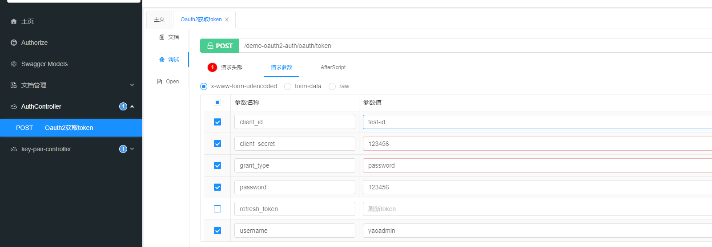

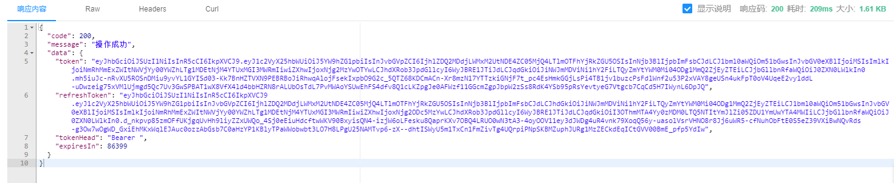

测试token刷新

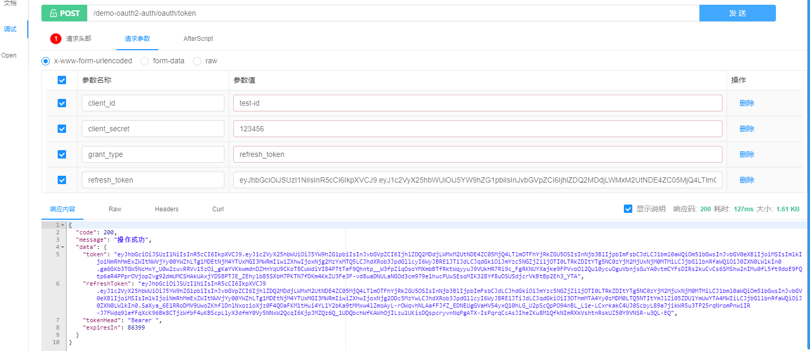

## 改造Ouath存储方式之JdbcTokenStore

> 之前我们实现的统一认证授权主要是基于内存方式,它有两个明显的缺点：
>
> 1、**重启**授权服务器时，令牌信息会**丢失**，导致用户需要重新授权；
>
> 2、**多个**授权服务器时，令牌信息无法**共享**，导致用户一会授权成功，一会授权失败

初始化数据库

mysql版

```sql
drop table if exists oauth_client_details;
create table oauth_client_details (
  client_id VARCHAR(255) PRIMARY KEY,
  resource_ids VARCHAR(255),
  client_secret VARCHAR(255),
  scope VARCHAR(255),
  authorized_grant_types VARCHAR(255),
  web_server_redirect_uri VARCHAR(255),
  authorities VARCHAR(255),
  access_token_validity INTEGER,
  refresh_token_validity INTEGER,
  additional_information VARCHAR(4096),
  autoapprove VARCHAR(255)
);

create table if not exists oauth_client_token (
  token_id VARCHAR(255),
  token LONG VARBINARY,
  authentication_id VARCHAR(255) PRIMARY KEY,
  user_name VARCHAR(255),
  client_id VARCHAR(255)
);

create table if not exists oauth_access_token (
  token_id VARCHAR(255),
  token LONG VARBINARY,
  authentication_id VARCHAR(255) PRIMARY KEY,
  user_name VARCHAR(255),
  client_id VARCHAR(255),
  authentication LONG VARBINARY,
  refresh_token VARCHAR(255)
);

create table if not exists oauth_refresh_token (
  token_id VARCHAR(255),
  token LONG VARBINARY,
  authentication LONG VARBINARY
);

create table if not exists oauth_code (
  code VARCHAR(255), authentication LONG VARBINARY
);

create table if not exists oauth_approvals (
	userId VARCHAR(255),
	clientId VARCHAR(255),
	scope VARCHAR(255),
	status VARCHAR(10),
	expiresAt TIMESTAMP DEFAULT CURRENT_TIMESTAMP,
	lastModifiedAt TIMESTAMP DEFAULT CURRENT_TIMESTAMP
);
```

postgres版

```sql
DROP TABLE IF EXISTS "public"."oauth_access_token";
CREATE TABLE "public"."oauth_access_token" (
  "token_id" varchar(255) COLLATE "pg_catalog"."default",
  "token" bytea,
  "authentication_id" varchar(255) COLLATE "pg_catalog"."default" NOT NULL,
  "user_name" varchar(255) COLLATE "pg_catalog"."default",
  "client_id" varchar(255) COLLATE "pg_catalog"."default",
  "authentication" bytea,
  "refresh_token" varchar(255) COLLATE "pg_catalog"."default"
)
;

-- ----------------------------
-- Table structure for oauth_approvals
-- ----------------------------
DROP TABLE IF EXISTS "public"."oauth_approvals";
CREATE TABLE "public"."oauth_approvals" (
  "userId" varchar(255) COLLATE "pg_catalog"."default",
  "clientId" varchar(255) COLLATE "pg_catalog"."default",
  "scope" varchar(255) COLLATE "pg_catalog"."default",
  "status" varchar(10) COLLATE "pg_catalog"."default",
  "expiresAt" timestamp(6),
  "lastModifiedAt" timestamp(6)
)
;

-- ----------------------------
-- Table structure for oauth_client_details
-- ----------------------------
DROP TABLE IF EXISTS "public"."oauth_client_details";
CREATE TABLE "public"."oauth_client_details" (
  "client_id" varchar(255) COLLATE "pg_catalog"."default" NOT NULL,
  "resource_ids" varchar(255) COLLATE "pg_catalog"."default",
  "client_secret" varchar(255) COLLATE "pg_catalog"."default",
  "scope" varchar(255) COLLATE "pg_catalog"."default",
  "authorized_grant_types" varchar(255) COLLATE "pg_catalog"."default",
  "web_server_redirect_uri" varchar(255) COLLATE "pg_catalog"."default",
  "authorities" varchar(255) COLLATE "pg_catalog"."default",
  "access_token_validity" int4,
  "refresh_token_validity" int4,
  "additional_information" varchar(4096) COLLATE "pg_catalog"."default",
  "autoapprove" varchar(255) COLLATE "pg_catalog"."default"
)
;

-- ----------------------------
-- Table structure for oauth_client_token
-- ----------------------------
DROP TABLE IF EXISTS "public"."oauth_client_token";
CREATE TABLE "public"."oauth_client_token" (
  "token_id" varchar(255) COLLATE "pg_catalog"."default",
  "token" bytea,
  "authentication_id" varchar(255) COLLATE "pg_catalog"."default" NOT NULL,
  "user_name" varchar(255) COLLATE "pg_catalog"."default",
  "client_id" varchar(255) COLLATE "pg_catalog"."default"
)
;

-- ----------------------------
-- Table structure for oauth_code
-- ----------------------------
DROP TABLE IF EXISTS "public"."oauth_code";
CREATE TABLE "public"."oauth_code" (
  "code" varchar(255) COLLATE "pg_catalog"."default",
  "authentication" bytea
)
;

-- ----------------------------
-- Table structure for oauth_refresh_token
-- ----------------------------
DROP TABLE IF EXISTS "public"."oauth_refresh_token";
CREATE TABLE "public"."oauth_refresh_token" (
  "token_id" varchar(255) COLLATE "pg_catalog"."default",
  "token" bytea,
  "authentication" bytea
)
;
-- ----------------------------
-- Primary Key structure for table oauth_access_token
-- ----------------------------
ALTER TABLE "public"."oauth_access_token" ADD CONSTRAINT "oauth_access_token_pkey" PRIMARY KEY ("authentication_id");

-- ----------------------------
-- Primary Key structure for table oauth_client_details
-- ----------------------------
ALTER TABLE "public"."oauth_client_details" ADD CONSTRAINT "oauth_client_details_pkey" PRIMARY KEY ("client_id");

-- ----------------------------
-- Primary Key structure for table oauth_client_token
-- ----------------------------
ALTER TABLE "public"."oauth_client_token" ADD CONSTRAINT "oauth_client_token_pkey" PRIMARY KEY ("authentication_id");
```

插入一个客户端脚本

```sql
INSERT INTO "public"."oauth_client_details"("client_id", "resource_ids", "client_secret", "scope", "authorized_grant_types", "web_server_redirect_uri", "authorities", "access_token_validity", "refresh_token_validity", "additional_information", "autoapprove") VALUES ('test-id', NULL, '$2a$10$.ZKgSAti6LM/n9aUKTc5xOn4RwuXgiTW.ncHp0aDKmDa4oWTaIORW', 'all', 'password,refresh_token,authorization_code', 'http://www.baidu.com', NULL, 7200, 86400, NULL, NULL);

```

修改demo-auth下的Oauth2ServerConfig配置类

```java
//      注入数据源
        @Autowired
        private DataSource dataSource;
//		配置客户端详情服务
        @Override
        public void configure(ClientDetailsServiceConfigurer clients) throws Exception {
      	clients.withClientDetails(jdbcClientDetailsService());
        }

        /**
         * 使用jdbc 对令牌进行读写
         * @return
         */
        @Bean
        public TokenStore jdbcTokenStore(){
                return new JdbcTokenStore(dataSource);
        }

        @Bean
        public ClientDetailsService jdbcClientDetailsService(){
                return new JdbcClientDetailsService(dataSource);
        }
        // 端点配置新增token存储类型
        @Override
    	public void configure(AuthorizationServerEndpointsConfigurer endpoints) throws Exception {
        endpoints.authenticationManager(authenticationManager)
            .tokenStore(jdbcTokenStore());
    	}
    	        @Bean
        public AuthorizationCodeServices authorizationCodeServices(){
                //基于内存存储的的授权码服务
//                return new InMemoryAuthorizationCodeServices();
                //基于内存存储的的授权码服务
                return new JdbcAuthorizationCodeServices(dataSource);
        }	

```

简单测试一下

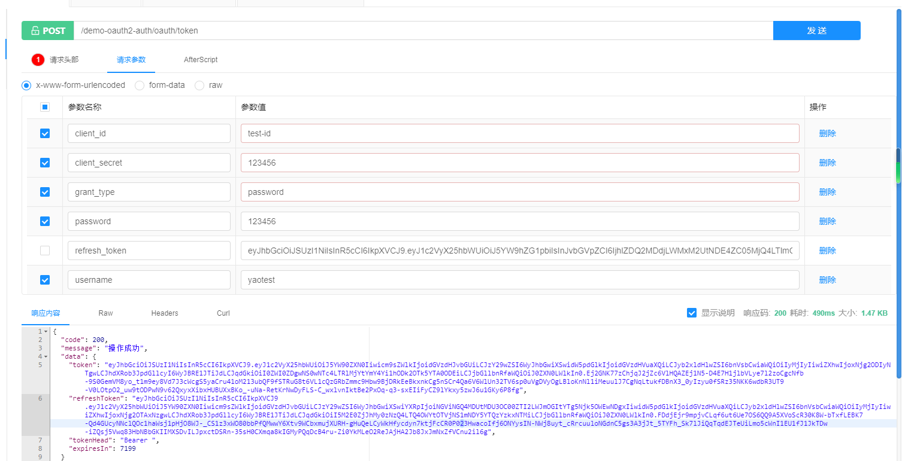

数据库的oauth_access_token 和oauth_refresh_token 均有数据

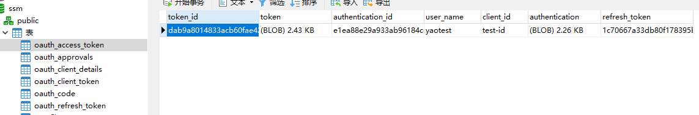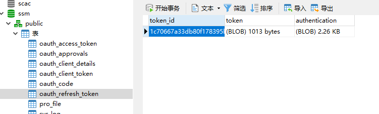

## 改造Ouath存储方式之RedisTokenStore

引入依赖

```xml
        <!-- 实现对 Spring Data Redis 的自动化配置 -->
        <dependency>
            <groupId>org.springframework.boot</groupId>
            <artifactId>spring-boot-starter-data-redis</artifactId>
        </dependency>
```

添加redis配置

```yaml
spring:
  redis:
    database: 0
    port: 6379
    host: localhost
    password:
```

修改demo-auth的Oauth2ServerConfig配置类

```java
       /**
         * Redis 连接的工厂
         */
        @Autowired
        private RedisConnectionFactory redisConnectionFactory;
                /**
         * 配置客户端详情服务
         **/
        @Override
        public void configure(ClientDetailsServiceConfigurer clients) throws Exception {
                //使用内存模式存储
                clients.inMemory()
                        //指定客户端唯一id
                        .withClient("test-id")
                        //客户端密钥 后面改成配置文件加载
                        .secret(this.passwordEncoder.encode("123456"))
                        .redirectUris("http://www.baidu.com") //配置redirect_uri，用于授权成功后跳转
                        // 定义客户端权限
                        .scopes("all")
                        //指定授权模式 授权模式一共四种 1.authorization_code 2.password 3.implicit 4.client_credentials
                        .authorizedGrantTypes("password", "refresh_token","authorization_code")
                        // accessToken 过期时间
                        .accessTokenValiditySeconds(3600*24)
                        // refreshToken 过期时间
                        .refreshTokenValiditySeconds(3600*24*7);

        }
         @Bean
        public AuthorizationCodeServices authorizationCodeServices(){
                //基于内存存储的的授权码服务
                return new InMemoryAuthorizationCodeServices();
        }
                /**
         * 使用redis对令牌进行读写
         * @return
         */
        @Bean
        public TokenStore redisTokenStore(){
                return new RedisTokenStore(redisConnectionFactory);
        }
         @Override
  		 public void configure(AuthorizationServerEndpointsConfigurer endpoints) throws Exception {
        endpoints.authenticationManager(authenticationManager)
            .tokenStore(redisTokenStore());
  		  }

```

简单测试下

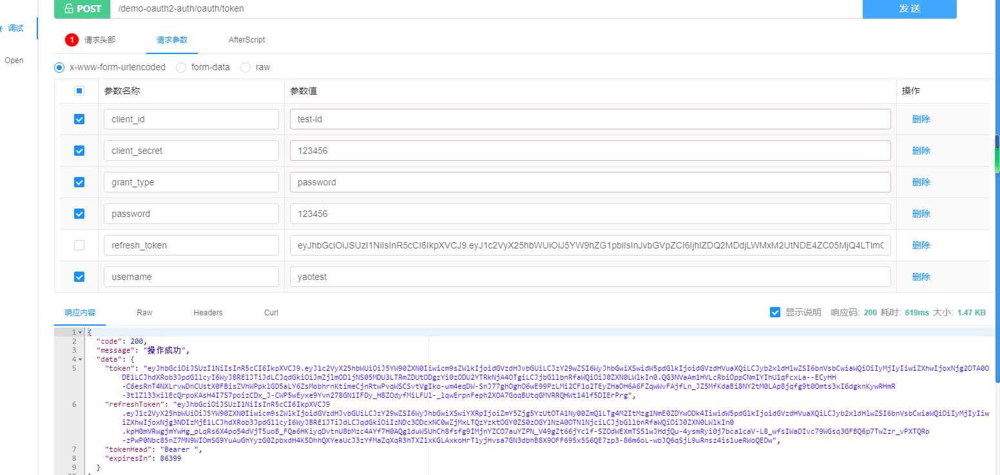

redis中有对应的数据

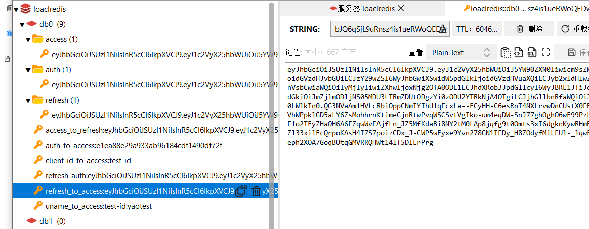

## 集成openfeign用于微服务之间的调用

> ​		作为Spring Cloud的子项目之一，Spring Cloud OpenFeign以将OpenFeign集成到Spring Boot应用中的方式，为微服务架构下服务之间的调用提供了解决方案。首先，利用了OpenFeign的声明式方式定义Web服务客户端；其次还更进一步，通过集成Ribbon或Eureka实现负载均衡的HTTP客户端。
>   OpenFeign 可以使消费者将提供者提供的服务名伪装为接口进行消费，消费者只需使用“Service 接口+ 注解”的方式。即可直接调用 Service 接口方法，而无需再使用 RestTemplate 了。其实原理还是使用RestTemplate，而通过Feign（伪装）成我们熟悉的习惯。

> 由于openfeign 2020版本之后不在使用Ribbn做负载均衡 ，所以还需要引入loadbalancer依赖

引入openfeign的依赖

在demo-api中引入依赖

```xml
        <!-- OpenFeign 微服务调用解决方案-->
        <dependency>
            <groupId>org.springframework.cloud</groupId>
            <artifactId>spring-cloud-starter-openfeign</artifactId>
        </dependency>
        <dependency>
            <groupId>org.springframework.cloud</groupId>
            <artifactId>spring-cloud-starter-loadbalancer</artifactId>
        </dependency>
```

新建接口作为微服务之间调用的公共方法

> @FeignClient()中添加要调用的微服务名

```java
@FeignClient("demo-oauth2-auth")
public interface AuthService {

    @PostMapping(value = "/oauth/token")
    CommonResult getAccessToken(@RequestParam Map<String, String> parameters);
}

```

修改启动类 @EnableFeignClients 开启feignClient的扫描

```java
@SpringBootApplication(scanBasePackages = {"com.hy.demo"})
@EnableDiscoveryClient
@MapperScan(value = "com.hy.demo.mapper")
@EnableFeignClients(basePackages = {"com.hy.demo"})
public class DemoApplication {
    public static void main(String[] args) {
        SpringApplication.run(DemoApplication.class, args);
    }
}

```

## 集成validation使用注解校验微服务消息参数

SpringBoot中常用的用于参数校验的注解如下：

```java
空检查
@Null			验证对象是否为null
@NotNull		验证对象是否不为null, 无法查检长度为0的字符串
@NotBlank		检查约束字符串是不是Null还有被Trim的长度是否大于0,只对字符串,且会去掉前后空格.
@NotEmpty		检查约束元素是否为NULL或者是EMPTY. 

Booelan检查
@AssertTrue		验证 Boolean 对象是否为 true  
@AssertFalse	验证 Boolean 对象是否为 false  

长度检查
@Size(min=, max=)		验证对象（Array,Collection,Map,String）长度是否在给定的范围之内  
@Length(min=, max=)		验证注解的元素值长度在min和max区间内

日期检查
@Past		验证 Date 和 Calendar 对象是否在当前时间之前  
@Future		验证 Date 和 Calendar 对象是否在当前时间之后  
@Pattern	验证 String 对象是否符合正则表达式的规则

数值检查，建议使用在Stirng,Integer类型，不建议使用在int类型上，因为表单值为“”时无法转换为int，但可以转换为Stirng为"",Integer为null
@Min			验证 Number 和 String 对象是否大等于指定的值  
@Max			验证 Number 和 String 对象是否小等于指定的值  
@DecimalMax		被标注的值必须不大于约束中指定的最大值. 这个约束的参数是一个通过BigDecimal定义的最大值的字符串表示.小数存在精度
@DecimalMin		被标注的值必须不小于约束中指定的最小值. 这个约束的参数是一个通过BigDecimal定义的最小值的字符串表示.小数存在精度
@Digits			验证 Number 和 String 的构成是否合法  
@Digits(integer=,fraction=)		验证字符串是否是符合指定格式的数字，interger指定整数精度，fraction指定小数精度。

@Range(min=, max=)	验证注解的元素值在最小值和最大值之间
@Range(min=10000,max=50000,message="range.bean.wage")

@Valid 写在方法参数前，递归的对该对象进行校验, 如果关联对象是个集合或者数组,那么对其中的元素进行递归校验,如果是一个map,则对其中的值部分进行校验.(是否进行递归验证)
@CreditCardNumber信用卡验证
@Email  验证是否是邮件地址，如果为null,不进行验证，算通过验证。
@ScriptAssert(lang= ,script=, alias=)
@URL(protocol=,host=, port=,regexp=, flags=)
```

在要使用注解的模块引入依赖

```java
 		<dependency>
            <groupId>org.springframework.boot</groupId>
            <artifactId>spring-boot-starter-validation</artifactId>
        </dependency>
```

在loginVo使用不为空的注解

```java
@Data
@EqualsAndHashCode(callSuper = false)
public class LoginVo {
    @NotEmpty
    @ApiModelProperty(value = "用户名", required = true)
    private String username;
    @NotEmpty
    @ApiModelProperty(value = "密码", required = true)
    private String password;
}
```

接口的参数使用@Valid注解

```java
    @RequestMapping(value = "/api/login", method = RequestMethod.POST)
    public CommonResult login(@Valid @RequestBody LoginVo loginVo) {
    }
```

如果只想对某个传参进行效验

**必须在类上标明@Validated注解才会生效**

```java
@Validated
@RestController
public class BookController {
@RequestMapping(value = "/book/info", method = RequestMethod.GET)
public Object getBookInfo(@NotBlank(message = "书籍ID不能为空") String bookId) {
    return "SUCCESS";
	}
}
```

### 自定义注解

首先你可以使用Crtl+B进入任意一个注解查看源代码，发现它们都有类似的结构，因此我们可以根据这些共同点，来开发我们自定义注解，下面以开发自定义验证是否是中国手机号来举例说明

```java
@Target({ METHOD, FIELD, ANNOTATION_TYPE, CONSTRUCTOR, PARAMETER, TYPE_USE })
@Retention(RUNTIME)
@Documented
@Constraint(validatedBy = { IsMobileVaildator.class })
public @interface IsMobile {
    //下面是可选的4个参数，且提前定义了默认值
    //required:是否是必填项,默认是true
    boolean required() default true;
	
    String message() default "手机号格式错误";

    Class<?>[] groups() default { };

    Class<? extends Payload>[] payload() default { };
}
```

下面是实现验证过程的类，实现该接口ConstraintValidator<T,T>.

第一个T代表你自定义接口的名字，第二个T代表的是该注解支持哪种对象的类型，这里是手机号自然就是String类型。

```java
public class IsMobileVaildator implements ConstraintValidator<IsMobile,String> {
    private boolean required =false;
	/**
	* 初始化方法
	*
	*/
    @Override
    public void initialize(IsMobile constraintAnnotation) {
        //初始为true意思就是你加了此注解就是保证它是个手机号
        required= constraintAnnotation.required();
    }

    /**
     * 在该方法中写具体验证过程
     * @param value object to validate
     * @param context context in which the constraint is evaluated
     *
     * @return 是否是个中国手机号
     */
    @Override
    public boolean isValid(String value, ConstraintValidatorContext context) {
        if(required){
           return MobileUtil.checkPhone(value);
        }else {
            //否则就是不是必填，2种情况，一种是没填返回true,一种是填了，既然填了就要验证,将验证的结果返回
            if(ObjectUtils.isEmpty(value)){
                return true;
            }else{
                return MobileUtil.checkPhone(value);
            }
        }
    }
}

```

参数效验异常处理

```java
/**
 *
 * @Description 参数效验异常处理
 * @Author yao
 * @Date 2023/5/25 16:48
 **/
@ControllerAdvice
public class Oauth2ExceptionHandler {
     @ExceptionHandler(value = {MethodArgumentNotValidException.class})
    public CommonResult<Object> handlerMethodArgumentNotValidException(MethodArgumentNotValidException methodArgumentNotValidException) {
        //获取异常字段及对应的异常信息
        StringBuffer stringBuffer = new StringBuffer();
        methodArgumentNotValidException.getBindingResult().getFieldErrors().stream()
                .map(t -> t.getField() + t.getDefaultMessage() + ";")
                .forEach(e -> stringBuffer.append(e));
        String errorMessage = stringBuffer.toString();
       return  CommonResult.failed(ResultCode.VALIDATE_FAILED, errorMessage);

    }
}
```

## 集成logback日志

> springboot 默认使用lomback所以不需要额外引入依赖

在resource下新建spring-lomback.xml

> 需要配置spring.profile.active 来指定日志配置

```xml
<?xml version="1.0" encoding="UTF-8"?>
<configuration scan="true" scanPeriod="60 seconds" debug="false">
    <!-- 日志输出格式 -->
    <property name="log.pattern" value="%d{HH:mm:ss.SSS} [%thread] %-5level %logger{20} - [%method,%line] - %msg%n" />
    <!-- 从 Spring Boot 配置文件中，读取 spring.application.name 应用名 -->
    <springProperty name="applicationName" scope="context" source="spring.application.name" />
    <!-- 日志存放路径 -->
    <property name="log.path" value="./logs/${applicationName}" />
    <!-- 控制台输出 -->
    <appender name="console" class="ch.qos.logback.core.ConsoleAppender">
        <encoder>
            <pattern>${log.pattern}</pattern>
        </encoder>
    </appender>

    <!-- 系统日志输出 -->
    <appender name="file_info" class="ch.qos.logback.core.rolling.RollingFileAppender">
        <file>${log.path}/info.log</file>
        <!-- 循环政策：基于时间创建日志文件  基于时间 + 大小的分包策略-->
        <rollingPolicy class="ch.qos.logback.core.rolling.SizeAndTimeBasedRollingPolicy">
            <!-- 日志文件名格式  每日生成日志文件或日志文件大小超出限制后输出的文件名模板-->
            <fileNamePattern>${log.path}/info-%d{yyyy-MM-dd}.%i.log</fileNamePattern>
            <!-- 日志最大的历史 30天 -->
            <maxHistory>30</maxHistory>
            <!-- 日志文件最大大小：30MB -->
            <maxFileSize>30MB</maxFileSize>
        </rollingPolicy>
        <encoder>
            <pattern>${log.pattern}</pattern>
        </encoder>
        <filter class="ch.qos.logback.classic.filter.LevelFilter">
            <!-- 过滤的级别 -->
            <level>INFO</level>
            <!-- 匹配时的操作：接收（记录） -->
            <onMatch>ACCEPT</onMatch>
            <!-- 不匹配时的操作：拒绝（不记录） -->
            <onMismatch>DENY</onMismatch>
        </filter>
    </appender>

    <appender name="file_error" class="ch.qos.logback.core.rolling.RollingFileAppender">
        <file>${log.path}/error.log</file>
        <!-- 循环政策：基于时间创建日志文件  基于时间 + 大小的分包策略-->
        <rollingPolicy class="ch.qos.logback.core.rolling.SizeAndTimeBasedRollingPolicy">
            <!-- 日志文件名格式 -->
            <fileNamePattern>${log.path}/error-%d{yyyy-MM-dd}.%i.log</fileNamePattern>
            <!-- 日志最大的历史 30天 -->
            <maxHistory>30</maxHistory>
            <!-- 日志文件最大大小：30MB -->
            <maxFileSize>30MB</maxFileSize>
        </rollingPolicy>
        <encoder>
            <pattern>${log.pattern}</pattern>
        </encoder>
        <filter class="ch.qos.logback.classic.filter.LevelFilter">
            <!-- 过滤的级别 -->
            <level>ERROR</level>
            <!-- 匹配时的操作：接收（记录） -->
            <onMatch>ACCEPT</onMatch>
            <!-- 不匹配时的操作：拒绝（不记录） -->
            <onMismatch>DENY</onMismatch>
        </filter>
    </appender>

    <!-- 测试环境，独有的配置 -->
    <springProfile name="dev">
        <!-- 系统模块日志级别控制  -->
        <logger name="com.hy.demo" level="debug" />
        <!-- Spring日志级别控制  -->
        <logger name="org.springframework" level="warn" />

        <root level="info">
            <appender-ref ref="console" />
        </root>

        <!--系统操作日志-->
        <root level="info">
            <appender-ref ref="file_info" />
            <appender-ref ref="file_error" />
        </root>
    </springProfile>

    <!-- 生产环境，独有的配置 -->
    <springProfile name="prod">
        <!-- 设置 Appender -->
        <root level="INFO">
            <appender-ref ref="console"/>
            <appender-ref ref="file_info" />
            <appender-ref ref="file_error" />
        </root>
    </springProfile>
</configuration>
```

## 集成分布式任务调度平台XXL-JOB

> XXL-JOB开源网站下载源码
>
> 本次使用的版本是2.4.0的
>
> 本项目使用的是postgres，xxl-job需要适配，适配过程此处省略

```
地址： https://github.com/xuxueli/xxl-job/releases
```

创建一个在父工程创建一个demo-job的模块来管理job相关的

> 在demo-job模块下新建xxl-job-admin的模块，把开源包的xxl-job-admin的代码复制到xxl-job-admin中

改造xxl-job-admin的pom.xml

> 主要是引入xxl-job-core的核心依赖包还有postgers驱动包

```xml
<?xml version="1.0" encoding="UTF-8"?>

<project xmlns="http://maven.apache.org/POM/4.0.0" xmlns:xsi="http://www.w3.org/2001/XMLSchema-instance"
         xsi:schemaLocation="http://maven.apache.org/POM/4.0.0 http://maven.apache.org/xsd/maven-4.0.0.xsd">
    <parent>
        <artifactId>demo-job</artifactId>
        <groupId>com.hy</groupId>
        <version>0.0.1-SNAPSHOT</version>
    </parent>
    <modelVersion>4.0.0</modelVersion>

    <artifactId>xxl-job-admin</artifactId>

    <name>xxl-job-admin</name>
    <packaging>jar</packaging>


    <dependencies>
        <!-- starter-web：spring-webmvc + autoconfigure + logback + yaml + tomcat -->
        <dependency>
            <groupId>org.springframework.boot</groupId>
            <artifactId>spring-boot-starter-web</artifactId>
        </dependency>
        <!-- starter-test：junit + spring-test + mockito -->
        <dependency>
            <groupId>org.springframework.boot</groupId>
            <artifactId>spring-boot-starter-test</artifactId>
            <scope>test</scope>
        </dependency>

        <!-- freemarker-starter -->
        <dependency>
            <groupId>org.springframework.boot</groupId>
            <artifactId>spring-boot-starter-freemarker</artifactId>
        </dependency>

        <!-- mail-starter -->
        <dependency>
            <groupId>org.springframework.boot</groupId>
            <artifactId>spring-boot-starter-mail</artifactId>
        </dependency>

        <!-- starter-actuator -->
        <dependency>
            <groupId>org.springframework.boot</groupId>
            <artifactId>spring-boot-starter-actuator</artifactId>
        </dependency>
        <!-- mybatis-starter：mybatis + mybatis-spring + hikari（default） -->
        <dependency>
            <groupId>org.mybatis.spring.boot</groupId>
            <artifactId>mybatis-spring-boot-starter</artifactId>
        </dependency>
        <!-- xxl-job-core -->
        <dependency>
            <groupId>com.xuxueli</groupId>
            <artifactId>xxl-job-core</artifactId>
        </dependency>

        <dependency>
            <groupId>org.postgresql</groupId>
            <artifactId>postgresql</artifactId>
        </dependency>

    </dependencies>
    <build>
        <plugins>
            <plugin>
                <groupId>org.springframework.boot</groupId>
                <artifactId>spring-boot-maven-plugin</artifactId>
                <version>${spring-boot.version}</version>
                <executions>
                    <execution>
                        <goals>
                            <goal>repackage</goal>
                        </goals>
                    </execution>
                </executions>
            </plugin>
        </plugins>
    </build>


</project>

```

根据项目风格，我们选择新建bootstrap.yml和application-dev.yml配置文件文件，舍弃原本的properties文件

bootstrap.yml

```yaml
server:
  port: 8086
spring:
  profiles:
    active: dev
  application:
    name: demo-job-admin
```

application-dev.yml

```yaml

spring:
  mvc:
    servlet:
      load-on-startup: 0
    static-path-pattern: /static/**
  resources:
    static-locations: classpath:/static
### freemarker
  freemarker:
    template-loader-path: classpath:/templates/
    suffix: .ftl
    charset: UTF-8
    request-context-attribute: request
    settings:
      number_format: 0.##########
### datasource
  datasource:
    url: jdbc:postgresql://localhost:5432/xxl-job
    username: postgres
    password: 123456
    driver-class-name: org.postgresql.Driver
    type: com.zaxxer.hikari.HikariDataSource
    hikari:
      minimum-idle: 10
      maximum-pool-size: 30
      auto-commit: true
      idle-timeout: 30000
      pool-name: HikariCP
      max-lifetime: 900000
      connection-timeout: 10000
      connection-init-sql: SELECT 1
      validation-timeout: 1000
### mail
  mail:
    host: smtp.qq.com
    port: 25
    username: xxx@qq.com
    from: xxx@qq.com
    password: xxx
    properties:
      mail:
        auth: true
        starttls:
          enable: true
          required: true
        socketFactory:
          class: javax.net.ssl.SSLSocketFactory

### xxl
xxl:
  job:
    accessToken: default_token    # xxl-job, access token
    i18n: zh_CN                   # xxl-job, i18n (default is zh_CN, and you can choose "zh_CN", "zh_TC" and "en")
    triggerpool:
      fast:
        max: 200
      slow:
        max: 100
    logretentiondays: 30          # log retention days

### mybatis
mybatis:
  mapper-locations: classpath:/mybatis-mapper/*Mapper.xml

### actuator
management:
  server:
    servlet:
      context-path: /actuator
  health:
    mail:
      enabled: false
server:
  servlet:
    context-path: /xxl-job-admin
```

将xxl-job-admin集成到微服务

增加nacos的依赖

```xml
 <!--         nacos注册中心依赖包 -->
        <dependency>
            <groupId>com.alibaba.cloud</groupId>
            <artifactId>spring-cloud-starter-alibaba-nacos-discovery</artifactId>
        </dependency>
```

在application-dev.yml新增nacos配置

```yaml
spring
  cloud:
    nacos:
      discovery:
        server-addr: 10.32.128.102:8848
```

在XxlJobAdminApplication启动类开启服务发现

```java
@SpringBootApplication
@EnableDiscoveryClient
public class XxlJobAdminApplication {

	public static void main(String[] args) {
        SpringApplication.run(XxlJobAdminApplication.class, args);
	}

}
```

在父工程demo-parent的pom下添加静态文件过滤

> xxl-job-admin是SpringMVC项目，其前端页面由ftl文件和静态文件组成，默认情况下maven启用分环境读取配置时，会对resource目录下的@进行替换，导致静态文件下的字体文件不能用，所以，这里需要进行和jks文件一样的过滤配置:

```xml
<build>
		<resources>
			<!-- 增加分环境读取配置 -->
			<resource>
				<directory>src/main/resources</directory>
				<filtering>true</filtering>
				<excludes>
					<exclude>**/*.jks</exclude>
					<exclude>static/**</exclude>
					<exclude>assets/**</exclude>
				</excludes>
			</resource>
			<!-- 解决jks被过滤掉的问题 -->
			<resource>
				<directory>src/main/resources</directory>
				<filtering>false</filtering>
				<includes>
					<include>**/*.jks</include>
					<include>static/**</include>
					<include>assets/**</include>
				</includes>
			</resource>
			<resource>
				<directory>src/main/java</directory>
				<includes>
					<include>**/*.xml</include>
				</includes>
			</resource>
		</resources>
		<plugins>
			<plugin>
				<groupId>org.springframework.boot</groupId>
				<artifactId>spring-boot-maven-plugin</artifactId>
				<version>${spring-boot.version}</version>
<!--				<configuration>-->
<!--					<fork>true</fork>-->
<!--					<addResources>true</addResources>-->
<!--				</configuration>-->
			</plugin>
		</plugins>
	</build>
```

在gateway的application-dev.yml添加xxl-job-admin路由转发

```yaml
        - id: demo-job-admin
          uri: lb://demo-job-admin
          predicates:
            - Path=/demo-job-admin/**
          filters:
            - StripPrefix=1
        - id: xxl-job-admin
          uri: lb://demo-job-admin
          predicates:
            - Path=/xxl-job-admin/**
          filters:
            - StripPrefix=0
```

在gateway的application-dev.yml添加xxl-job-admin的路径白名单

```yaml
secure:
  ignore:
    urls: #
      - "/xxl-job-admin/**"
      - "/demo-job-admin/**"
```

启动xxl-job-admin微服务，看是否成功

> 默认账号密码：admin/123456

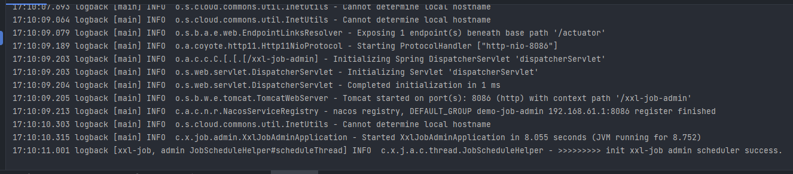

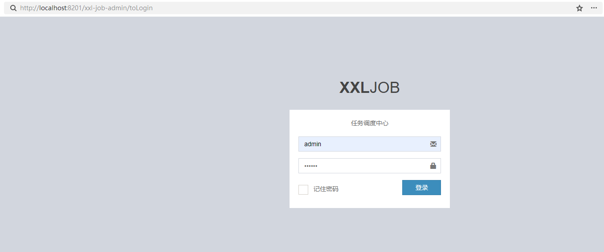

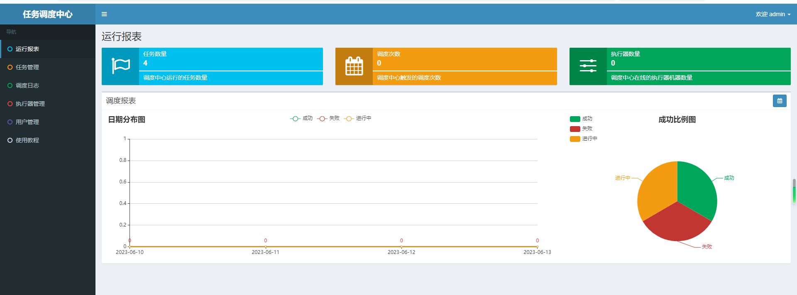


测试xxl-job

在demo-job父工程下创建一个test-job的模块用来编写job测试

添加相关依赖

> 主要是web、mybatisplus、xxl-job-core的依赖

```xml
<?xml version="1.0" encoding="UTF-8"?>

<project xmlns="http://maven.apache.org/POM/4.0.0" xmlns:xsi="http://www.w3.org/2001/XMLSchema-instance"
         xsi:schemaLocation="http://maven.apache.org/POM/4.0.0 http://maven.apache.org/xsd/maven-4.0.0.xsd">
    <parent>
        <artifactId>demo-job</artifactId>
        <groupId>com.hy</groupId>
        <version>0.0.1-SNAPSHOT</version>
    </parent>
    <modelVersion>4.0.0</modelVersion>

    <artifactId>test-job</artifactId>

    <name>test-job</name>


    <dependencies>
        <!-- spring-boot-starter-web (spring-webmvc + tomcat) -->
        <dependency>
            <groupId>org.springframework.boot</groupId>
            <artifactId>spring-boot-starter-web</artifactId>
        </dependency>

        <!-- xxl-job-core -->
        <dependency>
            <groupId>com.xuxueli</groupId>
            <artifactId>xxl-job-core</artifactId>
        </dependency>
        <dependency>
            <groupId>com.hy</groupId>
            <artifactId>demo-service</artifactId>
            <exclusions>
                <exclusion>
                    <groupId>com.github.xiaoymin</groupId>
                    <artifactId>knife4j-micro-spring-boot-starter</artifactId>
                </exclusion>
            </exclusions>
            <version>0.0.1-SNAPSHOT</version>
        </dependency>
    </dependencies>


</project>

```

创建bootstrap.yml和application-dev.yml配置文件

bootstrap.yml

```yaml
spring:
  application:
    name: test-job
  profiles:
    active: dev
server:
  port: 8092
```

application-dev.yml

```yaml
xxl:
  job:
    admin:
      addresses: http://127.0.0.1:8086/xxl-job-admin
    accessToken: default_token
    executor:
      appname: xxl-job-executor-sample        # xxl-job executor appname
      address:
      ip: 127.0.0.1
      port: 9999
      logpath: /data/applogs/xxl-job/jobhandler
      logretentiondays: 30
spring:
  datasource:
    url: jdbc:postgresql://10.32.128.113:5432/ssm
    username: postgres
    password: 123456
    driver-class-name: org.postgresql.Driver
    type: com.zaxxer.hikari.HikariDataSource
    hikari:
      minimum-idle: 5            # 最小空闲连接数量 默认10
      maximum-pool-size: 10      # 连接池默认最大连接数 默认10
      idle-timeout: 30000        # 空闲时间最大存活时间 默认10分钟（60000）
      auto-commit: true          # 此属性控制从池返回的连接的默认自动提交行为,默认值：true
      pool-name: HikariCPJob      # 连接池名称
      max-lifetime: 180000       # 此属性控制池中连接的最长生命周期，值0表示无限生命周期，默认1800000即30分钟
      connection-timeout: 30000  # 数据库连接超时时间,默认30秒，即30000
      connection-test-query: SELECT 1

mybatis-plus:
  configuration:
    log-impl: org.apache.ibatis.logging.stdout.StdOutImpl
    map-underscore-to-camel-case: false # 关闭驼峰命名规则
  mapper-locations: classpath:mapper/*Mapper.xml
logging:
  config: classpath:logback.xml
```

编写XxlJobConfig配置类

```java

@Configuration
public class XxlJobConfig {
    private Logger logger = LoggerFactory.getLogger(XxlJobConfig.class);

    @Value("${xxl.job.admin.addresses}")
    private String adminAddresses;

    @Value("${xxl.job.accessToken}")
    private String accessToken;

    @Value("${xxl.job.executor.appname}")
    private String appname;

    @Value("${xxl.job.executor.address}")
    private String address;

    @Value("${xxl.job.executor.ip}")
    private String ip;

    @Value("${xxl.job.executor.port}")
    private int port;

    @Value("${xxl.job.executor.logpath}")
    private String logPath;

    @Value("${xxl.job.executor.logretentiondays}")
    private int logRetentionDays;


    @Bean
    public XxlJobSpringExecutor xxlJobExecutor() {
        logger.info(">>>>>>>>>>> xxl-job config init.");
        XxlJobSpringExecutor xxlJobSpringExecutor = new XxlJobSpringExecutor();
        xxlJobSpringExecutor.setAdminAddresses(adminAddresses);
        xxlJobSpringExecutor.setAppname(appname);
        xxlJobSpringExecutor.setAddress(address);
        xxlJobSpringExecutor.setIp(ip);
        xxlJobSpringExecutor.setPort(port);
        xxlJobSpringExecutor.setAccessToken(accessToken);
        xxlJobSpringExecutor.setLogPath(logPath);
        xxlJobSpringExecutor.setLogRetentionDays(logRetentionDays);

        return xxlJobSpringExecutor;
    }

    /**
     * 针对多网卡、容器内部署等情况，可借助 "spring-cloud-commons" 提供的 "InetUtils" 组件灵活定制注册IP；
     *
     *      1、引入依赖：
     *          <dependency>
     *             <groupId>org.springframework.cloud</groupId>
     *             <artifactId>spring-cloud-commons</artifactId>
     *             <version>${version}</version>
     *         </dependency>
     *
     *      2、配置文件，或者容器启动变量
     *          spring.cloud.inetutils.preferred-networks: 'xxx.xxx.xxx.'
     *
     *      3、获取IP
     *          String ip_ = inetUtils.findFirstNonLoopbackHostInfo().getIpAddress();
     */


}
```

启动类

```java
@SpringBootApplication(scanBasePackages = {"com.hy.demo"})
@MapperScan(value = "com.hy.demo.mapper")
public class TestJobApplication {
    public static void main(String[] args) {
        SpringApplication.run(TestJobApplication.class,args);
    }
}

```

编写测试jobhandler

```java
@Component
public class TestJobHandler {
    private final static Logger log = LoggerFactory.getLogger(TestJobHandler.class);
    @Autowired
    private ProfileService profileService;
    @XxlJob("testJob1")
    public void testJob1() throws InterruptedException {
        XxlJobHelper.log("不带返回值：XXL-JOB, Hello World.");
        for (int i = 0; i < 5; i++) {
            XxlJobHelper.log("beat at:" + i);
            TimeUnit.SECONDS.sleep(1);
            log.info("test01-------{}",i);
            System.out.println("test01----------------"+i);
        }

    }

    /**
     * 2、简单任务示例（Bean模式）带成功或失败返回值
     */
    @XxlJob("testJob2")
    public ReturnT<String> testJob2() throws Exception {

        XxlJobHelper.log("带返回值：XXL-JOB, Hello World.");
        for (int i = 0; i < 5; i++) {
            XxlJobHelper.log("beat at:" + i);
            TimeUnit.SECONDS.sleep(1);
            log.info("test02-------{}",i);
            System.out.println("test02----------------"+i);
        }
        return ReturnT.SUCCESS;
    }
    @XxlJob("testJob3")
    public void testJob3(){
        int count = profileService.count();
        XxlJobHelper.log("文件数据库总个数:"+count);
        log.info("文件数据库总个数:{}",count);
    }
}
```

启动添加任务测试

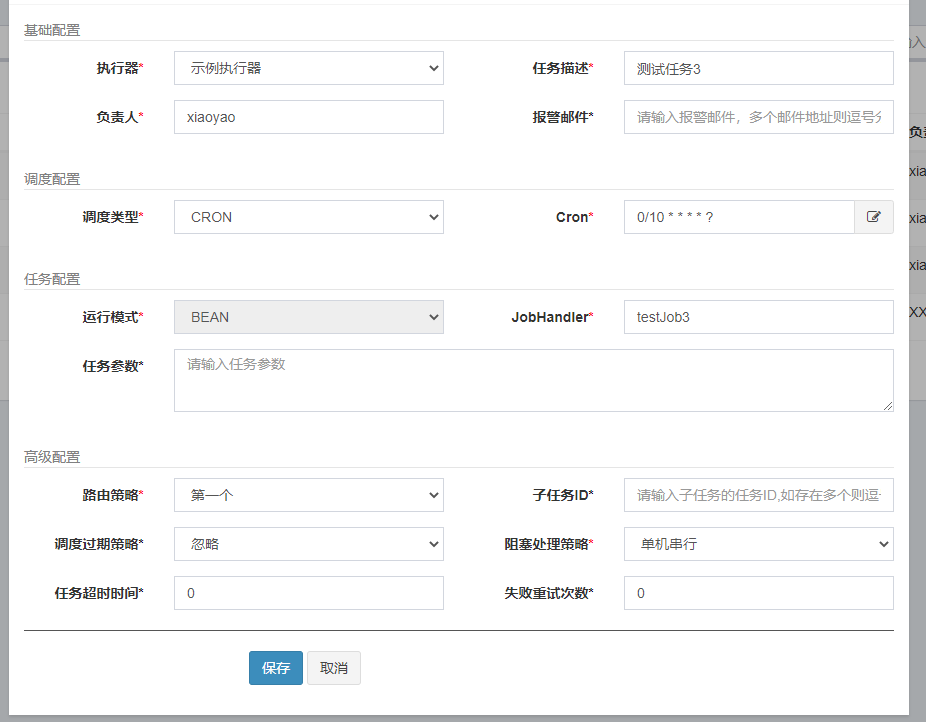

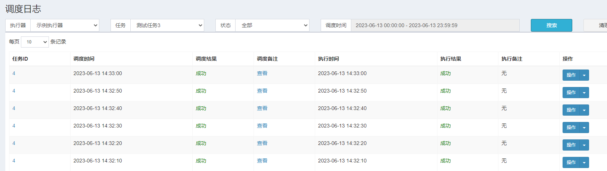


