## IDEA配置svn

1、打开setting-->version Control--> subverion 配置svn客户端路径

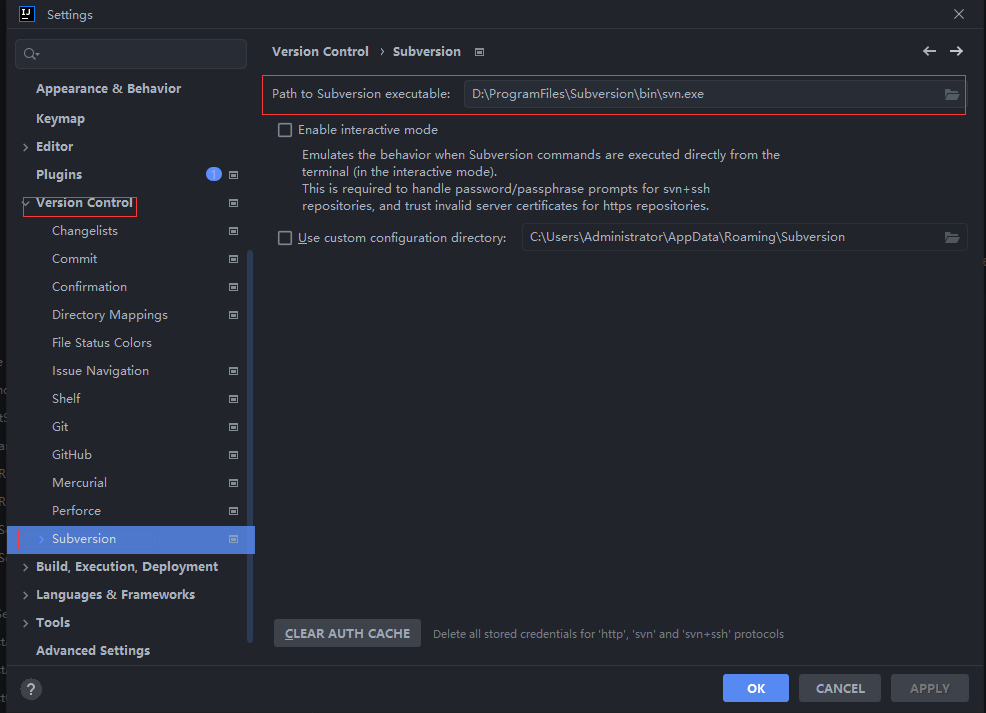

2、选择版本工具为svn

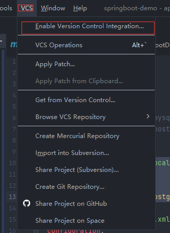

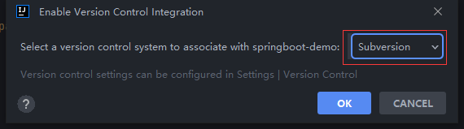

3、查看svn仓库


4、添加svn地址

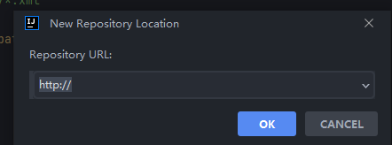

5、上传到svn

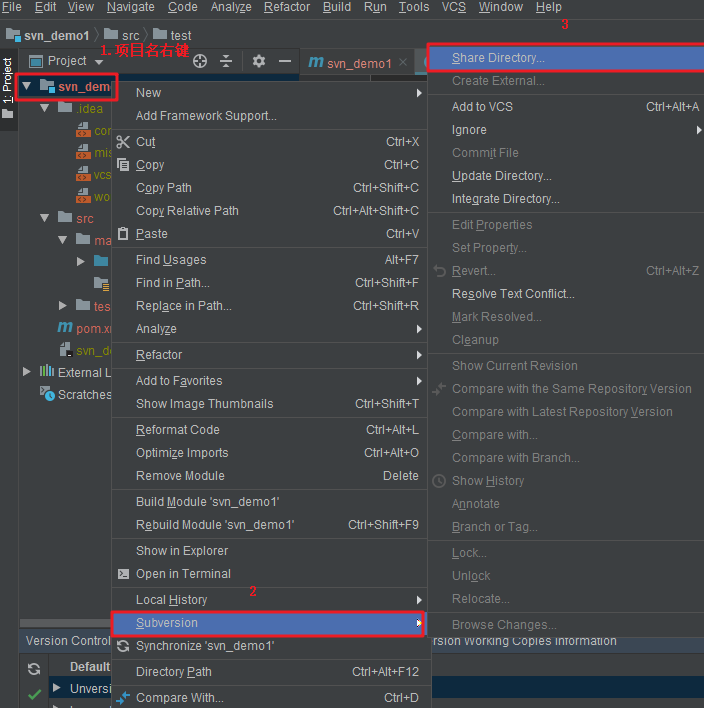

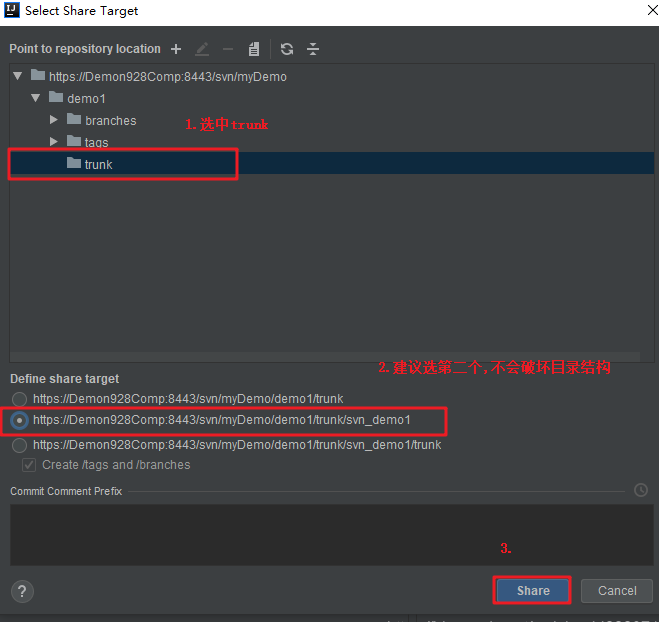

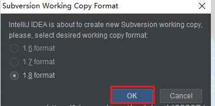

6、再次右键提交工程

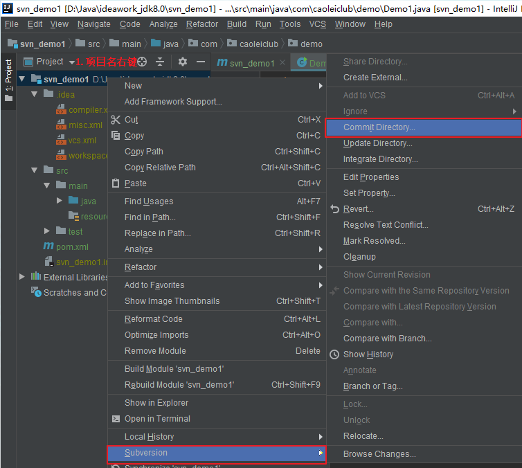

7、检查下是否过滤成功，提交即可


## IDEA设置SVN提交忽略文件

1、在setting-->editor-->file types -->Ignore files and folders中填写你需要忽略的文件或文件夹

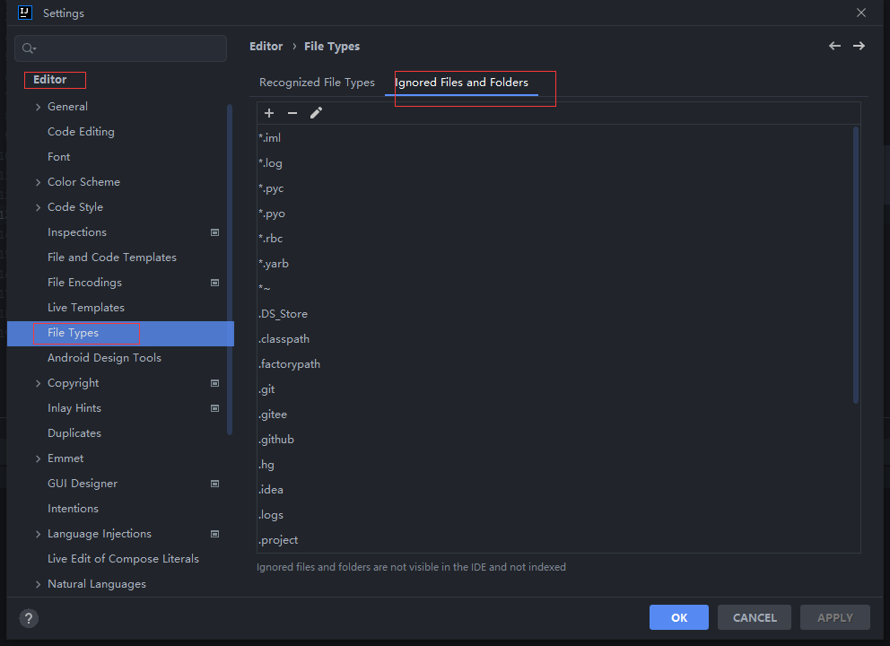

2、新增过滤的条件

```
node_modules;target;.idea;.settings;.project;*.iml;*.log;.logs;.classpath;.factorypath;.gitee;.github;
```

3、在svn客户端TortoriseSVN进行设置

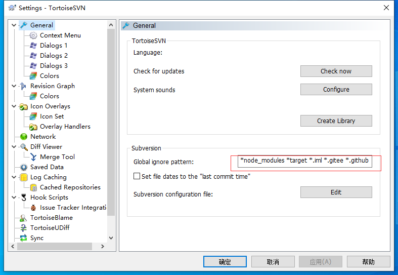

添加如下条件，覆盖即可

```
*node_modules *target *.iml *.gitee *.github *.svn *.idea  *.o *.lo *.la *.al .libs *.so *.so.[0-9]* *.a *.pyc *.pyo __pycache__ *.rej *~ #*# .#* .*.swp .DS_Store [Tt]humbs.db
```

## 解决springboot无法加载到nacos中的数据源问题

异常现象

正常配置，却出现了无数据源的问题

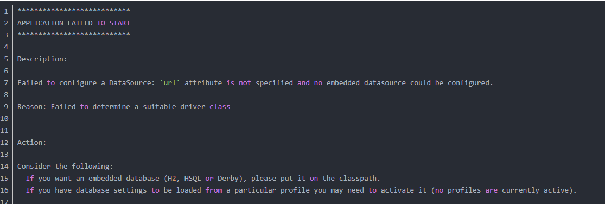

异常原因

**从Spring Boot 2.4版本开始，配置文件加载方式进行了重构，这才导致读取不到nacos配置中心文件的问题**

解决方法

增加依赖

```
<!-- 版本跟nacos保持一致 -->
<dependency>
    <groupId>org.springframework.cloud</groupId>
    <artifactId>spring-cloud-starter-bootstrap</artifactId>
</dependency>
```

## IDEA配置热部署

1、添加依赖

```xml
 <dependency>
  <groupId>org.springframework.boot</groupId>
  <artifactId>spring-boot-devtools</artifactId>
 </dependency>
```

2、添加插件

```xml
			<plugin>
				<groupId>org.springframework.boot</groupId>
				<artifactId>spring-boot-maven-plugin</artifactId>
				<configuration>
					<fork>true</fork>
					<addResources>true</addResources>
				</configuration>
			</plugin>
```

3、开启自动编译

File-Settings-Compiler-Build Project automatically

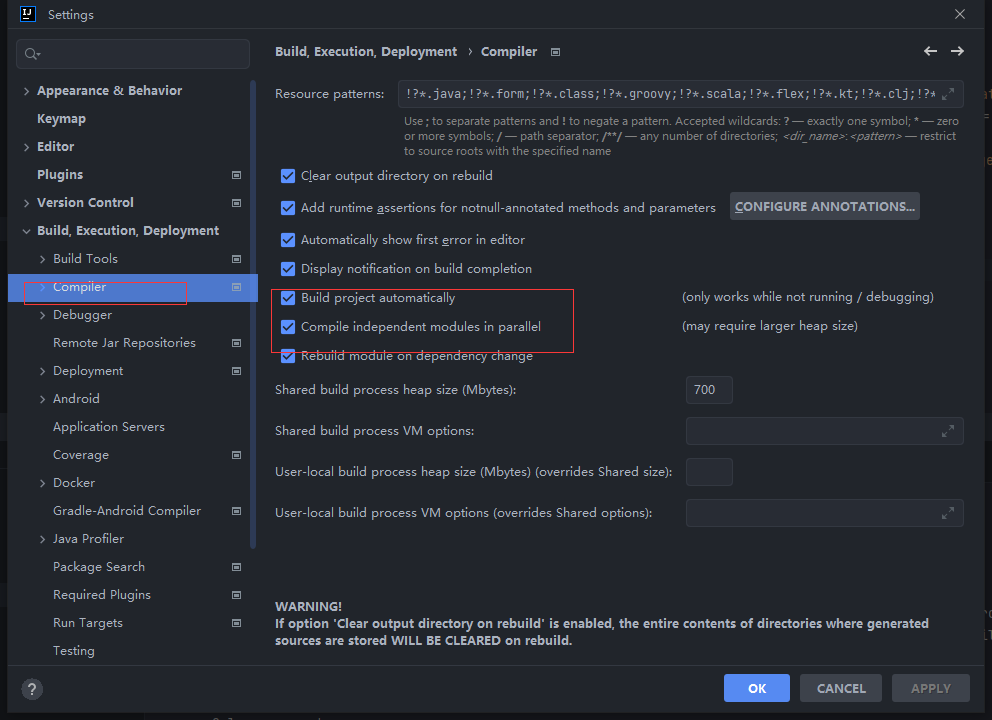

4、Ctrl+Shift+Alt+/ 选择Registry

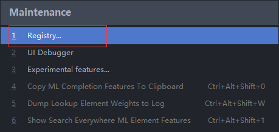


**找到选项Compiler autoMake allow when app running打勾**

**注意IDEA2022版本 在registry中找不到这选项，需要在Advanced Settings中开启**

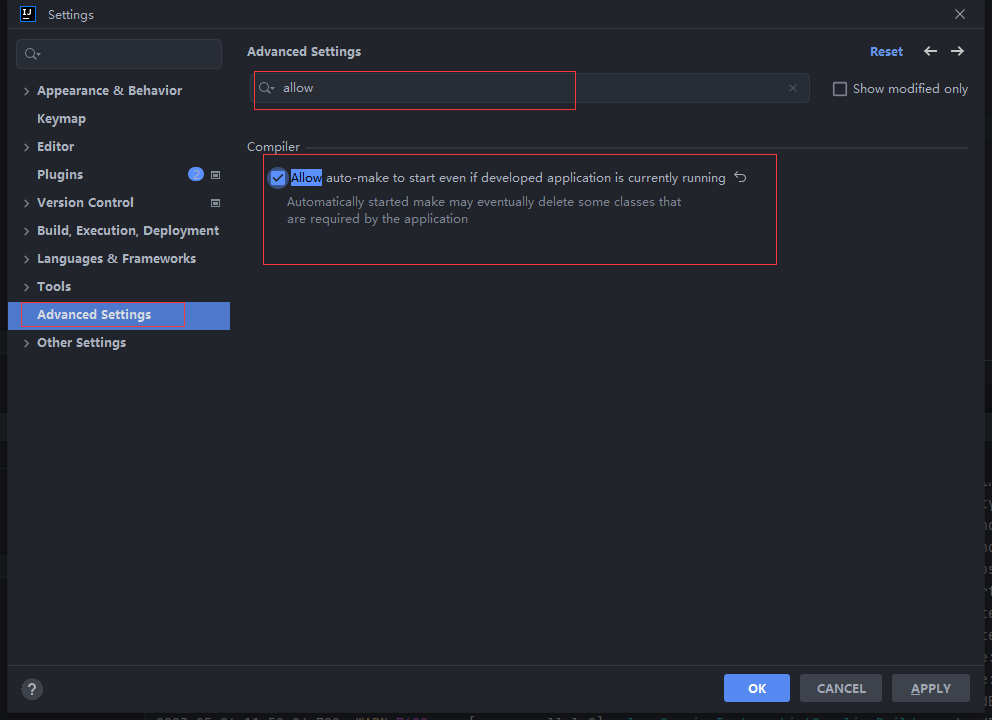

5、设置项目加载方式

**找到spring boot下的 On ‘Update' action 和 On frame deactivation** **，选择 Update classes and resources**

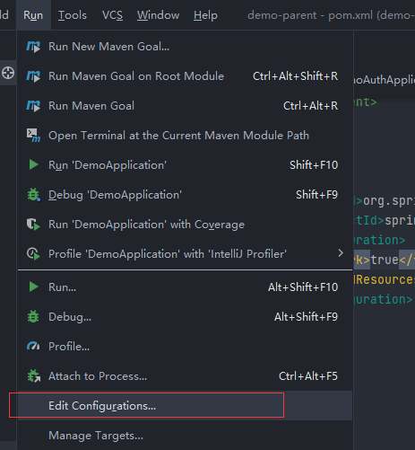

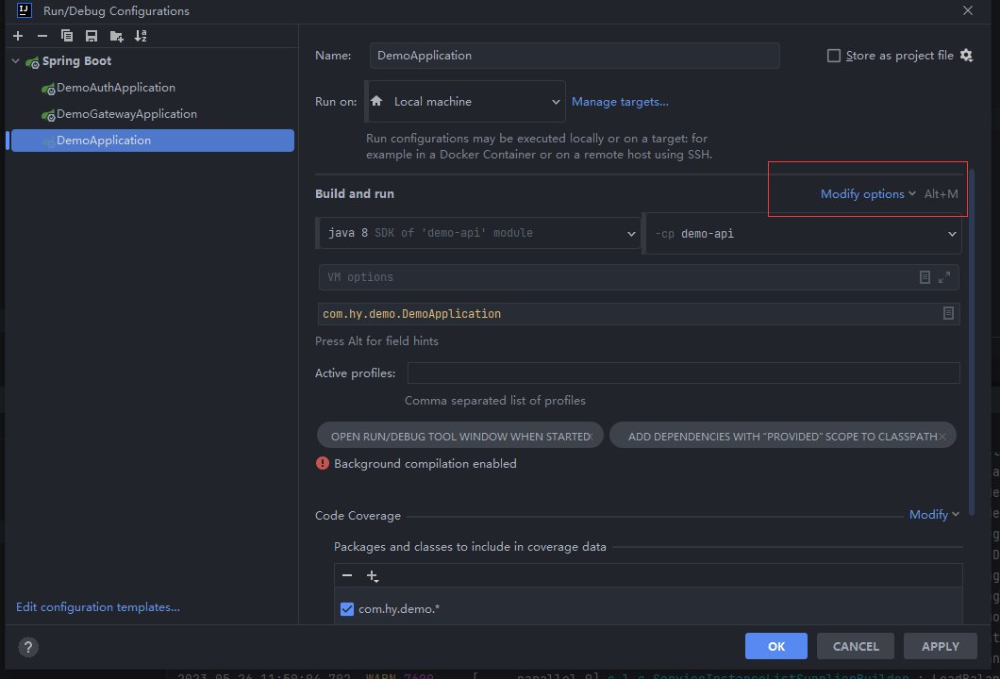

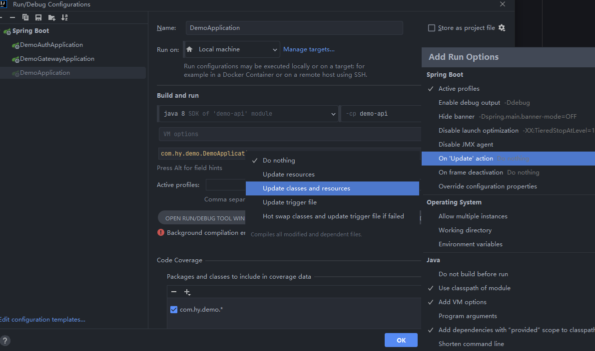

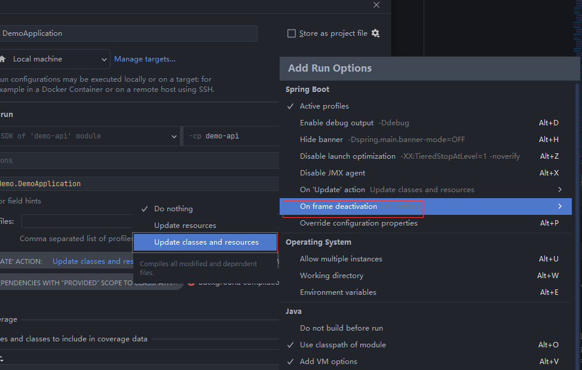

6、测试热部署是否生效

修改一个文件之后，看看是否生效

## 数据库字段有下划线导致获取值为null

问题原因：

mybatis plus 默认开启了驼峰命名规则，导致获取不到相关值

解决方法：

关闭mybatis plus 驼峰命名规则

```yml
mybatis-plus:
  configuration:
    map-underscore-to-camel-case: false # 关闭驼峰命名规则
```

## gateway报错class path resource [org/springframework/web/servlet/mvc/method/annotation/ResponseBodyAdvice

**出现原因**

> `gateway`引入了自定义的common包里面定义了统一返回值处理的方法
>
> 因为`gateway`不能使用`web-starter`所以报`ResponseBodyAdvice找不到`这个错误

```
@RestControllerAdvice(basePackages = "com.hy.demo")
public class ResponseAdvice implements ResponseBodyAdvice<Object> {
}
```

**解决方法**

>添加`@ConditionalOnClass`注解

```java
@RestControllerAdvice(basePackages = "com.hy.demo")
@ConditionalOnClass(ResponseBodyAdvice.class)
public class ResponseAdvice implements ResponseBodyAdvice<Object> {
}
```

## knife4j3.0文件上传接口没有上传文本域

**关键点**

> 文件要使用@RequestPart注解，dataType要使用MultipartFile，dataTypeClass要使用MultipartFile.class，paramType使用query
>
> allowMultiple = true 允许多文件上传

```java
 @ApiImplicitParams({@ApiImplicitParam(name = "file", value = "文件流对象", required = true,paramType = "query",dataType = "MultipartFile",allowMultiple = false,dataTypeClass = MultipartFile.class),
            @ApiImplicitParam(name = "proid", value = "proid", required = true,dataType = "String",dataTypeClass = String.class)})
    public CommonResult upload(@RequestPart("file") MultipartFile file, @RequestParam("proid") String proid, HttpServletRequest request) throws IOException {
    }
```

## bootstrap.yml配置文件不生效

**问题原因**

> 从springboot2.4版本开始，配置文件的方式进行了重构

```java
package org.springframework.cloud.util;
public abstract class PropertyUtils {
    public static boolean bootstrapEnabled(Environment environment) {
        return (Boolean)environment.getProperty("spring.cloud.bootstrap.enabled", Boolean.class, false) || MARKER_CLASS_EXISTS;
    }
```

**解决方案**

```xml
<!-- 引入bootstrap -->
<dependency>
    <groupId>org.springframework.cloud</groupId>
    <artifactId>spring-cloud-starter-bootstrap</artifactId>
</dependency>
```

## 通过spring gateway访问其他服务503 service unavailable

**问题原因**

> Spring Cloud 2020.0.0版本之前会自动引入Netflix Ribbon依赖,Netflix Ribbon功能跟loadbalancer一样,因Netflix公司停止维护Ribbon后, 在Spring Cloud 2020.0.0版本之后Spring使用loadbalancer替代了Ribbon, 但是loadbalancer依赖需要手动引入

**解决方案**

```xml
# 引入loadbalancer
<dependency>
    <groupId>org.springframework.cloud</groupId>
    <artifactId>spring-cloud-loadbalancer</artifactId>
</dependency>
```

**后续问题**

> 增加loadbalancer后启动提示：Spring Cloud LoadBalancer is currently working with the default cache. You can switch to using Caffeine cache, by adding it and org.springframework.cache.caffeine.CaffeineCacheManager to the classpath

**解决方案**

> 解决方案是引入caffeine，或者关闭cache

```xml
<dependency>
    <groupId>com.github.ben-manes.caffeine</groupId>
    <artifactId>caffeine</artifactId>
    <version>2.9.3</version>
</dependency>
```

**后续问题**

> 访问其他服务时提示：LoadBalancerCacheManager not available, returning delegate without caching

**解决方案**

> 引入以下依赖

```xml
<dependency>
  <groupId>org.springframework</groupId>
  <artifactId>spring-context-support</artifactId>
  <version>5.2.21.RELEASE</version>
</dependency>
```

## Failed to start bean ‘documentationPluginsBootstrapper’; nested exception is java.lang.NullPointerException

**问题原因**

> SpringBoot2.6之后将SpringMVC 默认路径匹配策略从AntPathMatcher 更改为PathPatternParser，导致出错

**解决方案**

> 添加配置

```yaml
spring:
  mvc:
    pathmatch:
      matching-strategy: ant_path_matcher
```

## npm设置国内源

> 查看源先看看源指向哪里：

```text
npm config get registry
```

> 默认是指向 `https://registry.npmjs.org/`，也就是官方源。

> 更换源,国内源有很多，我这里用淘宝源吧。

```text
npm config set registry https://registry.npmmirror.com/
```

一些文章还是写着旧的淘宝 NPM 镜像 `registry.npm.taobao.org`，但它已于 2022 年 05 月 31 日 废弃，读者需要更换为新的 `registry.npmmirror.com` 源。

## 解决gateway跨域问题

配置文件加如下代码

```yaml

spring:
  cloud:
    gateway:
          # 全局的跨域配置
      globalcors:
            # 解决options请求被拦截问题
        add-to-simple-url-handler-mapping: true
        cors-configurations:
              # 拦截的请求
          '[/**]':
                # 允许跨域的请求
            allowedOriginPatterns: "*" # spring boot2.4以后的配置
                # 允许请求中携带的头信息
            allowedHeaders: "*"
                # 运行跨域的请求方式
            allowedMethods: "*"
                # 是否允许携带cookie
            allowCredentials: true
                # 跨域检测的有效期,单位s
            maxAge: 36000


```

微服务的跨域配置需要删除掉，不然会有双跨域问题出现

## Springboot 2.7 跨域配置

```java
@Configuration
public class CorsConfig {
    @Bean
    public CorsFilter corsFilter() {
        CorsConfiguration corsConfiguration = new CorsConfiguration();
        //1,允许任何来源
        corsConfiguration.setAllowedOriginPatterns(Collections.singletonList("*"));
        //2,允许任何请求头
        corsConfiguration.addAllowedHeader(CorsConfiguration.ALL);
        //3,允许任何方法
        corsConfiguration.addAllowedMethod(CorsConfiguration.ALL);
        //4,允许凭证
        corsConfiguration.setAllowCredentials(true);

        UrlBasedCorsConfigurationSource source = new UrlBasedCorsConfigurationSource();
        source.registerCorsConfiguration("/**", corsConfiguration);
        return new CorsFilter(source);
    }
}
```


## 打包运行 jar时报没有主清单属性的错误

解决方案：

> 在pom文件中的maven插件中增加如下配置

```xml
<executions>
    <execution>
        <goals>
            <goal>repackage</goal>
        </goals>
    </execution>
</executions>
```

完整的插件配置

```xml
<build>
    <plugins>
        <plugin>
            <groupId>org.springframework.boot</groupId>
            <artifactId>spring-boot-maven-plugin</artifactId>
            <executions>
                <execution>
                    <goals>
                        <goal>repackage</goal>
                    </goals>
                </execution>
            </executions>
        </plugin>
    </plugins>
</build>
```

## 微服务项目配置热部署（JRebel）

### 简介

> JRebel是一套JavaEE开发工具。可快速实现热部署，节省了大量重启时间，提高了个人开发效率JRebel是一款JAVA虚拟机插件，它使得JAVA程序员能在不进行重部署的情况下，即时看到代码的改变对一个应用程序带来的影响。目前对于idea热部署最好的解决方案就是安装JRebel插件。

### 安装

1、安装插件 JRebel and XRebel

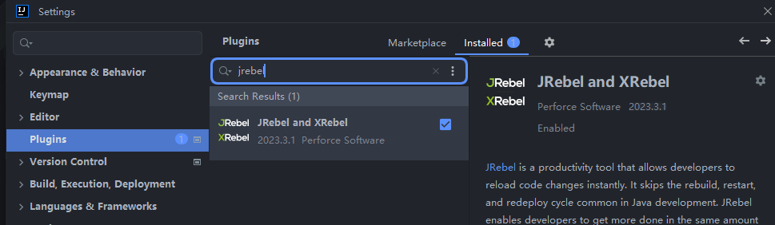

2、下载服务并启动

下载地址：https://github.com/ilanyu/ReverseProxy/releases/tag/v1.4

下载后直接运行

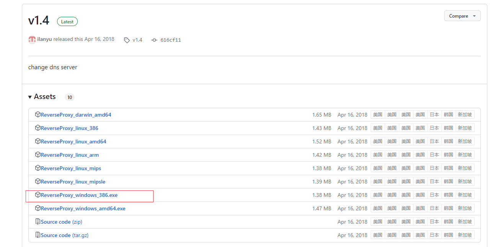

3、获取一个GUID或者UUID

生成guid的网址：https://www.guidgen.com/ 

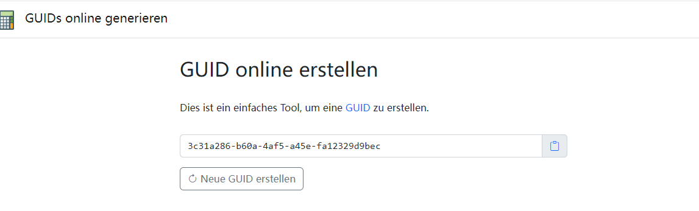


3、开启自动编译

File-Settings-Compiler-Build Project automatically


4、Ctrl+Shift+Alt+/ 选择Registry


**找到选项Compiler autoMake allow when app running打勾**

**注意IDEA2022版本 在registry中找不到这选项，需要在Advanced Settings中开启**


使用

启动项目时点击图中红色框的按钮启动，第一个是run，第二个是debug， 按快捷键 **Ctrl + Shift + F9** 或者 **Ctrl + F9** 强制部署


生成rebel.xml

pom中配置rebel.xml生成插件

```xml
<plugin>
                <groupId>org.zeroturnaround</groupId>
                <artifactId>jrebel-maven-plugin</artifactId>
                <version>1.1.9</version>
                <configuration>
                    <!-- 将配置的资源目录也添加到rebel.xml中 -->
                    <addResourcesDirToRebelXml>true</addResourcesDirToRebelXml>
                    <!--如果设置为true，则生成的rebel.xml将在构建期间在控制台中打印出来，可以立即看到生成的内容。默认为false-->
                    <showGenerated>true</showGenerated>
                    <!-- 每次都生成新的rebel.xml。如果为false，只在rebel.xml和pom.xml的时间戳不相同的时候，重新生成rebel.xml。默认为false -->
                    <!--<alwaysGenerate>true</alwaysGenerate>-->
                    <!-- 在单个项目中处理多个模块时，您可以选择跳过为特定模块生成rebel.xml。 只需将以下内容添加到他们的pom.xml中即可 -->
                    <!--<skip>true</skip>-->
                    <!-- 如果工程师自己自定义的package，则需要主动设置为 jar 或者 war -->
                    <!--<packaging>war</packaging>-->
                    <rebelXmlDirectory>${basedir}/src/main/resources</rebelXmlDirectory>
                </configuration>
                <executions>
                    <execution>
                        <id>generate-rebel-xml</id>
                        <phase>process-resources</phase>
                        <goals>
                            <goal>generate</goal>
                        </goals>
                    </execution>
                </executions>
            </plugin>
```

在项目管理中手动生成rebel.xml

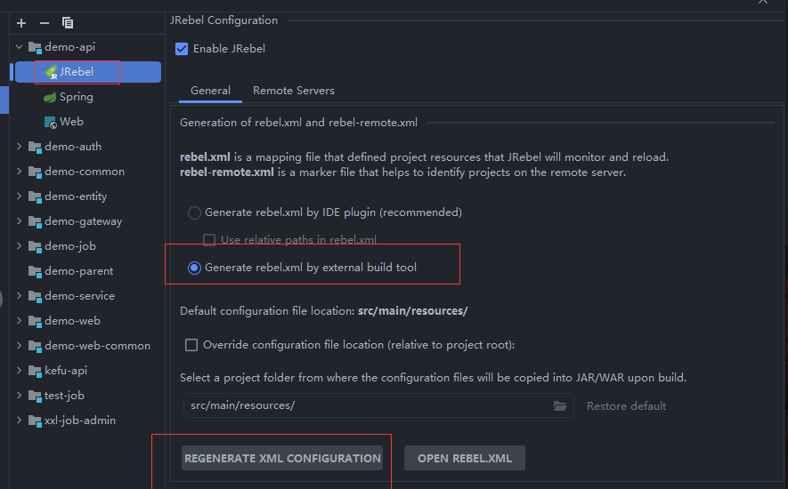

生成的示例文件

```
<?xml version="1.0" encoding="UTF-8"?>

<!--
  This is the JRebel configuration file. It maps the running application to your IDE workspace, enabling JRebel reloading for this project.
  Refer to https://manuals.zeroturnaround.com/jrebel/standalone/config.html for more information.
-->
<application generated-by="maven" build-tool-version="3.8.1" plugin-version="1.1.9" xmlns:xsi="http://www.w3.org/2001/XMLSchema-instance" xmlns="http://www.zeroturnaround.com" xsi:schemaLocation="http://www.zeroturnaround.com http://update.zeroturnaround.com/jrebel/rebel-2_2.xsd">
	<classpath>
		<dir name="F:/IDEA-PROJECT/demo-parent/demo-api/target/classes">
			<include name="application-dev.yml"/>
			<include name="application-prod.yml"/>
			<include name="bootstrap.yml"/>
			<include name="logback-spring.xml"/>
			<include name="rebel.xml"/>
		</dir>
		<dir name="F:/IDEA-PROJECT/demo-parent/demo-api/src/main/resources">
			<include name="**/*.jks"/>
			<include name="static/**"/>
			<include name="assets/**"/>
		</dir>
		<dir name="F:/IDEA-PROJECT/demo-parent/demo-api/src/main/java">
			<include name="**/*.xml"/>
		</dir>
		<dir name="F:/IDEA-PROJECT/demo-parent/demo-api/target/classes">
		</dir>
		<dir name="F:/IDEA-PROJECT/demo-parent/demo-common/target/classes">
		</dir>
		<dir name="F:/IDEA-PROJECT/demo-parent/demo-entity/target/classes">
		</dir>
		<dir name="F:/IDEA-PROJECT/demo-parent/demo-service/target/classes">
		</dir>
		<dir name="F:/IDEA-PROJECT/demo-parent/demo-web-common/target/classes">
		</dir>
		
	</classpath>

</application>

```

### 问题

1.为什么网上的很多教程改了配置文件无法热部署，需要重启项目？

加入以下配置

```
 <!-- 将配置的资源目录也添加到rebel.xml中 -->
                    <addResourcesDirToRebelXml>true</addResourcesDirToRebelXml>
```

会多生成

```xml
<dir name="F:/IDEA-PROJECT/demo-parent/demo-api/target/classes">
			<include name="application-dev.yml"/>
			<include name="application-prod.yml"/>
			<include name="bootstrap.yml"/>
			<include name="logback-spring.xml"/>
			<include name="rebel.xml"/>
		</dir>
		<dir name="F:/IDEA-PROJECT/demo-parent/demo-api/src/main/resources">
			<include name="**/*.jks"/>
			<include name="static/**"/>
			<include name="assets/**"/>
		</dir>
		<dir name="F:/IDEA-PROJECT/demo-parent/demo-api/src/main/java">
			<include name="**/*.xml"/>
		</dir>
```

这些文件会加入jrabel的监控

2.为什么多模块项目无法热部署？

因为你没有将你依赖的其他模块项目加入监控加入到rebel.xml中即可

例如我依赖了common、entity等其他模块的

```xml
<dir name="F:/IDEA-PROJECT/demo-parent/demo-common/target/classes">
		</dir>
		<dir name="F:/IDEA-PROJECT/demo-parent/demo-entity/target/classes">
		</dir>
		<dir name="F:/IDEA-PROJECT/demo-parent/demo-service/target/classes">
		</dir>
		<dir name="F:/IDEA-PROJECT/demo-parent/demo-web-common/target/classes">
		</dir>
```

整合来的rebel.xml

```xml
<?xml version="1.0" encoding="UTF-8"?>

<!--
  This is the JRebel configuration file. It maps the running application to your IDE workspace, enabling JRebel reloading for this project.
  Refer to https://manuals.zeroturnaround.com/jrebel/standalone/config.html for more information.
-->
<application generated-by="maven" build-tool-version="3.8.1" plugin-version="1.1.9" xmlns:xsi="http://www.w3.org/2001/XMLSchema-instance" xmlns="http://www.zeroturnaround.com" xsi:schemaLocation="http://www.zeroturnaround.com http://update.zeroturnaround.com/jrebel/rebel-2_2.xsd">
	<classpath>
        <!-- 配置文件 -->
		<dir name="F:/IDEA-PROJECT/demo-parent/demo-api/target/classes">
			<include name="application-dev.yml"/>
			<include name="application-prod.yml"/>
			<include name="bootstrap.yml"/>
			<include name="logback-spring.xml"/>
			<include name="rebel.xml"/>
		</dir>
        <!-- 静态文件 -->
		<dir name="F:/IDEA-PROJECT/demo-parent/demo-api/src/main/resources">
			<include name="**/*.jks"/>
			<include name="static/**"/>
			<include name="assets/**"/>
		</dir>
		<dir name="F:/IDEA-PROJECT/demo-parent/demo-api/src/main/java">
			<include name="**/*.xml"/>
		</dir>
        <!-- 本项目classes文件 -->
		<dir name="F:/IDEA-PROJECT/demo-parent/demo-api/target/classes">
		</dir>
        <!-- 本项目依赖模块的classes文件 -->
		<dir name="F:/IDEA-PROJECT/demo-parent/demo-common/target/classes">
		</dir>
		<dir name="F:/IDEA-PROJECT/demo-parent/demo-entity/target/classes">
		</dir>
		<dir name="F:/IDEA-PROJECT/demo-parent/demo-service/target/classes">
		</dir>
		<dir name="F:/IDEA-PROJECT/demo-parent/demo-web-common/target/classes">
		</dir>
		
	</classpath>

</application>
```

